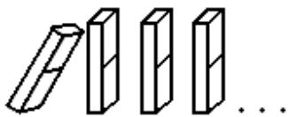
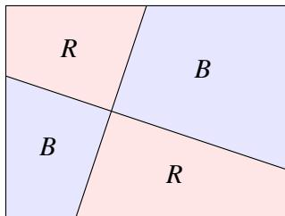
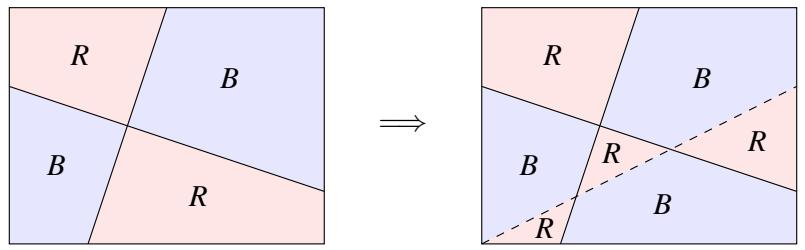

# 003 - 数学归纳法

## 1 简介
在本讲义中，我们介绍 **数学归纳法**（Mathematical Induction） 的证明技术。归纳法是一个强大的工具，用于建立一个陈述对所有自然数都成立。当然，自然数有无限多个——归纳法提供了一种通过有限手段对它们进行推理的方法。

让我们用一个例子来演示归纳法背后的直觉。假设我们希望证明以下陈述：对于所有自然数 $n$ ， $0 + 1 + 2 + 3 + \cdots + n = \frac{n(n+1)}{2}$ 。更正式地，使用讲义 1 中的全称量词，我们可以将其写为：

$$
\forall n \in \mathbb{N}, \quad \sum_{i=0}^{n} i = \frac{n(n+1)}{2}. \tag{1}
$$

你会如何证明这一点？嗯，你可以开始检查它对 $n = 0, 1, 2$ 等等是否成立。但是有无限多个 $n$ 值需要检查！此外，仅检查前几个 $n$ 值并不足以断定该陈述对所有 $n \in \mathbb{N}$ 都成立，如下例所示：

> 概念检查！考虑陈述： $\forall n \in \mathbb{N}$ ， $n^{2} - n + 41$ 是一个质数。检查它对前几个自然数是否成立。（事实上，你可以一直检查到 $n = 40$ 都找不到反例！）现在检查 $n = 41$ 的情况。

在数学归纳法中，我们通过一个有趣的观察来绕过这个问题：假设该陈述对于某个值 $n = k$ 成立，即 $\sum_{i = 0}^{k} i = \frac{k(k + 1)}{2}$ （这被称为 **归纳假设**（Induction Hypothesis））。那么：

$$
\left(\sum_{i = 0}^{k} i\right) + (k + 1) = \frac{k (k + 1)}{2} + (k + 1) = \frac{(k + 1) (k + 2)}{2}, \tag{2}
$$

即该断言对于 $n = k + 1$ 也成立！换句话说，如果陈述对某个 $k$ 成立，那么它也必须对 $k + 1$ 成立。让我们把上面的论证称为 **归纳步**（Inductive Step）。归纳步是一个非常强大的工具：如果我们能证明陈述对 $k$ 成立，那么归纳步允许我们断定它对 $k + 1$ 也成立；但既然它对 $k + 1$ 成立，归纳步就蕴含它对 $k + 2$ 成立；依此类推。实际上，我们可以对所有 $n \geq k$ 无限重复这个论证。所以就这样了吗？我们证明了 (1) 吗？差不多了！

问题是，为了应用归纳步，我们首先必须确定 (1) 对于某个初始值 $k$ 成立。由于我们的目标是证明该陈述对所有自然数都成立，显而易见的选择是 $k = 0$ 。我们称这个 $k$ 的选择为 **基准情况**（Base Case）。然后，如果基准情况成立，数学归纳法公理说归纳步允许我们断定 (1) 确实对所有 $n \in \mathbb{N}$ 成立。

现在让我们正式重写这个证明。

**定理 3.1**。 $\forall n \in \mathbb{N}, \sum_{i = 0}^{n} i = \frac{n(n + 1)}{2}$ 。

**证明**。我们对变量 $n$ 进行归纳。

**基准情况**（$n = 0$）：这里，我们有 $\sum_{i = 0}^{0} i = 0 = \frac{0(0 + 1)}{2}$ 。因此，基准情况是正确的。

**归纳假设**：对于任意 $n = k \geq 0$ ，假设 $\sum_{i = 0}^{k} i = \frac{k(k + 1)}{2}$ 。用语言表达，归纳假设说“让我们假设我们已经证明了该陈述对于一个任意值 $n = k \geq 0$ 成立”。

**归纳步**：证明陈述对于 $n = (k + 1)$ 成立，即展示 $\sum_{i = 0}^{k + 1} i = \frac{(k + 1)(k + 2)}{2}$ ：

$$
\sum_{i = 0}^{k + 1} i = \left(\sum_{i = 0}^{k} i\right) + (k + 1) = \frac{k (k + 1)}{2} + (k + 1) = \frac{k (k + 1) + 2 (k + 1)}{2} = \frac{(k + 1) (k + 2)}{2}, \tag{3}
$$

其中第二个等号由归纳假设得出。根据数学归纳法原理，该断言成立。证毕。 □

> 概念检查！归纳假设究竟是如何帮助我们证明 (3) 中的第二个等号的？（提示：我们用它将 $\sum_{i = 0}^{k} i$ 替换成了有用的东西。）

**回顾**。到目前为止我们学到了什么？设 $P(n)$ 表示陈述 $\sum_{i = 0}^{n} i = \frac{n(n + 1)}{2}$ ，我们的目标是证明 $\forall n \in \mathbb{N}, P(n)$ 。归纳原理断言，证明这一点需要三个简单的步骤：

1. **基准情况**：证明 $P(0)$ 为真。
2. **归纳假设**：对于任意 $k \geq 0$ ，假设 $P(k)$ 为真。
3. **归纳步**：在有了归纳假设的条件下，展示 $P(k + 1)$ 为真。

让我们使用多米诺骨牌来可视化这三个步骤是如何结合在一起的。让陈述 $P(i)$ 由一系列编号为 $0, 1, 2, \ldots, n$ 的多米诺骨牌表示，使得 $P(0)$ 对应第 0 张骨牌， $P(1)$ 对应第 1 张骨牌，依此类推。多米诺骨牌排成一排，使得如果第 $k$ 张骨牌被撞倒，它反过来又撞倒第 $k + 1$ 张。撞倒第 $k$ 张骨牌对应于证明 $P(k)$ 为真。归纳步对应于多米诺骨牌的放置，以确保如果第 $k$ 张骨牌倒下，它反过来又撞倒第 $k + 1$ 张骨牌。基准情况（$n = 0$）撞倒第 0 张骨牌，引发连锁反应撞倒所有骨牌！



最后，关于选择合适的基准情况——在这个例子中我们选择了 $k = 0$ ，但通常基准情况的选择将自然取决于你希望证明的断言。

**另一个归纳证明**。让我们再做一个归纳证明。回想讲义 1，对于整数 $a$ 和 $b$ ，我们说 $a$ 整除 $b$ ，记作 $a \mid b$ ，当且仅当存在一个整数 $q$ 满足 $b = aq$ 。

**定理 3.2**。对于所有 $n \in \mathbb{N}$ ， $n^{3} - n$ 能被 3 整除。

**证明**。我们对 $n$ 进行归纳。设 $P(n)$ 表示 $n^{3} - n$ 能被 3 整除。

**基准情况**（$n = 0$）： $P(0)$ 断言 $3 \mid (0^{3} - 0)$ 或 $3 \mid 0$ ，这是真的，因为任何非零整数都整除 0。

**归纳假设**：假设对于 $n = k \geq 0$ ， $P(k)$ 为真。即 $3 \mid (k^{3} - k)$ ，或者等价地 $k^{3} - k = 3q$ 对于某个整数 $q$ 。

**归纳步**：我们展示 $P(k + 1)$ 为真，即 $3 \mid ((k + 1)^{3} - (k + 1))$ 。为了展示这一点，我们将数字 $(k + 1)^{3} - (k + 1)$ 展开如下：

$$
\begin{array}{l} (k + 1)^{3} - (k + 1) = k^{3} + 3k^{2} + 3k + 1 - (k + 1) \\ = (k^{3} - k) + 3k^{2} + 3k \\ = 3q + 3(k^{2} + k) \text{ 对于某个 } q \in \mathbb{Z} \quad (\text{根据归纳假设}) \\ = 3(q + k^{2} + k) \\ \end{array}
$$

我们得出结论： $3 \mid ((k + 1)^{3} - (k + 1))$ 。因此，根据归纳原理， $\forall n \in \mathbb{N}, 3 \mid (n^{3} - n)$ 。证毕。 □

> 概念检查！在上面展示的推导中，归纳假设究竟是如何帮助我们证明第三个等号的？

**两色定理**。我们现在考虑一个更高级的归纳证明，它建立了一个著名的四色定理的简化版本。四色定理指出，任何地图都可以用四种颜色着色，使得任何两个相邻的国家都有不同的颜色。四色定理非常难以证明，自从该问题在 1852 年首次提出以来，有人声称提出了几个错误的证明。事实上，直到 1976 年才由 Appel 和 Haken 最终给出了该定理的计算机辅助证明。（有关该问题的有趣历史和最先进的证明，尽管仍然非常有挑战性，请参见 [www.math.gatech.edu/~thomas/FC/fourcolor.html](http://www.math.gatech.edu/~thomas/FC/fourcolor.html)。）

在本讲义中，我们考虑该定理的一个更简单的版本，其中我们的“地图”由一个矩形给出，该矩形通过画直线被划分为若干区域，使得每条线将矩形划分为两个区域。我们能否使用不超过两种颜色（例如，红色和蓝色）为这样一份简化的地图着色，使得没有两个共享边界的区域具有相同的颜色？为了说明这一点，这里有一个两色地图的例子：



**定理 3.3**。设 $P(n)$ 表示陈述“任何具有 $n$ 条直线的上述形式的地图都是两色可着色的”。那么， $\forall n \in \mathbb{N}, P(n)$ 成立。

**证明**。我们对 $n$ 进行归纳。

**基准情况**（$n = 0$）：显然 $P(0)$ 成立，因为如果我们有 $n = 0$ 条直线，我们可以使用单种颜色为整个地图着色。

**归纳假设**：对于某个任意的 $n = k \geq 0$ ，假设 $P(k)$ 成立。

**归纳步**：我们证明 $P(k + 1)$ 。具体来说，我们得到一份具有 $k + 1$ 条直线的地图，并希望展示它是两色可着色的。让我们看看如果我们移除一条线会发生什么。地图上由于只有 $k$ 条线，归纳假设说我们可以为该地图着色。让我们进行如下观察：给定一个有效的着色，如果我们交换红蓝色，我们仍然得到一个有效的着色。考虑到这一点，让我们放回移除的那条线，并保持线的一侧颜色不变。在直线的另一侧，交换红蓝色。如图 1 所示。我们断言这是具有 $k + 1$ 条直线的地图的一个有效两色着色。


图 1：（左）移除第 $k+1$ 条线后的地图。（右）第 $k+1$ 条线显示为虚线的地图。

为什么这可行？考虑由共享边界分隔的任何两个区域。那么，以下两种情况之一必须成立：情况 1 是共享边界是那条被移除又放回的线，即第 $k+1$ 条线。但根据构造，我们翻转了该线一侧的颜色，因此由其分隔的任何两个区域都具有不同的颜色。情况 2 是共享边界是前 $k$ 条线之一；在这里，归纳假设保证由该边界分隔的两个区域具有不同的颜色。因此，在两种情况下，由共享边界分隔的区域都具有不同的颜色，正如所要求的。证毕。 □

## 2 强化归纳假设
使用归纳法时，选择正确的陈述进行证明至关重要。例如，假设我们希望证明以下陈述：对于所有 $n \geq 1$ ，前 $n$ 个奇数的和是一个完全平方数。这是归纳法的第一次尝试证明。

**证明尝试**。我们对 $n$ 进行归纳。

**基准情况**（$n = 1$）：第一个奇数是 1，它是一个完全平方数。

**归纳假设**：假设前 $k$ 个奇数的和是一个完全平方数，设为 $m^{2}$ 。

**归纳步**：第 $k + 1$ 个奇数是 $2k + 1$ 。因此，根据归纳假设，前 $k + 1$ 个奇数的和是 $m^{2} + 2k + 1$ 。但现在我们卡住了。为什么 $m^{2} + 2k + 1$ 应该是一个完全平方数？看起来我们的归纳假设太“弱”了；它没有给我们足够的结构来对 $k + 1$ 的情况说出任何有意义的话。

所以让我们退后一步，进行初步检查以确保我们的主张并非明显错误：让我们计算前几个案例的值。也许在这个过程中，我们还可以发现一些我们尚未识别出的隐藏结构。

• $n = 1$ ： $1 = 1^{2}$ 是一个完全平方数。
• $n = 2$ ： $1 + 3 = 4 = 2^{2}$ 是一个完全平方数。
• $n = 3$ ： $1 + 3 + 5 = 9 = 3^{2}$ 是一个完全平方数。
• $n = 4$ ： $1 + 3 + 5 + 7 = 16 = 4^{2}$ 是一个完全平方数。

看起来我们有了一个好消息，甚至还有一个更好的消息：好消息是我们尚未发现该断言的反例。更好的消息是，出现了一个令人惊讶模式：前 $n$ 个奇数的和不仅是一个完全平方数，而且恰好等于 $n^{2}$ ！由于这一发现的启发，让我们尝试一些违反直觉的事情：让我们尝试证明以下更强的断言。

**定理 3.4**。对于所有 $n \geq 1$ ，前 $n$ 个奇数的和是 $n^{2}$ 。

**证明**。我们对 $n$ 进行归纳。

**基准情况**（$n = 1$）：第一个奇数是 1，它等于 $1^{2}$ 。

**归纳假设**：假设前 $k$ 个奇数的和是 $k^{2}$ 。

**归纳步**：第 $k + 1$ 个奇数是 $2k + 1$ 。应用归纳假设，前 $k + 1$ 个奇数的和是 $k^{2} + (2k + 1) = (k + 1)^{2}$ 。因此，根据归纳原理，该定理成立。证毕。 □

所以让我们理清一下——我们无法证明最初的陈述，所以我们假设了一个更强的陈述，并成功证明了它。这究竟为什么可行？原因是我们的原始断言没有捕捉到我们试图证明的基础事实的真实结构——它太模糊了。结果，我们的归纳假设不够强大，无法证明我们想要的结果。相比之下，虽然我们的第二个断言先验地更强，但它也具有更多的结构；这反过来使得我们的归纳假设更强大——我们可以利用这样一个事实：不仅前 $k$ 个奇数的和是一个完全平方数，而且它实际上等于 $k^{2}$ 。这种额外的结构正是我们完成证明所需要的。总之，我们演示了一个例子，虽然断言是真的，但归纳假设的精确表述决定了证明的成败。

**示例**。现在让我们尝试第二个例子；这一次，我们将让你完成部分工作！假设我们希望证明该断言：对于所有 $n \geq 1$ ， $\textstyle \sum_{i = 1}^{n} \frac{1}{i^{2}} \leq 2$ 。

> 概念检查！“显而易见”的归纳假设选择如下：假设对于 $n = k$ ， $\textstyle \sum_{i = 1}^{k} \frac{1}{i^{2}} \leq 2$ 。为什么这不足以证明 $n = k + 1$ 的断言，即展示 $\begin{array} { r } { \sum_{i = 1}^{k} \frac{1}{i^{2}} + \frac{1}{(k + 1)^{2}} \leq 2 } \end{array}$ ？（提示： $\scriptstyle \sum_{i = 1}^{k} \frac{1}{i^{2}}$ 是否可能实际上等于 2？）

现在让我们再次做一些违反直觉的事情——让我们证明以下更强的陈述，即强化我们的归纳假设。

**定理 3.5**。对于所有 $n \geq 1, \sum_{i = 1}^{n} \frac{1}{i^{2}} \leq 2 - \frac{1}{n}$ 。

**证明**。我们对 $n$ 进行归纳。

**基准情况**（$n = 1$）：我们有 $\sum_{i = 1}^{1} \frac{1}{i^{2}} = 1 \leq 2 - \frac{1}{1}$ ，符合要求。

**归纳假设**：假设该断言对 $n = k$ 成立。

**归纳步**：根据归纳假设，我们有：

$$
\sum_{i = 1}^{k + 1} \frac{1}{i^{2}} = \sum_{i = 1}^{k} \frac{1}{i^{2}} + \frac{1}{(k + 1)^{2}} \leq 2 - \frac{1}{k} + \frac{1}{(k + 1)^{2}}.
$$

因此，要证明我们的主张，只需证明：

$$
2 - \frac{1}{k} + \frac{1}{(k + 1)^{2}} \leq 2 - \frac{1}{k + 1}, \tag{4}
$$

这很容易看出对所有 $k \geq 0$ 都成立。

**练习**。使用简单的代数证明 (4) 成立。

根据数学归纳法原理，该主张成立。

## 3 简单归纳法 vs. 强归纳法
到目前为止，我们一直在使用一种称为 **简单归纳法**（Simple Induction） 或 **弱归纳法**（Weak Induction） 的归纳概念。还有另一种归纳概念，我们现在讨论它，称为 **强归纳法**（Strong Induction）。后者与简单归纳法类似，只是我们有一个略有不同的归纳假设：不是仅假设 $P(k)$ 为真（如简单归纳法的情况），而是假设 $P(0), P(1), \dots, P(k)$ 全部为真（即 $\bigwedge_{i = 0}^{k} P(i)$ 为真）的更强陈述。

强归纳法和弱归纳法的力量是否有区别，即强归纳法能否证明弱归纳法无法证明的陈述？没有！直观上，这可以通过回到我们第 1 节中的多米诺骨牌类比来看到。在这幅图中，弱归纳法说如果第 $k$ 张骨牌倒下，那么第 $k+1$ 张也会倒下，而强归纳法说如果第 1 到 $k$ 张骨牌倒下，那么第 $k+1$ 张也会倒下。但这两种场景是等价的：如果第一张骨牌倒下，那么重复应用弱归纳法，我们得出结论，第一张骨牌反过来又推倒了第 2 到 $k$ 张骨牌，从而为 $k+1$ 的情况做好了准备，就像强归纳法的情况一样。话虽如此，强归纳法确实有一个吸引人的优势——它可以使证明更容易，因为我们可以假设一个更强的假设。我们应该如何理解这一点？考虑螺丝刀和电动螺丝刀的类比——它们都完成相同的任务，但后者更容易使用！

让我们尝试一个强归纳法的简单例子。作为奖励，这是我们第一个需要多个基准情况的归纳证明。

**定理 3.6**。对于每个自然数 $n \geq 12$ ， $n = 4x + 5y$ 对于某些 $x, y \in \mathbb{N}$ 成立。

**证明**。我们对 $n$ 进行归纳。

**基准情况**（$n = 12$）：我们有 $12 = 4 \cdot 3 + 5 \cdot 0$ 。
**基准情况**（$n = 13$）：我们有 $13 = 4 \cdot 2 + 5 \cdot 1$ 。
**基准情况**（$n = 14$）：我们有 $14 = 4 \cdot 1 + 5 \cdot 2$ 。
**基准情况**（$n = 15$）：我们有 $15 = 4 \cdot 0 + 5 \cdot 3$ 。

**归纳假设**：固定任何 $k \geq 15$ ，假设对于所有 $12 \leq n \leq k$ ，该断言成立。

**归纳步**：我们证明 $n = k + 1$ 的主张。首先注意 $k + 1 \geq 16$ ，因此 $(k + 1) - 4 \geq 12$ ；因此，归纳假设蕴含 $(k + 1) - 4 = 4x' + 5y'$ 对于某些 $x', y' \in \mathbb{N}$ 。设定 $x = x' + 1$ 且 $y = y'$ 即可完成证明。 □

> 概念检查！如果我们将弱归纳法用于上述证明，为什么会失败？

让我们尝试第二个、更高级的例子。为此，回想一下一个数 $n \geq 2$ 是质数，如果它的约数只有 1 和 $n$ 。

**定理 3.7**。每个自然数 $n > 1$ 都可以写成一个或多个质数的乘积。

**证明**。我们对 $n$ 进行归纳。设 $P(n)$ 为命题 $n$ 可以写成质数的乘积。我们将证明 $P(n)$ 对所有 $n \geq 2$ 为真。

**基准情况**（$n = 2$）：我们从 $n = 2$ 开始。显然 $P(2)$ 成立，因为 2 是一个质数。

**归纳假设**：假设 $P(n)$ 对于所有 $2 \leq n \leq k$ 为真。

**归纳步**：证明 $n = k + 1$ 可以写成质数的乘积。我们有两种情况：要么 $k + 1$ 是一个质数，要么不是。对于第一种情况，如果 $k + 1$ 是一个质数，那么我们就完成了，因为 $k + 1$ 平凡地是一个质数（它本身）的乘积。对于第二种情况，如果 $k + 1$ 不是一个质数，那么根据定义， $k + 1 = xy$ 对于某些满足 $1 < x, y < k + 1$ 的 $x, y \in \mathbb{Z}^{+}$ 。根据归纳假设， $x$ 和 $y$ 都可以各自写成质数的乘积（因为 $x$ 和 $y$ 都 $\leq k$ ）。但这蕴含了 $k + 1$ 也可以写成质数的乘积。 □

> 概念检查！如果我们改用简单归纳法，为什么这个证明会失败？（提示：假设 $k + 1 = 42$ 。由于 $42 = 6 \times 7$ ，在归纳步中我们希望使用 $P(6)$ 和 $P(7)$ 为真的事实。但弱归纳法并没有给我们这些——弱归纳法允许我们在这种情况下假设哪个 $P$ 的值是真的？）

最后，对于那些希望更正式地理解为什么弱归纳法和强归纳法等价的人，请考虑以下内容实。设 $Q(n) = P(0) \land P(1) \land \cdots \land P(n)$ 。那么，对 $P$ 的强归纳法等价于对 $Q$ 的弱归纳法。尝试说服自己这一断言。

## 4 递归、编程与归纳
归纳和递归之间有着密切的联系，我们在这里通过两个例子来探讨。

**示例 1：斐波那契的兔子**。 13 世纪有一位著名的意大利数学家，被称为斐波那契（也被称为比萨的列奥纳多），他在 1202 年考虑了以下谜题：从一对兔子开始，一年后有多少对兔子，如果每个月每对兔子都会生出一对新兔子，而新兔子从第二个月起变得具有生产力？这种人口增长模型可以通过递归定义一个函数来建模；由此产生的数字序列在今天被称为 **斐波那契数**（Fibonacci numbers）。

为了递归地建模我们的兔子种群，设 $F(n)$ 表示第 $n$ 个月的兔子对数。根据上述规则，我们的初始条件如下：显然 $F(0) = 0$ 。在第 1 个月，引入了一对兔子，这意味着 $F(1) = 1$ 。最后，由于新兔子需要一个月的时间才能变得有生产力，我们还有 $F(2) = 1$ 。

在第 3 个月，乐趣开始了。例如， $F(3) = 2$ ，因为原始的那对兔子繁殖产生了一对新兔子。但是对于一般值的 $n$ ， $F(n)$ 会是多少呢？给出一个显式的 $F(n)$ 公式似乎很困难。然而，我们可以按如下方式递归地定义 $F(n)$ 。在第 $n - 1$ 个月，根据定义我们有 $F(n - 1)$ 对兔子。这些兔子中有多少是有生产力的？嗯，只有那些在前一个月已经存活的兔子，即 $F(n - 2)$ 对。因此，在第 $n$ 个月，我们除了现有的 $F(n - 1)$ 对兔子之外，还有 $F(n - 2)$ 对新兔子。因此，我们有 $F(n) = F(n - 1) + F(n - 2)$ 。总结如下：

• $F(0) = 0$ 。
• $F(1) = 1$ 。
• 对于 $n \geq 2$ ， $F(n) = F(n - 1) + F(n - 2)$ 。

非常巧妙，只不过你可能会想，我们为什么要关心兔子的繁殖！事实证明，这种简化的人口增长模型说明了一个基本原则：如果不加控制，人口会随着时间的推移呈指数增长。以下练习给出了这种指数增长率的下限。（真实的增长率相当大，约为 $1.6^{n}$ 。）

**练习**。使用归纳法展示斐波那契数对于所有 $n \geq 3$ 满足 $F(n) \geq 2^{(n - 1) / 2}$ 。注意你将需要两个基准情况： $n = 3$ 和 $n = 4$ 。（为什么？）

事实上，理解这种由于不加控制导致的指数级人口增长，是引导达尔文制定其进化论的一个关键步骤。引用达尔文的话：“每一个生物都以如此高的速度增长，如果不被毁灭，地球很快就会被一对后裔所覆盖，这是没有例外的规律。”

现在，我们在本节的标题中向你承诺了编程，所以这里有一个评估 $F(n)$ 的平凡递归程序：

```lua
function F(n)  
if n=0 then return 0  
if n=1 then return 1  
else return F(n - 1) + F(n - 2)
end
```

**练习**。计算 $F(n)$ 需要多长时间，即需要调用多少次 $F(n)$ ？你应该能够通过归纳法展示调用的次数至少是 $F(n)$ 本身！

上面的练习应该让你相信，这是一个计算第 $n$ 个斐波那契数非常低效的方法。这里有一个更快得多的迭代算法来完成同样的任务（这应该是将尾递归转变为迭代算法的一个熟悉例子）：

```lua
function F_2(n)
  if n == 0 then return 0
  if n == 1 then return 1
  a = 1
  b = 0
  for k = 2 to n do
    temp = a
    a = a + b
    b = temp
  return a
end
```

**练习**。计算 $F_{2}(n)$ 的迭代算法需要多长时间，即它的循环需要进行多少次迭代？你能通过归纳法展示这个新函数 $F_{2}(n) = F(n)$ 吗？

**示例 2：二分查找**。我们接下来使用归纳法来分析一个甚至你祖母都可能熟悉的递归算法—— **二分查找**（Binary Search）！让我们在寻找字典中的单词的上下文中讨论二分查找：为了找到单词 $W$ ，我们将字典打开到中间页面。如果该页面的第一个单词在 $W$ 之后，我们对字典的前半部分（中间页面之前）进行递归；否则，我们对字典的后半部分（从中间页面起）进行递归。（当字典有偶数页 $2m$ 时，我们定义中间页面为第 $(m + 1)$ 页。）一旦我们将字典缩小到单页，我们就通过暴力搜索在该页上查找 $W$ 。在伪代码中，我们有：

```txt
1 // 前提条件：W 是一个单词，D 是字典的一个子集，
2 // 且至少有 1 页。
3 // 后置条件：返回 W 的定义，或返回 "W not found"。
4 findWord(W, D) {
5   // 基准情况
6   if (D 恰好只有一页)
7     通过暴力搜索在 D 中查找 W。
8     如果找到，返回其定义；否则，返回 "W not found"。
9
10  // 递归情况
11  设 W' 是 D 中间页面的第一个单词。
12  if (W 在 W' 之前)
13    return findWord(D 的前半部分)
14  else
15    return findWord(D 的后半部分)
16 }
```

让我们使用归纳法证明 `findWord()` 是正确的，即如果 $W$ 在字典 $D$ 中，它会返回 $W$ 的定义。作为奖励，证明需要我们使用强归纳法而不是简单归纳法！

**`findWord()` 的正确性证明**。我们对 $D$ 中的页数 $n$ 进行强归纳。

**基准情况**（$n = 1$）：如果 $D$ 有一页，第 7 行通过暴力搜索查找 $W$ 。因此，如果 $W$ 存在，它就会被找到并返回；否则，我们按预期返回“W not found”。

**归纳假设**：假设 `findWord()` 对于所有 $1 \leq n \leq k$ 都是正确的。

**归纳步**：我们证明 `findWord()` 对于 $n = k + 1$ 是正确的。在第 11 行之后，我们知道了 $W'$ ；因此我们可以确定 $W$ 必须在 $D$ 的前半部分还是后半部分。在第一种情况下，我们在第 13 行递归调用 $D$ 的前半部分，在第二种情况下，我们在第 15 行递归调用 $D$ 的后半部分。根据归纳假设，递归调用能正确地在前半部分或后半部分找到 $W$ ，或者返回“W not found”，因为这两个半部分都包含最多 $k$ 页。由于我们返回了递归调用的答案，我们得出结论： `findWord()` 在大小为 $n = k + 1$ 的 $D$ 中正确地找到了 $W$ 。根据归纳法， `findWord()` 因此是正确的。证毕。

> 概念检查！为什么我们在上面的证明中需要强归纳法？

## 5 错误证明
如果你的证明不正确，很容易证明错误的事情！让我们用一个著名的例子来说明。在上个世纪中叶，一个常用的口语表达是“that is a horse of a different color”，指的是与正常或共同预期完全不同的事物。著名数学家乔治·波利亚（George Pólya）也是一位向普通大众解释数学的大师，他给出了以下证明，展示了没有不同颜色的马！

**定理 3.8**。所有的马都是同一种颜色。

**证明？** 我们对马的数量 $n$ 进行归纳。设 $P(n)$ 为该断言的陈述。

**基准情况**（$n = 1$）： $P(1)$ 当然是真的，因为如果你有一个只包含一匹马的集合，集合中所有的马都有相同的颜色。

**归纳假设**：假设 $P(n)$ 对于某个任意的 $n \geq 1$ 成立。

**归纳步**：给定一个包含 $n + 1$ 匹马的集合 $\{ h_{1}, h_{2}, \dots, h_{n+1} \}$ ，我们可以排除集合中的最后一匹马，并仅对前 $n$ 匹马 $\{ h_{1}, \dots, h_{n} \}$ 应用归纳假设，推断出它们都具有相同的颜色。类似地，我们可以得出结论，最后 $n$ 匹马 $\{ h_{2}, \dots, h_{n+1} \}$ 都具有相同的颜色。但现在“中间”的马 $\{ h_{2}, \dots, h_{n} \}$ （即除第一匹和最后一匹之外的所有马）属于这两个集合，因此它们与马 $h_{1}$ 具有相同的颜色，也与马 $h_{n+1}$ 具有相同的颜色。因此得出结论，所有 $n + 1$ 匹马都具有相同的颜色。根据归纳原理，我们得出结论，所有的马都具有相同的颜色。 $\spadesuit$

显然，所有的马并非同一种颜色！那么，我们哪里出错了？回想一下，为了使数学归纳法原理适用，归纳步必须展示以下陈述： $\forall n \geq 1, P(n) \implies P(n + 1)$ 。我们断言在上面的证明中，这一陈述是假的——特别地，存在一个 $n$ 的选择，会产生该陈述的一个反例。

**练习**。对于哪个 $n$ 值， $P(n) \implies P(n + 1)$ 不成立？（提示：思考证明中拥有“中间”马的关键属性。）

## 6 练习题
1. 证明对于任何自然数 $n$ ，有 $1^{2} + 2^{2} + 3^{2} + \cdots + n^{2} = \frac{1}{6}n(n + 1)(2n + 1)$ 。
2. 在实分析中， **伯努利不等式**（Bernoulli's Inequality） 是一个近似 $1 + x$ 指数运算的不等式。证明这个不等式，它指出如果 $n$ 是一个自然数且 $1 + x > 0$ ，则 $(1 + x)^{n} \geq 1 + nx$ 。
3. 一个常见的递归定义函数是 **阶乘**（Factorial），对于非负数 $n$ 定义为 $n! = n(n - 1)(n - 2) \dots 1$ ，基准情况为 $0! = 1$ 。让我们通过考虑以下涉及阶乘的定理来强化我们对递归和归纳之间联系的理解。

**定理 3.9**。对于所有 $n \in \mathbb{N}$ ， $n > 1 \Longrightarrow n! < n^{n}$ 。

使用归纳法证明这个定理。（提示：在归纳步中，写成 $(n + 1)! = (n + 1) \cdot n!$ ，并使用归纳假设。）

4. 宴会上的 **名人**（Celebrity） 是指每个人都认识他，但他却不认识任何人。假设你正在一个有 $n$ 个人的宴会上。对于宴会上的任何一对人 $A$ 和 $B$ ，你可以问 $A$ 是否认识 $B$ 并得到诚实的回答。给出一个递归算法，通过最多询问 $3n - 4$ 个问题来确定宴会上是否有名人，如果有的话是谁。（注意：为了这个问题的目的，你只是访问宴会来问问题。你试图确定的是实际参加宴会的 $n$ 个人中是否包括一名名人。）

通过归纳法证明你的算法总是能正确识别出名人（如果有的话），且问题的数量最多为 $3n - 4$ 。

5. 使用定理 3.6 的证明设计一个算法，给定任何至少 12 美分的邮资，输出组成该邮资的 4 美分和 5 美分邮票的数量。你的算法最多会使用多少张 5 美分邮票？