# 005 - 图论简介

## 1 图论：概论
计算机科学中的基本思想之一是 **抽象**（Abstraction） 的概念：通过一个简单的模型捕捉某些复杂情况的本质或核心。我们可能处理的一些最大且最复杂的实体包括互联网、大脑、地图和社交网络。在每种情况下，都有一个潜在的“网络”或 **图**（Graph），它捕捉了帮助我们更深入地理解这些实体的重要特征。在互联网的情况下，这个网络或图指定了网页如何相互链接。在大脑的情况下，它是神经元之间的互连网络。我们可以在美丽的 **图论**（Graph Theory） 框架内描述这些想法，这是本讲义的主题。

值得注意的是，图论起源于几个世纪前普鲁士柯尼斯堡（Königsberg，现为俄罗斯加里宁格勒）居民的一个简单的傍晚消遣。普雷格尔河（Pregel river）流经他们的城市，如下图 1 左侧所示，将柯尼斯堡分为 A 和 D 两个河岸以及 B 和 C 两个岛屿。连接岛屿与大陆的是七座桥。当城市的居民在傍晚散步时，许多人会尝试解决这样一个挑战：选择一条路径，恰好穿过七座桥中的每一座一次，并返回起点。

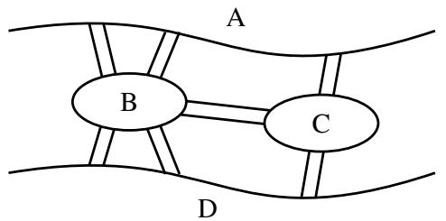  
(a) 柯尼斯堡市。

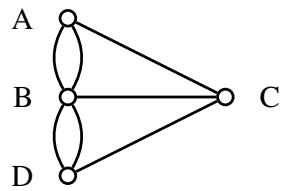  
(b) 模拟柯尼斯堡桥梁连接的（多重）图。
图 1：柯尼斯堡市的两种等效表示。

1736 年，天才数学家莱昂哈德·欧拉（Leonhard Euler）证明了这项任务是不可能的。他是怎么做到的？关键是要意识到，为了选择这样一条路径，图 1a 可以被图 1b 取代，其中每个陆地块 A、B、C 和 $D$ 都被一个点（显示为一个小圆圈）取代，每座桥由一条线段取代。有了这种抽象，选择路径的任务就可以重新表述如下：追踪所有的线段并在不抬笔且不重复行走任何线段的情况下返回起点。不可能性的证明很简单。在这些追踪规则下，笔进入每个点的次数必须与离开它的次数相同，因此与该点相连的线段数量必须是偶数。但在图 1b 中，每个点都有奇数条线段与之相连，因此无法进行这种追踪。实际上欧拉做得更多。他给出了可以进行追踪的精确条件。由于这个原因，欧拉通常被誉为图论的奠基人。

### 1.1 正式定义
形式上，一个（无向）图由一组 **顶点**（Vertex） $V$ 和一组 **边**（Edge） $E$ 定义。顶点对应于上图 1 中的点，边对应于顶点之间的线段。在图 1 中， $V = \{ A, B, C, D \}$ 且 $E = \{ \{ A, B \}, \{ A, B \}, \{ A, C \}, \{ B, C \}, \{ B, D \}, \{ B, D \}, \{ C, D \} \}$ 。然而，请注意，在这里 $E$ 是一个 **多重集**（Multiset，一个元素可以出现多次的集合）。这是因为在柯尼斯堡的例子中，在一对河岸之间有多座桥。除非另有说明，我们通常不允许在单对顶点之间存在多条边，即我们将要求 $E$ 是一个集合，而不是多重集。因此，在任何一对顶点之间，边数为 0 或 1。

更一般地，我们也可以定义 **有向图**（Directed Graph）。如果无向图中的一条边代表一条街道，那么有向图中的一条边就代表一条单行道。为了使其正式化，设 $V$ 为图 $G$ 的顶点集。那么有向边集 $E$ 是 $V \times V$ 的子集，即 $E \subseteq V \times V$ 。（回想一下， $U \times V$ 表示集合 $U$ 和 $V$ 的笛卡尔积，定义为 $U \times V = \{ (u, v) : u \in U \text{ 且 } v \in V \}$ 。）例如，如果 $V = \{ 1, 2, 3, 4 \}$ 且 $E = \{ (1, 2), (1, 3), (1, 4) \}$ ，则对应的图为图 2 所示的 $G_{1}$ 。

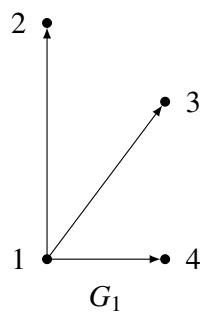

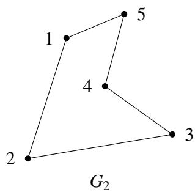  
图 2：分别为有向图和无向图的示例。

请注意， $G_{1}$ 中的每条边都有一个箭头指定的方向；因此，例如 $(1, 2) \in E$ 但 $(2, 1) \notin E$ 。有向图在模拟单向关系时非常有用，例如两个地点之间的单向街道。另一方面，如果每条边都是双向的，即 $(u, v) \in E$ 当且仅当 $(v, u) \in E$ ，那么我们称该图为 **无向图**（Undirected Graph）。对于无向图，我们省去边的有序对表示法，仅用集合 $\{ u, v \}$ 来表示 $u$ 和 $v$ 之间的边。无向图自然地模拟了诸如地点之间的双向街道之类的关系；图 2 中的 $G_{2}$ 给出了一个示例。为简单起见，我们在绘制无向图的边时省略了箭头。在任何一种情况下，图形式上都被指定为一个有序对 $G = (V, E)$ ，其中 $V$ 是顶点集， $E$ 是边集（有向或无向）。

> 概念检查！图 $G_{2}$ 的顶点集 $V$ 和边集 $E$ 是什么？

让我们继续讨论社交网络中的一个例子，在这个领域中图论起着基础性的作用。假设你想模拟一个社交网络，其中顶点对应人，边对应人与人之间的以下关系：我们说 Alex **认识**（Recognize） Bridget，如果 Alex 知道 Bridget 是谁（但 Bridget 不一定知道 Alex 是谁）。我们会使用有向图来模拟这种情况，因为这种关系不是对称的。另一方面，如果我们想模拟 Alex 和 Bridget 彼此认识的关系，那么我们会使用无向图。

引入一些进一步有用的术语，我们说边 $e = \{ u, v \}$ （或 $e = (u, v)$ ）与顶点 $u$ 和 $v$ **关联**（Incident），并且 $u$ 和 $v$ 是 **邻居**（Neighbor）或 **相邻的**（Adjacent）。如果 $G$ 是无向的，那么顶点 $u \in V$ 的 **度**（Degree）是与 $u$ 关联的边的数量，即 $degree(u) = | \{ v \in V : \{ u, v \} \in E \} |$ 。度数为 0 的顶点 $u$ 被称为 **孤立顶点**（Isolated Vertex），因为没有边将 $u$ 与图的其余部分连接起来。

> 概念检查！在我们的无向社交网络中，顶点的度代表了什么？边 $\{ u, v \}$ 意味着 $u$ 和 $v$ 彼此认识。我们应该如何解释一个孤立顶点？

另一方面，有向图由于边的方向性而有两种不同的度的概念。具体来说，顶点 $u$ 的 **入度**（In-degree）是从其他顶点指向 $u$ 的边的数量，而 $u$ 的 **出度**（Out-degree）是从 $u$ 指向其他顶点的边的数量。

> 概念检查！在我们的有向社交网络中，顶点的入度和出度分别代表什么？边 $(u, v)$ 意味着 $u$ 认识 $v$ 。

最后，到目前为止我们对图的定义允许形如 $\{ u, u \}$ （或 $(u, u)$ ）的边，即 **自环**（Self-loop）。然而，在我们的社交网络中，这并没有提供任何有趣的信息（这意味着人 $A$ 认识他/她自己！）。因此，除非另有说明，在这些讲义中，我们通常假设我们的图没有自环。

**路径、行走与圈**。设 $G = (V, E)$ 为一个无向图。 $G$ 中的一条 **路径**（Path）是一个边序列 $\{ v_{1}, v_{2} \}, \{ v_{2}, v_{3} \}, \dots, \{ v_{n-1}, v_{n} \}$ 。在这种情况下，我们说 $v_{1}$ 和 $v_{n}$ 之间存在一条路径。例如，假设下面的图 $G_{3}$ 模拟了一个住宅区，其中每个顶点对应一个房子，如果存在从 $u$ 到 $v$ 的直接道路，则两个房子 $u$ 和 $v$ 是邻居。

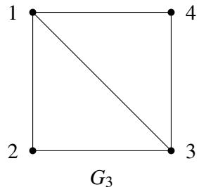

> 概念检查！在 $G_{3}$ 中，从 2 号房子到 4 号房子的最短路径是什么？在假设没有房子被访问两次的情况下，最长路径是什么？

在本课程中，我们假设路径是 **简单的**（Simple），意味着 $v_{1}, \ldots, v_{n}$ 是互不相同的。在我们房子的例子 $G_{3}$ 中，这完全说得通；如果你想通过 1 号房从 2 号房开车到 4 号房，为什么要访问 1 号房超过一次呢？ **圈**（Cycle，或回路 Circuit）是一个边序列 $\{ v_{1}, v_{2} \}, \{ v_{2}, v_{3} \}, \ldots, \{ v_{n-1}, v_{n} \}, \{ v_{n}, v_{1} \}$ ，其中 $v_{1}, \ldots, v_{n}$ 是互不相同的。因此，圈是从 $v_{1}$ 到 $v_{n}$ 的路径加上将我们带回 $v_{1}$ 的边 $\{ v_{n}, v_{1} \}$ 。

> 概念检查！在 $G_{3}$ 中给出一个从 1 号房子开始的圈。

现在假设你的目的不是尽可能快地从 2 走到 4，而是通过序列 $\{ 2, 1 \}, \{ 1, 2 \}, \{ 2, 3 \}, \{ 3, 4 \}$ 进行一次悠闲的漫步。像这样可能包含重复顶点的边序列被称为从 2 到 4 的 **行走**（Walk）。类似于路径和圈之间的关系， **游历**（Tour）是起点和终点都在同一个顶点的行走。例如， $\{ 2, 1 \}, \{ 1, 3 \}, \{ 3, 4 \}, \{ 4, 1 \}, \{ 1, 2 \}$ 是一次游历。

这里是所有这些术语的快速总结：

| | 边可以重复吗？ | 顶点可以重复吗？ | 起点 = 终点？ |
| :--- | :--- | :--- | :--- |
| **行走** | 是 | 是 | 任意 |
| **路径** | 否 | 否 | 否 |
| **游历** | 是 | 是 | 是 |
| **圈** | 否 | 否* | 是 |

(*除了起点和终点顶点外)

备注：在本课程中，我们将尽力提醒你这些术语定义中的细微差别；只要你理解了这些想法，就不必过于担心正式定义。

**连通性**。本讲义中我们讨论的大部分内容都围绕着 **连通性**（Connectivity） 的概念展开。如果任何两个不同的顶点之间都存在路径，则称该图为 **连通的**（Connected）。例如，我们上面的住宅网络 $G_{3}$ 是连通的，因为人们可以通过一系列直接道路从任何一所房子开车到任何其他房子。另一方面，下面的网络是断开的（Disconnected）。

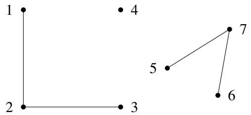

> 概念检查！在我们的住宅网络中，一个断开的顶点代表了什么？你为什么不想以这种方式设计一个社区？

请注意，任何图（即使是断开的图）总是由一组 **连通分量**（Connected Components） 组成的，即顶点集 $V_{1}, \dots, V_{k}$ ，使得集 $V_{i}$ 中的所有顶点都是连通的。例如，上面的图不是连通的，但它仍然由三个连通分量组成： $V_{1} = \{ 1, 2, 3 \}$ , $V_{2} = \{ 4 \}$ , 和 $V_{3} = \{ 5, 6, 7 \}$ 。

## 2 重温柯尼斯堡七桥问题：欧拉游历
有了图论的正式基础，我们准备重温柯尼斯堡七桥问题。这个问题到底在问什么？它说：给定一个图 $G$ （在这种情况下， $G$ 是柯尼斯堡的一个抽象）， $G$ 中是否存在一条刚好穿过每条边一次的行走？我们称图中的任何此类行走为 **欧拉行走**（Eulerian Walk）。（相比之下，根据定义，行走通常可以根据需要访问每条边或顶点任意多次。）此外，如果欧拉行走是封闭的，即它在起点处结束，那么它就被称为 **欧拉游历**（Eulerian Tour）。因此，柯尼斯堡七桥问题问的是：给定一个图 $G$ ，它是否有欧拉游历？我们现在根据图 $G$ 的更简单的性质来给出这一点的精确刻画。为此，将 **偶数度图**（Even Degree Graph） 定义为所有顶点度数均为偶数的图。

**定理 5.1**（欧拉定理 (1736)）。无向图 $G = (V, E)$ 具有欧拉游历当且仅当 $G$ 是偶数度的且连通的（除了孤立顶点外）。

**证明**。为了证明这一点，我们必须建立两个方向：充分性和必要性。

**必要性**：我们对前向方向给出一个直接证明，即如果 $G$ 有欧拉游历，那么它是连通的且度数为偶数。假设 $G$ 具有欧拉游历。这意味着每个具有与其相邻的边的顶点（即每个非孤立顶点）必然位于游历上，因此与游历上的所有其他顶点连通。这证明了图是连通的（除了孤立顶点外）。

接下来，我们通过展示与一个顶点关联的所有边都可以配对来证明每个顶点都具有偶数度。请注意，每当游历沿着一条边进入一个顶点时，它都会沿着另一条不同的边离开。我们可以将这两条边配对（它们在游历中再也不会被走过）。唯一的例外是起始顶点，离开它的第一条边无法以这种方式配对。但请注意，根据定义，游历必然在起始顶点结束。因此，我们可以将第一条边与进入起始顶点的最后一条边配对。因此，与游历中任何顶点相邻的所有边都可以被配对，因此每个顶点都具有偶数度。

**充分性**：我们给出了一个寻找欧拉游历的递归算法，并通过归纳法证明它能正确输出欧拉游历。

我们从一个有用的子程序 `FindTour(G, s)` 开始，它在 $G$ 中寻找一个游历（不一定是欧拉游历）。 `FindTour` 非常简单：它只是从顶点 $s \in V$ 开始走，每一步都选择与当前顶点关联且尚未走过的任何边，直到它卡住，因为没有更多相邻的未走边。我们现在证明 `FindTour` 实际上必然会卡在原始顶点 $s$ 处。

**断言 5.1**。 `FindTour(G, s)` 必然在 $s$ 处被卡住。

**断言的证明**：通过对行走长度的简单归纳证明表明，每当 `FindTour` 进入任何顶点 $v \neq s$ 时，它必然已经走过了与 $v$ 关联的奇数条边，而当它进入 $s$ 时，它必然已经走过了与 $s$ 关联的偶数条边。由于 $G$ 中的每个顶点的度数都是偶数，这意味着每当它进入 $v \neq s$ 时，至少还有一条与 $v$ 关联的未走边，因此行走不会在那里卡住。因此，它唯一能被卡住的顶点是 $s$ 。正式证明留作练习。 □

算法 `FindTour(G, s)` 当它卡在 $s$ 处时，返回它所走过的游历。请注意，虽然 `FindTour(G, s)` 总是能成功找到一个游历，但它并不总是返回一个欧拉游历。

我们现在给出一个递归算法 `Euler(G, s)` ，它输出一个以 $s$ 开始并结束的欧拉游历。 `Euler(G, s)` 调用了另一个子程序 `Splice(T, T1, ..., Tk)` ，它将若干个边不相交的游历 $T, T_{1}, \dots, T_{k} (k \geq 1)$ 作为输入，条件是游历 $T$ 与每个游历 $T_{i}$ 相交（即 $T$ 与每个 $T_{i}$ 共享一个顶点）。过程 `Splice(T, T1, ..., Tk)` 输出一个单一的游历 $T'$ ，它穿越了 $T, T_{1}, \dots, T_{k}$ 中的所有边，即它将所有的游历拼接在一起。组合游历 $T'$ 是通过穿越 $T$ 的边获得的，每当它到达一个与其他游历 $T_{i}$ 相交的顶点 $s_{i}$ 时，它就会绕道从 $s_{i}$ 回到 $s_{i}$ 穿越 $T_{i}$ ，然后才继续穿越 $T$ 。

算法 `Euler(G, s)` 如下：

```txt
Function Euler(G, s)  
  T = FindTour(G, s)  
  设 G1, ..., Gk 是从 G 中移除 T 的边后的连通分量  
  设 si 是 T 中第一个与 Gi 相交的顶点  
  Output Splice(T, Euler(G1, s1), ..., Euler(Gk, sk))  
End EULER
```

我们通过对 $G$ 的大小进行归纳来证明 `Euler(G, s)` 在 $G$ 中输出一个欧拉游历。无论我们将大小视为顶点数还是边数，同样的证明都适用。为具体起见，这里我们使用 $G$ 的边数 $m$ 。

**基准情况**： $m = 0$ ，这意味着 $G$ 是空的（它没有边），所以没有游历可言。

**归纳假设**：对于任何包含最多 $m \geq 0$ 条边的偶数度连通图， `Euler(G, s)` 输出一个欧拉游历。

**归纳步**：假设 $G$ 有 $m + 1$ 条边。回想一下 $T = FindTour(G, s)$ 是一个游历，因此在每个顶点都具有偶数度。因此，当我们从 $G$ 中移除 $T$ 的边时，我们留下了一个边数少于 $m$ 的偶数度图，但它可能是断连的。设 $G_{1}, \ldots, G_{k}$ 为连通分量。每个这样的连通分量都是偶数度的且连通的（除去孤立顶点）。此外， $T$ 与每个 $G_{i}$ 相交，且由于我们穿越了 $T$ ，存在它与 $G_{i}$ 相交的第一个顶点。将其命名为 $s_{i}$ 。根据归纳假设， `Euler(Gi, si)` 输出 $G_{i}$ 的欧拉游历。现在根据 `Splice` 的定义，它将各个游历拼接成一个包含 $G$ 中所有边的大型游历，即欧拉游历。 □

> 概念检查！为什么定理 5.1 暗示了柯尼斯堡七桥问题的答案是否定的？

## 3 树与完全图
在本节中，我们将介绍两类非常重要的特殊图，即完全图和树。在某种意义（我们将在第 5 节详细讨论）上，这些图分别是所有连通图中规模最大和最小的。

### 3.1 完全图
我们从最简单的一类图——完全图开始。为什么这类图被称为完全图？因为它们包含了最大可能数量的边。换句话说，在一个（无向）完全图件中，每一对（不同的）顶点 $u$ 和 $v$ 都通过一条边 $\{ u, v \}$ 相连。下图分别展示了具有 $n = 2, 3, 4$ 个顶点的完全图。

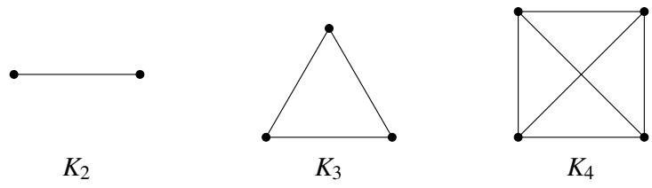

在此，符号 $K_{n}$ 表示 $n$ 个顶点上的唯一完全图。形式上，我们可以写成 $K_{n} = (V, E)$ ，其中 $|V| = n$ 且 $E = \{ \{ v_{i}, v_{j} \} \mid v_{i} \neq v_{j} \text{ 且 } v_{i}, v_{j} \in V \}$ 。

> 概念检查！
> 1. 你能画出 $K_{5}$ ，即 $n = 5$ 个顶点上的完全图吗？
> 2. $K_{n}$ 中每个顶点的度数是多少？

**练习**。 $K_{n}$ 中有多少条边？（答案： $n(n - 1) / 2$ ）验证你上面画的 $K_{5}$ 是否有这么多条边。

最后，我们也可以引入有向完全图，其定义正如你所预料的那样：对于任何一对顶点 $u$ 和 $v$ ， $(u, v)$ 和 $(v, u)$ 都属于 $E$ 。

### 3.2 树
树是一种不包含圈的连通图。事实上，对于图 $G = (V, E)$ 何时是一棵树，有几个等价的定义，包括以下这些：

1. $G$ 是连通的且不包含圈。
2. $G$ 是连通的且具有 $n - 1$ 条边（其中 $n = |V|$ ）。
3. $G$ 是连通的，且移除任何一条边都会使 $G$ 断开。
4. $G$ 没有圈，且增加任何一条边都会产生一个圈。

这里是树的三个例子：

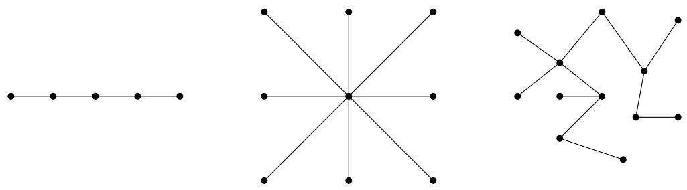

> 概念检查！
> 1. 说服自己上述三个图满足树的所有四个等效定义。
> 2. 给出一个不是树的图的例子。

请注意，对于任何给定的顶点数 $n$ ，可能存在的树的数量都非常庞大（确切地说是 $n^{n-2}$ ）。这与完全图形成了鲜明对比，后者的对于任何给定的 $n$ 都是唯一的。

为什么树很重要？原因之一是许多在任意图上计算困难的图论问题（如最大割问题 Maximum Cut），在树上都很容易解决。另一个原因是它们模拟了对象之间的许多类型的自然关系。为了演示，我们引入 **有根树**（Rooted Tree）的概念，下面给出了一个示例。

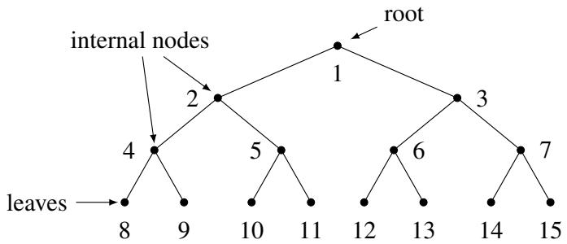

在有根树中，有一个被称为 **根**（Root） 的指定节点，我们认为它位于树的顶部。树的顶点可以被认为被分为 $d + 1$ 层，其中对于 $k \in \{ 0, 1, \ldots, d \}$ ，第 $k$ 层是通过恰好由 $k$ 条边组成的路径与根相连的顶点集。我们称 $d$ 为树的 **深度**（Depth）。度数为 1 的顶点（根节点除外）被称为 **叶子**（Leaf），中间的顶点被称为 **内部节点**（Internal Node）。（在一般的无源树中，叶子是任何度数为 1 的顶点。）

> 概念检查！
> 1. 上面这棵树的深度是多少？（答案：3）
> 2. 上面这棵树的第 0 层有哪些顶点？第 3 层呢？

有根树在什么地方派上用场？例如，考虑细菌细胞分裂的情景。在这种情况下，根可能代表单个细菌，此后的每一层对应于细胞分裂，在分裂中细菌分裂成两个新的细菌。有根树也可以用于允许快速搜索有序元素集，例如在二分搜索树中，你可能在学习中已经遇到过。

关于树的一件好事是，归纳法在证明它们的性质时特别有效。让我们用一个恰当的例子来演示：我们将证明上面给出的树的前两个定义确实是等价的。

**定理 5.2**。陈述“G 是连通的且不包含圈”和“G 是连通的且具有 $n - 1$ 条边”是等价的。

**证明**。我们通过展示正向和反向来证明。

**正向**：我们使用对 $n$ 的强归纳法证明，如果 $G$ 是连通的且不包含圈，那么 $G$ 是连通的且具有 $n - 1$ 条边。假设 $G = (V, E)$ 是连通的且不包含圈。

**基准情况**（$n = 1$）：在这种情况下， $G$ 是单个顶点且没有边。因此，主张成立。

**归纳假设**：假设对于 $1 \leq n \leq k$ ，该主张为真。

**归纳证明**：我们展示 $n = k + 1$ 的主张。从 $G$ 中移除一个任意的顶点 $v \in V$ 及其关联的边，并将结果图称为 $G'$ 。显然，移除顶点不会产生圈；因此， $G'$ 不包含圈。然而，移除 $v$ 可能会导致断开的图 $G'$ ，在这种情况下，归纳假设无法应用于整个 $G'$ 。因此，我们需要检查两种情况——或者是 $G'$ 连通，或者是 $G'$ 断开。这里，我们展示前一种情况，因为它更简单且捕捉了基本的证明思路。后一种情况作为下面的练习。

因此，假设 $G'$ 是连通的。但现在 $G'$ 是一个具有 $k$ 个顶点且没有圈的连通图，所以我们可以对 $G'$ 应用归纳假设，得出 $G'$ 是连通的且具有 $k - 1$ 条边的结论。现在让我们将 $v$ 加回 $G'$ 以获得 $G$ 。有多少边可以与 $v$ 关联？嗯，由于 $G'$ 是连通的，那么如果 $v$ 与多于一条边关联， $G$ 将包含一个圈。但根据假设 $G$ 没有圈！因此， $v$ 必须与一条边关联，这意味着 $G$ 具有 $(k - 1) + 1 = k$ 条边，正如所愿。

**反向**：我们使用反证法证明，如果 $G$ 是连通的且具有 $n - 1$ 条边，那么 $G$ 是连通的且不包含圈。假设 $G$ 是连通的，具有 $n - 1$ 条边，且包含一个圈。那么，根据圈的定义，移除圈中的任何一条边都不会使图 $G$ 断开。换句话说，我们可以移除圈中的一条边以获得一个新的连通图 $G'$ ，它由 $n - 2$ 条边组成。然而，我们断言 $G'$ 必然是断连的，这将产生我们想要的矛盾。这是因为为了使图连通，它必须至少有 $n - 1$ 条边。这是一个你在下面的练习中必须证明的事实。这完成了反向证明。 □

## 4 平面图与欧拉公式
如果一个图可以绘制在平面上且没有交叉，则它是 **平面图**（Planar Graph）。例如，下面显示的前四个图是平面图。请注意，第一和第二个图是相同的，但绘制方式不同。尽管第二个画法有交叉，但该图仍被认为是平面图，因为可以不用交叉地画出它。

另外三个图是非平面图。其中的第一个是声名狼藉的“三屋三井图”，也被称为 $K_{3,3}$ （这种表示法说有两组顶点，每组大小为三，且两组顶点之间的所有边都存在）。第二个是五个节点的“完全”图（每条边都存在），或 $K_{5}$ 。第三个是四维立方体。我们很快就会看到如何证明这三个图都是非平面的。

一个有用的概念是 **二部图**（Bipartite Graph）的概念， $G = (V, E)$ 是一个图，其中的顶点被分成两组，边只在两组之间。更正式地，我们有 $V = L \cup R$ 且 $E \subseteq L \times R$ 。显然， $K_{3,3}$ 是二部的。此外，四维立方体是二部的：这源于立方体中的每一个圈都具有偶数长度的事实。稍后我们将展示其等价性。

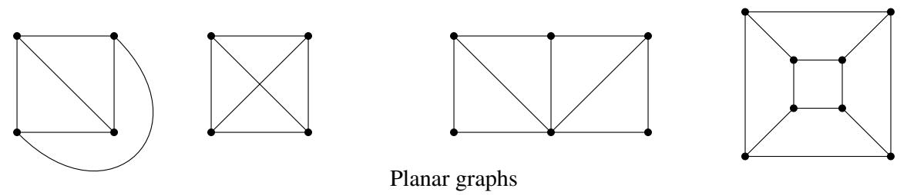

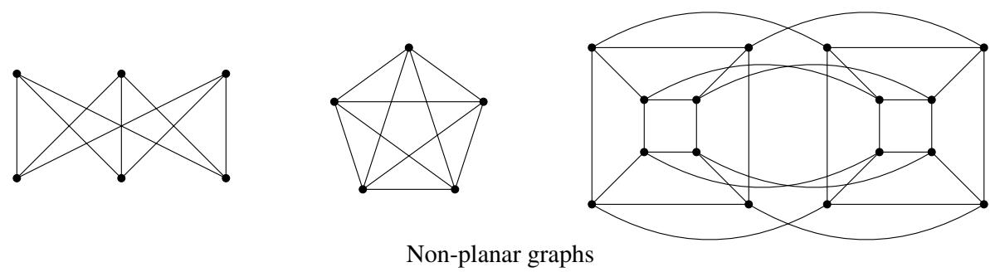

当一个平面图画在平面上时，除了它的顶点（在这里其数量记为 $v$ ）和边（其数量为 $e$ ）之外，还可以区分该图（更准确地说是画法）的 **面**（Face）。面是图将平面细分成的区域。其中一个是无限的（“外部”面），其他的是有限的。面的数量记为 $f$ 。例如，对于所示的第一个图 $f = 4$ ，对于第四个（立方体） $f = 6$ 。

关于平面图的一个基本且重要的事实是欧拉公式： $v + f = e + 2$ （在上面的图中检查一下）。它有一个有趣的故事。古希腊人知道这个公式适用于所有的多面体（例如，在立方体、四面体和八面体上检查一下），但无法证明它。你如何在多面体上做归纳？你如何应用归纳假设？一个多面体减去一个顶点或一条边是什么？在 18 世纪欧拉意识到，这是由于归纳假设太弱而无法通过归纳证明定理的一个例子，我们在学习归纳时一再看到这种情况。为了证明这个定理，必须推广多面体。而正确的推广就是平面图。

**练习**。你能明白为什么平面图推广了多面体吗？为什么所有的（凸）多面体都是平面图？

**定理 5.3**（欧拉公式）。对于每一个连通平面图， $v + f = e + 2$ 。

**证明**：对 $e$ 进行归纳。当 $e = 0$ 且 $v = f = 1$ 时，它显然成立。现在取任何一个连通平面图 $G$ 。有两种情况需要考虑：

• 如果 $G$ 是一棵树，那么 $f = 1$ （在平面上画一棵树不会细分平面），且 $e = v - 1$ 。所以公式成立。
• 如果 $G$ 不是一棵树，找一个圈并删除该圈的任何一条边。这相当于将 $e$ 和 $f$ 分别减少一个。通过归纳，公式在较小的图中是正确的，因此它在原始图中也必定是正确的。

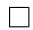

**练习**。当图不连通时会发生什么？连通分量的数量如何进入公式？

取一个具有 $f$ 个面的平面图，并考虑其中一个面。它有若干个边，即顺时针包围它的边。请注意，如果一条边的两侧具有相同的面，则该边可能会被计数两次，例如在树中发生的情况（此类边被称为“桥”）。用 $s_{i}$ 表示第 $i$ 个面的边数。现在，如果我们将所有的 $s_{i}$ 相加，我们必然会得到 $2e$ ，因为每条边被计算两次，一次为其右侧的面，一次为其左侧的面（如果边是桥，则这些面可能重合）。我们得出结论，在任何平面图中，

$$
\sum_{i = 1}^{f} s_{i} = 2e \tag{1}
$$

现在注意，由于我们不允许在相同的两个节点之间存在平行边，且如果我们假设至少有两条边（因此至少有三个顶点），那么每个面至少有三个边，或者说对于所有的 $i$ ， $s_{i} \geq 3$ 。由此得出 $3f \leq 2e$ 。解出 $f$ 并代入欧拉公式，我们得到

$$
e \leq 3v - 6.
$$

这是一个重要的事实。首先它告诉我们平面图是 **稀疏的**（Sparse）：即它们不能有太多的边。一个 1,000 个顶点的连通图可以有从一千到五十万条边之间的任何位置。这个不等式告诉我们，对于平面图，范围要小得多，在 999 到 2,994 之间。

它还告诉我们 $K_{5}$ 不是平面的：只需注意到它有五个顶点和十条边。

$K_{3,3}$ 具有 $v = 6, e = 9$ ，因此它非常出色地通过了平面性测试。我们必须再多想一点来证明 $K_{3,3}$ 是非平面的。请注意，如果我们要能够把它画在平面上，就不会有三角形：这是因为三角形意味着要么两口井或者是两所房子相互连接，而事实并非如此。所以，我们现在可以将我们从 (1) 得到的结果从 $3 f \le 2 e$ 强化到 $4 f \le 2 e$ 。像之前一样解出 $f$ 并代入欧拉公式，现在得出了更强的结论 $e \le 2 v - 4$ ，这表明 $K _ { 3 , 3 }$ 确实是非平面的！

因此，我们已经建立了 $K_{5}$ 和 $K_{3,3}$ 都是非平面的结论。这里还有更深层的东西：在某种意义上，这些是 **唯一** 的非平面图。波兰数学家库拉托夫斯基（Kuratowski，这就是“K”的含义）的以下著名结果精确地说明了这一点。

**定理 5.4**。一个图是非平面的当且仅当它包含 $K_{5}$ 或 $K_{3,3}$ 。

这里的“包含”意味着可以在图中标识出节点（在 $K_{5}$ 的情况下为五个，在 $K_{3,3}$ 的情况下为六个），这些节点通过路径（可能是单条边）像相应的图一样连接，且这些路径中没有两条共享一个顶点。例如，图 3 所示的 4-立方体是非平面的，因为它包含 $K_{3,3}$ ，如图所示。

图 3： 4-立方体中的 $K_{3,3}$ （要查看动画，请使用 Adobe Acrobat 或其他支持 PDF 动画的 PDF 阅读器）

**练习**。你能在同一个图中找到 $K_{5}$ 吗？

库拉托夫斯基定理的一个方向是显而易见的：如果一个图包含这两个非平面图之一，那么它本身当然是非平面的。由于另一个方向，即在没有这些图的情况下我们可以绘制任何图在平面上，这是困难的。如果你对证明感兴趣，你可能想在 Google 上搜索“库拉托夫斯基定理的证明”。

## 5 连通性与超立方体
正如我们所看到的，图是一个抽象而通用的结构，允许我们表示对象（如房屋和道路）之间的关系。图的一个特别重要的应用是作为互联网（或其他一些网络）上路由器之间相互连接的表示。要将一个数据包从一个节点发送到另一个节点，我们需要在这个图中找到一条从源到目的地的路径。因此，为了能够从任何节点向任何其他节点发送数据包，我们需要图是连通的。最小连通图被称为树，它是我们可以用来连接任何顶点集的最有效的图（即具有最小边数的图）。更具体地说，如果树网络中的任何一条边（连接）失效，那么网络就会断开，且有些节点我们将无法到达。为了避免这种情况，我们希望网络连接中具有某种冗余或 **鲁棒性**（Robustness）。

另一个极端是完全图，它包含了每一对节点之间的连接。这个网络连接得极其紧密，如以下练习所示。

**练习**。要使 $K_{n}$ 变得断开，最少必须移除多少条边？[提示：要包含一个孤立顶点，必须移除多少条边？]

然而，完全图作为一种网络架构是完全不切现实的，因为它包含了太多的边：确切地说是 $\frac{n(n-1)}{2} \sim \frac{n^{2}}{2}$ 。在实践中，只要节点与节点之间的最大距离（也称为网络的“直径” Diameter）不太大，就不需要在每对节点之间建立直接连接。

在本节中，我们研究一类被称为 **超立方体图**（Hypercube Graphs） 的精品图，它结合了两个世界的优点：它们具有鲁棒的连接性且直径较小，但不会使用太多的边。

我们讨论了完全图是如何作为顶点的“连接性非常好”的一类图。然而，为了实现这种强大的连接性，需要大量的边，这在图论的许多应用中是不可行的。以连接机器（Connection Machine）为例，它是 20 世纪 80 年代由思维机器公司设计的大规模并行计算机。连接机器的想法是让一百万个处理器并行工作，所有处理器都通过一个通信网络相连。如果你要将每对这样的处理器用一根直接的电线连接起来以允许它们通信（即，如果你使用完全图来模拟你的通信网络），这将需要 $10^{12}$ 根电线！因此，连接机器的建造者决定使用 20 维超立方体来模拟他们的网络，这仍然允许强大水平的连通性，同时将网络中每个处理器的邻居数量限制在 20 个。本节致力于研究这类特别有用的图，即超立方体。

$n$ 维超立方体 $G = (V, E)$ 的顶点集由 $V = \{ 0, 1 \}^{n}$ 给出，回想一下 $\{ 0, 1 \}^{n}$ 表示所有 $n$ 位二进制字符串的集合。换句话说，每个顶点由一个独特的 $n$ 位二进制字符串标记，例如 $00110 \cdots 0100$ 。边集 $E$ 定义如下：两个顶点 $x$ 和 $y$ 通过边 $\{ x, y \}$ 连接当且仅当 $x$ 和 $y$ 在恰好一个位的位置上不同。例如， $x = 0000$ 和 $y = 1000$ 是邻居，但 $x = 0000$ 和 $y = 0011$ 不是。更正式地， $x = x_{1}x_{2} \ldots x_{n}$ 和 $y = y_{1}y_{2} \ldots y_{n}$ 是邻居当且仅当存在一个 $i \in \{ 1, \ldots, n \}$ 使得 $x_{j} = y_{j}$ 对于所有的 $j \neq i$ ，并且 $x_{i} \neq y_{i}$ 。为了帮助你想象超立方体，我们在下面描绘了 1 维、 2 维和 3 维的超立方体。

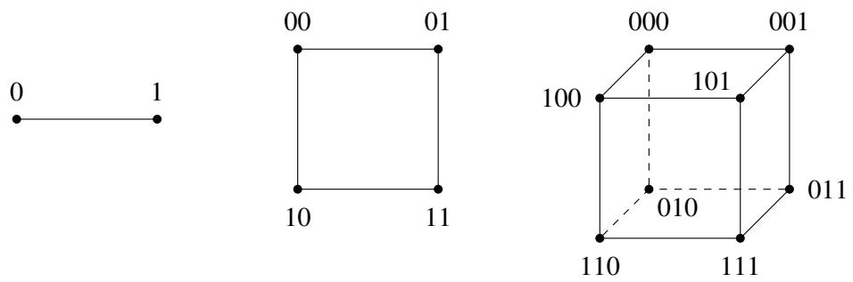

有一种通过递归定义 $n$ 维超立方体的替代且有用的方法，我们现在讨论它。将 0-子立方体（0-subcube）（以及 1-子立方体 1-subcube）定义为 $(n-1)$ 维超立方体，其顶点分别带有标签 $0x$ （对于 $x \in \{ 0, 1 \}^{n-1}$ ）（以及 $1x$ 对于 $x \in \{ 0, 1 \}^{n-1}$ ）。然后，通过在 0-子立方体中的每个顶点 $0x$ 和 1-子立方体中相应的顶点 $1x$ 之间放置一条边，来获得 $n$ 维超立方体。

> 概念检查！在上面描绘的 3 维超立方体中， 0-子立方体和 1-子立方体在哪里？你能将这些连同上面的递归定义一起用来画出 4 维超立方体吗？

**练习**。证明 $n$ 维超立方体具有 $2^{n}$ 个顶点，且它的直径（任何两个顶点之间路径的最大长度）为 $n$ 。[提示：利用每个位有两种可能的设置： 0 或 1 的事实。] 注意，直径比顶点数要指数级地小！

我们在本节开始时赞美了超立方体在连通性方面的性质；我们现在正式研究这些主张。让我们先为超立方体一个简单性质给出的两个证明做热身。每个证明都依赖于我们对超立方体两个等效定义（即直接定义和递归定义）中的一个。

**引理 5.1**。 $n$ 维超立方体中边的总数为 $n 2^{n-1}$ 。

**证明 1**：每个顶点的度数为 $n$ ，因为在任何 $x \in \{ 0, 1 \}^n$ 中， $n$ 个位的位置都可以被翻转。由于每条边都被计算了两次（从每个端点各计算一次），这产生了总共 $n 2^{n} / 2 = n 2^{n-1}$ 条边。 □

**证明 2**：由超立方体的第二种定义可知， $E(n) = 2E(n - 1) + 2^{n-1}$ ，且 $E(1) = 1$ ，其中 $E(n)$ 表示 $n$ 维超立方体中边的数量。简单的归纳法表明 $E(n) = n 2^{n-1}$ 。 □

**练习**。使用归纳法在上面的证明 2 中展示 $E(n) = n 2^{n-1}$ 。

让我们现在关注连通性问题，并证明 $n$ 维超立方体在以下意义上是连通良好的：为了使顶点的任何子集 $S \subseteq V$ 与图中其余部分断开，必须移除大量的边。特别地，我们将看到移除边的数量必然随 $|S|$ 扩展。在下面的定理中，回想一下 $V - S = \{ v \in V \mid v \not\in S \}$ 是不在 $S$ 中的顶点集。

**定理 5.5**。在 $n$ 维超立方体 $G = (V, E)$ 中，设 $S \subseteq V$ 使得 $|S| \leq |V - S|$ （即 $|S| \leq 2^{n-1}$ ），并设 $E_{S}$ 表示连接 $S$ 与 $V - S$ 的边集，即

$$
E_{S} := \{ \{ u, v \} \in E \mid u \in S \text{ 且 } v \in V - S \}.
$$

那么，必然有 $|E_{S}| \geq |S|$ 。

**证明**。我们对 $n$ 进行归纳。

**基准情况**（$n = 1$）： 1 维超立方体图有两个顶点 0 和 1，以及一条边 $\{ 0, 1 \}$ 。我们还有假设 $|S| \leq 2^{1-1} = 1$ ，所以有两种可能性。首先，如果 $|S| = 0$ ，那么该主张显然成立。否则，如果 $|S| = 1$ ，那么 $S = \{ 0 \}$ 且 $V - S = \{ 1 \}$ ，或者反之。在任何一种情况下由我们都有 $E_{S} = \{ 0, 1 \}$ ，所以 $|E_{S}| = 1 = |S|$ 。

**归纳假设**：假设对于 $1 \leq n \leq k$ ，该主张成立。

**归纳步**：我们证明 $n = k + 1$ 的主张。回想我们有假设 $|S| \le 2^{k}$ 。设 $S_{0}$ （以及 $S_{1}$ ）是 $S$ 中来自 0-子立方体（以及 1-子立方体）的顶点。我们可以不失一般性地假设 $|S_{0}| \geq |S_{1}|$ ：如果不是，那么我们可以在下面的论证中互换 $S_{0}$ 和 $S_{1}$ 的角色。我们有两种情况需要检查： $S$ 要么与 0-子立方体和 1-子立方体具有相当平等的交叉大小，要么不是。

1. 情况 1： $|S_{0}| \leq 2^{k-1}$ 且 $|S_{1}| \leq 2^{k-1}$
在这种情况下，我们可以分别对 0-子立方体和 1-子立方体应用归纳假设。这表明，仅限于 0-子立方体，在 $S_{0}$ 及其（在 0-子立方体中的）补集之间至少有 $|S_{0}|$ 条边；同样地，在 $S_{1}$ 及其（在 1-子立方体中的）补集之间至少有 $|S_{1}|$ 条边。因此， $S$ 和 $V - S$ 之间的边总数至少为 $|S_{0}| + |S_{1}| = |S|$ ，正如所愿。

2. 情况 2： $S_{0} > 2^{k-1}$
在这种情况下， $S_{0}$ 对于应用归纳假设来说不幸地太大了。然而，注意由于 $|S| \leq 2^{k}$ ，我们有 $|S_{1}| = |S| - |S_{0}| \leq 2^{k-1}$ ，所以我们可以对 $S_{1}$ 应用假设。正如在情况 1 中，这允许我们得出结论：在 1-子立方体中，在 $S$ 和 $V - S$ 之间至少有 $|S_{1}|$ 条跨越边。

那么 0-子立方体呢？在这里，我们不能直接应用归纳假设，但在稍作处理后有一种应用它的方法。考虑集合 $V_{0} - S_{0}$ ，其中 $V_{0}$ 是 0-子立方体中的顶点集。注意 $|V_{0}| = 2^{k}$ 且 $|V_{0} - S_{0}| = |V_{0}| - |S_{0}| = 2^{k} - |S_{0}| < 2^{k} - 2^{k-1} = 2^{k-1}$ 。因此，我们可以对集合 $V_{0} - S_{0}$ 应用归纳假设。这得出了 $S_{0}$ 和 $V_{0} - S_{0}$ 之间的边数至少为 $2^{k} - |S_{0}|$ 。将目前为止对 0-子立方体和 1-子立方体的总计相加，我们得出在 $S$ 和 $V - S$ 之间至少有 $2^{k} - |S_{0}| + |S_{1}|$ 条跨越边。然而，回想我们的目标是展示跨越边的数量至少为 $|S|$ ；因此，离我们希望的目标还差一点。

但还有一些边我们没有考虑到——即 $E_{S}$ 中跨越 0-子立方体和 1-子立方体的那些。由于在每一个形如 $0x$ 的顶点和对应的顶点 $1x$ 之间都有一条边，我们得出结论：在 $E_{S}$ 中至少有 $|S_{0}| - |S_{1}|$ 条两个子立方体之间的跨越边。因此，跨越边的总数至少为 $2^{k} - |S_{0}| + |S_{1}| + |S_{0}| - |S_{1}| = 2^{k} \geq |S|$ ，正如所欲证明。 □

## 6 练习题
1. **德布鲁因序列**（de Bruijn Sequence）是一个 $2^{n}$ 位的循环序列，使得每一个长度为 $n$ 的字符串都作为该序列的连续子串恰好出现一次。例如，下面是 $n = 3$ 情况下的德布鲁因序列：

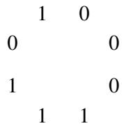

请注意，有 8 个长度为 3 的子串，每个子串对应一个从 0 到 7 的二进制数，如 000, 001, 010 等。事实证明，此类序列可以从德布鲁因图（de Bruijn graph）生成，德布鲁因图是顶点集 $V = \{ 0, 1 \}^{n-1}$ （即所有 $n-1$ 位二进制字符串的集合）上的有向图 $G = (V, E)$ 。每个顶点 $a_{1}a_{2} \ldots a_{n-1} \in V$ 有两条出边：

$$
(a_{1}a_{2} \dots a_{n-1}, a_{2}a_{3} \dots a_{n-1}0) \in E \quad \text{和} \quad (a_{1}a_{2} \dots a_{n-1}, a_{2}a_{3} \dots a_{n-1}1) \in E.
$$

因此，每个顶点也有两条入边：

$$
(0a_{1}a_{2} \dots a_{n-2}, a_{1}a_{2} \dots a_{n-1}) \in E \quad \text{和} \quad (1a_{1}a_{2} \dots a_{n-2}, a_{1}a_{2} \dots a_{n-1}) \in E.
$$

例如，对于 $n = 4$ ，顶点 110 有两条指向 100 和 101 的出边，以及两条来自 011 和 111 的入边。请注意，这些是有向边，且允许自环。

德布鲁因序列是由德布鲁因图中的欧拉游历生成的。欧拉定理（定理 5.1）可以被修改以适用于有向图——我们需要修改的只是第二个条件，现在它应该表述为：“对于每一个 $V$ 中的顶点 $v$ ， $v$ 的入度等于 $v$ 的出度。”显然，德布鲁因图满足此条件，因此它具有欧拉游历。

为了实际生成序列，从任何顶点开始，我们沿着游历走，并在穿越每条边时添加由于从右侧移入而产生的相应位。这里是 $n = 3$ 时的德布鲁因图。

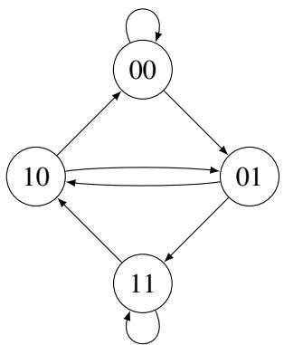

找出生成上述给出的德布鲁因序列的此图的欧拉游历。

2. 在这个问题中，我们完成定理 5.2 证明的归纳组件。

(a) 假设在证明中 $G'$ 有两个互不相同的连通分量 $G_{1}'$ 和 $G_{2}'$ 。完成归纳步骤以展示 $G$ 是连通的且具有 $n - 1$ 条边。（提示：论证你可以分别对 $G_{1}'$ 和 $G_{2}'$ 应用归纳假设。注意这需要强归纳法！）
(b) 更一般地， $G'$ 可能有 $t \geq 2$ 个互不相同的连通分量 $G_{1}'$ 到 $G_{t}'$ ——在这个情境下推广你上面的论证，以便完成定理 5.2 的证明。

**人生教训**：这个问题教给你如何解决问题的一般范式，无论是在计算机科学研究中还是在日常生活中。具体来说，当面对一个难题时（如定理 5.2 的证明），首先尝试在可能的最简单情况下解决它（如当 $G'$ 连通时）。然后，逐渐扩展你的解决方案以处理更困难的情况，直到建立起一般的断言（即 $G'$ 有 $t$ 个连通分量）。

3. 证明任何顶数数为 $n$ 的连通图至少必然具有 $n - 1$ 条边，使用对顶点数 $n$ 的归纳法。