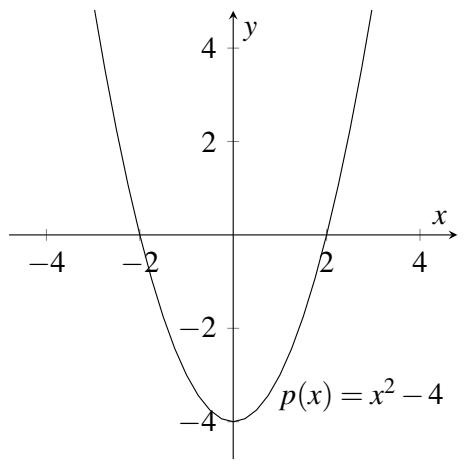
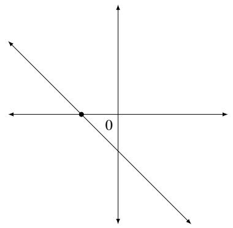
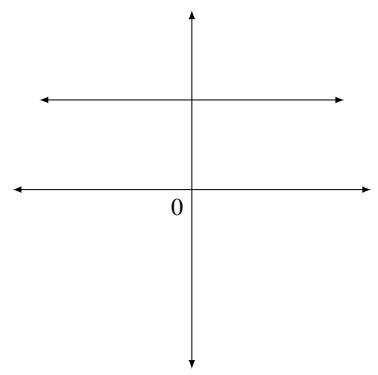
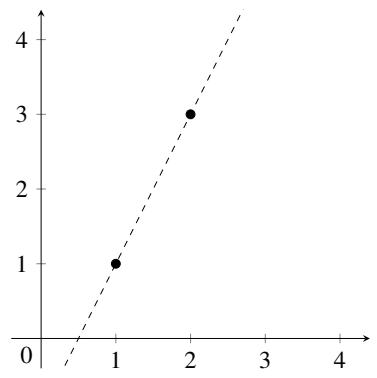
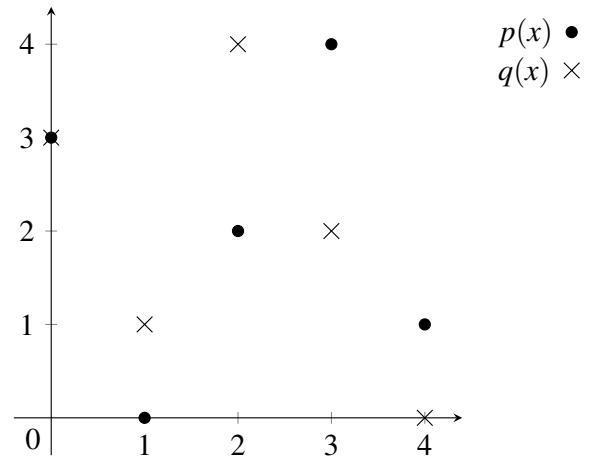
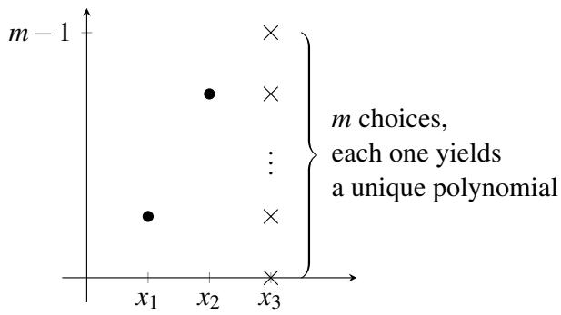

# 008 - 多项式

## 1 多项式
多项式构成了一类丰富的函数，它们既易于描述，又广泛应用于从傅里叶分析、加密和通信到控制和计算几何等各个领域。在本讲义中，我们将讨论多项式的更多特性，正是这些特性使它们如此有用。这里的核心思想是将你已经了解的关于实数和复数域上的多项式的知识扩展到同余运算中。然后，我们将描述如何利用这些特性来开发秘密共享方案。

回想一下高中数学，单变量多项式是形如 $p(x) = a_d x^d + a_{d-1} x^{d-1} + \dots + a_1 x + a_0$ 的表达式。这里，变量 $x$ 和系数 $a_i$ 通常是实数。例如，$p(x) = 5x^3 + 2x + 1$ 是一个次数为 $d = 3$ 的多项式。它的系数为 $a_3 = 5$，$a_2 = 0$，$a_1 = 2$，$a_0 = 1$。多项式具有一些非常简单、优雅且强大的特性，我们将在本讲义中探讨这些特性。

多项式代表一个函数，可以使用加法和乘法自然地求值。例如，$p(x) = 5x^3 + 2x + 1$ 可以在 $x = 3$ 处求值，得到 $p(3) = 5(3)^3 + 2(3) + 1 = 142$。

如果 $p(a) = 0$，我们说 $a$ 是多项式 $p(x)$ 的一个**根**（root）。例如，2 次多项式 $p(x) = x^2 - 4$ 有两个根，即 2 和 -2，因为 $p(2) = p(-2) = 0$。如果我们在 $x-y$ 平面上绘制多项式 $p(x)$，那么该多项式的根就是曲线与 $x$ 轴相交的地方：

我们现在阐述多项式的两个基本性质，稍后将对其进行证明。

**性质 1**：次数为 $d$ 的非零多项式最多有 $d$ 个根。

**性质 2**：给定 $d + 1$ 个点对 $(x_1, y_1), \dots, (x_{d+1}, y_{d+1})$，其中所有 $x_i$ 互不相同，存在唯一的次数（最多）为 $d$ 的多项式 $p(x)$，使得对于 $1 \leq i \leq d+1$，有 $p(x_i) = y_i$。

让我们考虑这两个性质在 $d = 1$ 的情况下的含义。实数域上的一阶（1 次）多项式 $y = a_1 x + a_0$ 的图像是一条直线。性质 1 说，如果一条直线不是 $x$ 轴（即，如果多项式不是 $y = 0$），那么它与 $x$ 轴最多相交于一点。

性质 2 说，两点唯一确定一条直线。

## 2 多项式插值
性质 2 说，两点唯一确定一个 1 次多项式（直线），三点唯一确定一个 2 次多项式（抛物线），四点唯一确定一个 3 次多项式（立方曲线），依此类推。给定 $d + 1$ 个点对 $(x_1, y_1), \dots, (x_{d+1}, y_{d+1})$，我们如何确定多项式 $p(x) = a_d x^d + \dots + a_1 x + a_0$，使得对于 $1 \leq i \leq d+1$，有 $p(x_i) = y_i$？我们将给出一种重构系数 $a_0, \dots, a_d$ 并从而重构多项式 $p(x)$ 的算法。（下讲义将描述另一种更显式地基于线性代数的标准算法，它在不同的应用中会很有用。）

这里的方法被称为**拉格朗日插值**（Lagrange interpolation），它应该会让你想起中国剩余定理：让我们从解决一个较简单的问题开始。假设我们得知 $y_1 = 1$，且对于 $2 \leq j \leq d+1$，有 $y_j = 0$。现在我们能重构 $p(x)$ 吗？是的，这很简单！考虑 $q(x) = (x - x_2)(x - x_3) \dots (x - x_{d+1})$。这是一个 $d$ 次多项式（$x_i$ 是常数，$x$ 出现了 $d$ 次）。此外，显然对于 $2 \leq j \leq d+1$，有 $q(x_j) = 0$。那么 $q(x_1)$ 是多少呢？嗯，$q(x_1) = (x_1 - x_2)(x_1 - x_3) \dots (x_1 - x_{d+1})$，这是一个不等于 0 的常数（因为 $x_1$ 不等于任何其他 $x_i$）。因此，如果我们令 $p(x) = q(x) / q(x_1)$（除法是可行的，因为 $q(x_1) \neq 0$），我们就得到了我们要寻找的多项式。例如，假设给定点对 $(1, 1), (2, 0), (3, 0)$。那么我们可以通过令 $q(x) = (x - 2)(x - 3) = x^2 - 5x + 6$，且 $q(x_1) = q(1) = 2$，来构造 $d = 2$ 次多项式 $p(x)$。因此，我们现在可以构造 $p(x) = q(x) / q(1) = (x^2 - 5x + 6) / 2$。

当然，如果我们挑选某个任意索引 $i$ 而不是 1，即 $y_i = 1$ 且对于 $j \neq i$ 有 $y_j = 0$，这个问题也同样简单。让我们引入一些符号：用 $\Delta_i(x)$ 表示通过这 $d+1$ 个点的 $d$ 次多项式。那么 $\Delta_i(x) = \frac{\prod_{j \neq i} (x - x_j)}{\prod_{j \neq i} (x_i - x_j)}$。

现在我们回到原始问题。给定 $d+1$ 个点对 $(x_1, y_1), \dots, (x_{d+1}, y_{d+1})$，我们首先按照上述方法构造 $d+1$ 个多项式 $\Delta_1(x), \dots, \Delta_{d+1}(x)$。现在我们主张，我们可以写出 $p(x) = \sum_{i=1}^{d+1} y_i \Delta_i(x)$。为什么这可行呢？首先注意到 $p(x)$ 是一个 $d$ 次多项式，符合要求，因为它是 $d$ 次多项式的和。其次，当它在 $x_i$ 处求值时，和式中的 $d+1$ 项中有 $d$ 项的值为 0，而第 $i$ 项的值为 $y_i$ 乘以 1，符合要求。

在上述构造中，我们可以将多项式 $\Delta_i(x)$ 视为在点 $\{x_j\}$ 处指定值的所有多项式的“自然基”。注意，这些基多项式仅取决于 $x_j$，而不取决于这些点处的值 $y_j$。然后我们对基多项式 $\Delta_i$ 进行求和，系数等于对应的值 $y_i$，以构造所需的多项式 $p(x)$。请注意这里与我们在证明中国剩余定理时使用的构造的相似之处：基多项式 $\Delta_i(x)$ 与中国剩余定理中的基数 $u_i$ 起到了类似的作用。

举个例子，假设我们想要找到通过三个点 $(x_1, y_1) = (1, 1), (x_2, y_2) = (2, 2)$ 和 $(x_3, y_3) = (3, 4)$ 的 2 次多项式 $p(x)$。三个多项式 $\Delta_i$ 如下：

$$
\Delta_1(x) = \frac{(x - 2)(x - 3)}{(1 - 2)(1 - 3)} = \frac{(x - 2)(x - 3)}{2} = \frac{1}{2}x^2 - \frac{5}{2}x + 3;
$$

$$
\Delta_2(x) = \frac{(x - 1)(x - 3)}{(2 - 1)(2 - 3)} = \frac{(x - 1)(x - 3)}{-1} = -x^2 + 4x - 3;
$$

$$
\Delta_3(x) = \frac{(x - 1)(x - 2)}{(3 - 1)(3 - 2)} = \frac{(x - 1)(x - 2)}{2} = \frac{1}{2}x^2 - \frac{3}{2}x + 1.
$$

因此，多项式 $p(x)$ 为：

$$
p(x) = 1 \cdot \Delta_1(x) + 2 \cdot \Delta_2(x) + 4 \cdot \Delta_3(x) = \frac{1}{2}x^2 - \frac{1}{2}x + 1.
$$

你应该核实该多项式确实通过上述三个点。

### 2.1 性质 2 的证明
我们现在可以证明前面提到的性质 2，即：

**性质 2**：给定 $d + 1$ 个点对 $(x_1, y_1), \dots, (x_{d+1}, y_{d+1})$，其中所有 $x_i$ 互不相同，存在唯一的次数（最多）为 $d$ 的多项式 $p(x)$，使得对于 $1 \leq i \leq d+1$，有 $p(x_i) = y_i$。

我们已经在上文中展示了如何找到满足 $p(x_i) = y_i$ 的多项式 $p(x)$。这证明了性质 2 的一部分（多项式的存在性）。我们该如何证明第二部分，即多项式的唯一性呢？假设为了导出矛盾，存在另一个多项式 $q(x)$ 满足上述所有 $d+1$ 个点对的点。现在考虑多项式 $r(x) = p(x) - q(x)$。由于我们假设 $q(x)$ 和 $p(x)$ 是不同的多项式，因此 $r(x)$ 必须是一个次数最多为 $d$ 的非零多项式。根据性质 1（稍后证明），它最多可以有 $d$ 个根。但另一方面，在 $d+1$ 个互不相同的点 $x_i$ 处，$r(x_i) = p(x_i) - q(x_i) = 0$，所以 $r(x)$ 至少有 $d+1$ 个根。矛盾。因此，$p(x)$ 是通过这 $d+1$ 个点的唯一多项式。

### 多项式除法
让我们稍微偏离一下主题，讨论一下多项式除法，这在性质 1 的证明中会很有用。如果我们有一个 $d$ 次多项式 $p(x)$，我们可以使用长除法将其除以一个次数 $\leq d$ 的多项式 $q(x)$。结果将是：

$$
p(x) = q'(x)q(x) + r(x)
$$

其中 $q'(x)$ 是商，$r(x)$ 是余数。$r(x)$ 的次数必须小于 $q(x)$ 的次数。我们可以使用多项式的长除法来计算商和余数，如下例所示。

**示例**。我们希望将 $p(x) = x^3 + x^2 - 1$ 除以 $q(x) = x - 1$：

*   首先我们减去一个因子 $x^2(x - 1)$，得到：$p(x) = x^2(x - 1) + (2x^2 - 1)$
*   然后我们减去一个因子 $2x(x - 1)$，将余数写成 $2x^2 - 1 = 2x(x - 1) + (2x - 1)$。
*   然后我们减去一个因子 $2(x - 1)$，将余数写成 $2x - 1 = 2(x - 1) + 1$。
*   最后，将上述三行结合起来，我们得到 $p(x) = (x^2 + 2x + 2)(x - 1) + 1$。

使用你可能熟悉的符号写出来：

$$
\begin{array}{l} x^2 + 2x + 2 \\ \cline{1-1} x - 1 \big) x^3 + x^2 + 0x - 1 \\ \phantom{x-1} \underline{-(x^3 - x^2)} \\ \phantom{x-1 \big) x^3 -} 2x^2 + 0x \\ \phantom{x-1 \big) x^3 -} \underline{-(2x^2 - 2x)} \\ \phantom{x-1 \big) x^3 - 2x^2 +} 2x - 1 \\ \phantom{x-1 \big) x^3 - 2x^2 +} \underline{-(2x - 2)} \\ \phantom{x-1 \big) x^3 - 2x^2 + 2x-} 1 \end{array}
$$

因此，商是 $q'(x) = x^2 + 2x + 2$，余数是 $r(x) = 1$。

### 2.2 性质 1 的证明
现在让我们证明前面提到的性质 1：

**性质 1**：次数为 $d$ 的非零多项式最多有 $d$ 个根。

证明思路如下。我们将证明以下两个引理：

**引理 1**：如果 $a$ 是次数为 $d \geq 1$ 的多项式 $p(x)$ 的一个根，那么 $p(x) = (x - a)q(x)$，其中 $q(x)$ 是一个 $d - 1$ 次多项式。

**引理 2**：具有互不相同的根 $a_1, \dots, a_d$ 的 $d$ 次多项式 $p(x)$ 可以写成 $p(x) = c(x - a_1) \dots (x - a_d)$，其中 $c$ 是一个实数。

注意到引理 2 立即证明了性质 1：我们只需要说明对于 $i = 1, \dots, d$，$a \neq a_i$ 不可能是 $p(x)$ 的根即可。但这可以从引理 2 中得出，因为 $p(a) = c(a - a_1) \dots (a - a_d) \neq 0$。

### 引理 1 的证明

将 $p(x)$ 除以 $(x - a)$ 得到 $p(x) = (x - a)q(x) + r(x)$，其中 $q(x)$ 是商（次数为 $d - 1$），$r(x)$ 是余数。$r(x)$ 的次数必然小于除数 $(x - a)$ 的次数。因此 $r(x)$ 的次数必须为 0，即它是一个常数 $c$。现在代入 $x = a$，我们得到 $p(a) = c$。但由于 $a$ 是一个根，故 $p(a) = 0$。因此 $c = 0$，从而 $p(x) = (x - a)q(x)$。

### 引理 2 的证明

对 $d$ 使用归纳法证明。

*   **基础情况**：$d = 0$。如果 $p(x)$ 是 0 次多项式，那么它只是一个常数 $c$，显然可以写成所需的格式。
*   **归纳假设**：对于某个 $d \geq 0$，任何具有 $d$ 个互不相同根 $a_1, \dots, a_d$ 的 $d$ 次多项式都可以写成 $p(x) = c(x - a_1) \dots (x - a_d)$。
*   **归纳步骤**：令 $p(x)$ 为一个具有 $d+1$ 个互不相同根 $a_1, \dots, a_{d+1}$ 的 $d+1$ 次多项式。根据引理 1，$p(x) = (x - a_{d+1})q(x)$，其中 $q(x)$ 是某个 $d$ 次多项式。由于对于所有 $i \neq d+1$，$0 = p(a_i) = (a_i - a_{d+1})q(a_i)$，且 $a_i - a_{d+1} \neq 0$，因此 $q(a_i)$ 必须等于 0。因此 $q(x)$ 是一个具有 $d$ 个互不相同根 $a_1, \dots, a_d$ 的 $d$ 次多项式。我们现在可以将归纳假设应用于 $q(x)$，写成 $q(x) = c(x - a_1) \dots (x - a_d)$。代入 $p(x) = (x - a_{d+1})q(x)$，我们得到 $p(x) = c(x - a_1) \dots (x - a_{d+1})$，作为所需的结果。$\square$

## 3 有限域
性质 1 和性质 2 在系数和变量 $x$ 的取值范围为复数甚至是有理数（而非实数）时同样成立。然而，如果取值限制为自然数或整数，这些证明就不再成立了。让我们试着更深入地理解这些事实。在多项式插值以及性质 1 和 2 的证明中，我们唯一使用的数字性质是我们可以对任何一对数字进行加、减、乘、除运算（只要不除以 0）。（你应该回头检查一下这个说法！）因此，对于复数和有理数，一切都同样成立。另一方面，我们不能减去两个自然数并保证结果仍是自然数，而且两个整数相除通常不会得到整数，因此对于自然数和整数，一切都会崩溃。

然而，如果我们模一个素数 $m$ 进行运算，那么我们就可以进行加、减、乘、除（除以任何非零的模 $m$ 数字）运算。要核实这一点，请回想一下，如果 $\operatorname{gcd}(m, x) = 1$，则 $x$ 在模 $m$ 下有逆元，因此如果 $m$ 是素数，所有数字 $\{ 1, \dots, m - 1 \}$ 都有模 $m$ 下的逆元。因此，如果系数和变量 $x$ 被限制在模 $m$ 的取值范围内，性质 1 和性质 2 仍然成立。这个引人注目的事实——即使我们将自己限制在有限的值集内，这些性质仍然成立——是我们将要看到的几个应用的关键。

让我们看一个模 5 的 1 次多项式的例子。令 $p(x) = 2x + 3 \pmod{5}$。该多项式的根是所有使得 $2x + 3 \equiv 0 \pmod{5}$ 成立的 $x$ 值。解 $x$，我们得到 $2x = -3 \equiv 2 \pmod{5}$，从而 $x = 1 \pmod{5}$。注意，这与性质 1 是相符的，因为我们只得到了 1 次多项式的一个根。

现在考虑多项式 $p(x) = 2x + 3 \pmod{5}$ 和 $q(x) = 3x - 2 \pmod{5}$。我们可以在 $x-y$ 平面上将每个多项式的值 $y$ 绘制为 $x$ 的函数。由于我们是在模 5 的环境下工作，因此 $x$ 只有 5 种可能的选择，$y$ 也只有 5 种可能的选择：

注意这两条“直线”恰好交于一点 $(0, 3)$，尽管这幅图看起来一点也不像欧几里得平面上的直线！看着这些图，当我们模任何素数 $m$ 运算时，性质 1 和性质 2 仍然成立，这似乎很神奇。但正如我们上面所说的，性质 1 和 2 的证明唯一需要的就是对任何一对数字进行加、减、乘、除运算的能力（只要不除以 0）。因此，只要我们模一个素数 $m$ 进行运算，它们就成立。

当我们在模素数 $m$ 的环境下运算时，我们说我们是在**有限域**（finite field）上工作，记作 $F_m$ 或 $\mathrm{GF}(m)$（代表“伽罗瓦域” Galois Field）。为了使一个集合成为域，它必须满足某些公理，这些公理是允许这些性质和其他性质成立的基石。如果你想了解更多关于域及其满足的公理，可以阅读维基百科关于域（field）的文章：[https://en.wikipedia.org/wiki/Field_(mathematics)](https://en.wikipedia.org/wiki/Field_(mathematics))。

## 4 计数
模 $m$ 的（最多）2 次多项式有多少个？这很简单：有 3 个系数，每个系数可以取 $m$ 个值中的一个，总共 $m^3$ 个多项式。通过指定 $d + 1$ 个系数 $a_i$ 来写出 $p(x) = a_d x^d + a_{d-1} x^{d-1} + \dots + a_0$ 被称为多项式 $p(x)$ 的**系数表示**（coefficient representation）。还有其他方法可以指定 $p(x)$ 吗？

有的！我们的（最多）2 次多项式由它在任何三个点（比如 $x = 0, 1, 2$）处的值唯一确定。多项式在这三个点的每一个点上同样可以取 $m$ 个值之一，总共有 $m^3$ 种可能性。通常，我们可以通过指定一个 $d$ 次多项式 $p(x)$ 在 $d + 1$ 个点（比如 $x = 0, 1, \dots, d$）处的值来指定它，总共有 $m^{d+1}$ 种可能性。这 $d + 1$ 个值 $(y_0, y_1, \dots, y_d)$ 被称为 $p(x)$ 的**数值表示**（value representation）。通过在 $0, 1, \dots, d$ 处求多项式的值，可以将系数表示转换为数值表示。并且正如我们所见，拉格朗日插值可用于将数值表示转换为系数表示。

因此，如果我们给定任何三对点 $(x_1, y_1), (x_2, y_2), (x_3, y_3)$ 且 $x_i$ 互不相同，那么存在唯一的 2 次多项式满足 $p(x_i) = y_i$。但现在，假设只给定两对点 $(x_1, y_1), (x_2, y_2)$；通过这两点的不同 2 次多项式有多少个？注意，$y_3$ 恰好有 $m$ 种选择，对于每种选择，都存在唯一的（且互不相同的）通过这三个点 $(x_1, y_1), (x_2, y_2), (x_3, y_3)$ 的 2 次多项式。由此得出，恰好有 $m$ 个次数最多为 2 的多项式通过两个点 $(x_1, y_1), (x_2, y_2)$，如下图所示：

如果只给定一个点 $(x_1, y_1)$ 呢？嗯，$y_2$ 和 $y_3$ 有 $m^2$ 种选择，产生 $m^2$ 个通过给定点的次数最多为 2 的多项式。一种规律开始显现，如下表所示：

| $F_m$ 上次数为 $\leq d$ 的多项式 | |
| :--- | :--- |
| **点数** | **多项式数量** |
| $d+1$ | $1$ |
| $d$ | $m$ |
| $d-1$ | $m^2$ |
| $\vdots$ | $\vdots$ |
| $d-k$ | $m^{k+1}$ |
| $\vdots$ | $\vdots$ |
| $0$ | $m^{d+1}$ |

注意，在这种情况下我们能够计算多项式数量的原因是我们是在有限域上工作。如果我们在像实数域这样的无限域上工作，通过 $d$ 个点的 $d$ 次多项式将会有无限多个！（想一下直线，它的次数为 1。如果只给你一个点，第二个点将会有无限多种可能性，其中每一个都唯一地定义了一条直线。）

## 5 秘密共享
在 20 世纪 50 年代末到 60 年代的冷战期间，德怀特·D·艾森豪威尔总统批准了指示，并授权高级指挥官在非常严重的紧急情况下使用核武器。建立这些措施是为了在发生攻击时保卫美国，因为当时没有足够的时间与总统商议并决定适当的对策。这使得在苏联袭击美国本土时能够迅速做出反应。这是一个可以使用秘密共享方案的完美场景，以确保一定数量的官员必须聚在一起才能成功发动核打击，从而例如没有任何一个人拥有对这种极具毁灭性和破坏力的武器的权力和控制权。假设美国政府决定，只有在至少 $k > 1$ 名高级官员同意的情况下，才能发起核打击。我们希望设计一个方案，使得以下两个性质同时成立：

1. 这些官员中的任何 $k$ 个人组成的团队都可以汇集他们的信息，计算出启动代码并发起打击。
2. 任何 $k - 1$ 或更少人的官员团队都无法获得关于启动代码的任何信息，即使他们汇集了各自的知识。例如，他们不应了解到秘密是奇数还是偶数、是否为素数、是否能被某个数字 $a$ 整除，或者秘密的最低有效位是多少。

我们如何实现这一点呢？假设有 $n$ 名官员，从 1 到 $n$ 编号，启动代码为某个自然数 $s$。令 $q$ 为大于 $n$ 且大于 $s$ 的素数。从现在起，我们将在 $\mathrm{GF}(q)$ 上工作。

现在随机选取一个 $k - 1$ 次多项式 $P(x)$，使得 $P(0) = s$，并将 $P(1)$ 给第一位官员，$P(2)$ 给第二位，……，$P(n)$ 给第 $n$ 位。那么我们有：

1. 任何 $k$ 名官员，拥有多项式在 $k$ 个点上的值，可以使用拉格朗日插值找到 $P$，一旦他们知道 $P$ 是什么，就可以计算 $P(0) = s$ 来得知秘密。另一种说法是，任何 $k$ 名官员之间拥有多项式的数值表示，他们可以将其转换为系数表示，从而评估出 $P(0) = s$。
2. 任何由 $k - 1$ 名（或更少）官员组成的团队都无法获得关于 $s$ 的任何信息！为了说明这一点，请观察到他们只知道 $k - 1$ 次未知多项式 $P(x)$ 所通过的 $k - 1$ 个点。他们希望重构 $P(0) = s$。但根据我们在上一节的讨论，对于每一个可能的 $P(0) = b$ 值，都存在唯一的 $k - 1$ 次多项式，既通过这些官员拥有的 $k - 1$ 个点，也通过 $(0, b)$。因此，秘密可以是 $q$ 个可能值 $\{ 0, 1, \dots, q-1 \}$ 中的任何一个，因此这些官员在精确的意义上没有关于 $s$ 的任何信息。另一种说法是，官员们的信息与 $q$ 种不同的数值表示一致，每种表示对应秘密的一种可能值，因此官员们没有关于 $s$ 的信息。

**示例**。假设你负责建立一个秘密共享方案，秘密 $s = 1$，你希望将 $n = 5$ 份份额分发给 5 个人，使得任何 $k = 3$ 个或更多的人都能算出秘密，但两个或更少的人则不能。假设我们是在 GF(7) 上工作（注意 $7 > s$ 且 $7 > n$），你随机选择了以下 $k - 1 = 2$ 次多项式：$P(x) = 3x^2 + 5x + 1$（这里，$P(0) = 1 = s$，即秘密）。所以你了解关于秘密和多项式的一切，但接收份额的人呢？分发给份额分别是：$P(1) = 2$ 给第一位官员，$P(2) = 2$ 给第二位，$P(3) = 1$ 给第三位，$P(4) = 6$ 给第四位，$P(5) = 3$ 给第五位。假设第 3、4、5 位官员聚到一起（我们预期他们能够恢复秘密）。使用拉格朗日插值，他们

计算出以下基函数：

$$
\Delta_3(x) = \frac{(x - 4)(x - 5)}{(3 - 4)(3 - 5)} = \frac{(x - 4)(x - 5)}{2} = 4(x - 4)(x - 5);
$$

$$
\Delta_4(x) = \frac{(x - 3)(x - 5)}{(4 - 3)(4 - 5)} = \frac{(x - 3)(x - 5)}{-1} = 6(x - 3)(x - 5);
$$

$$
\Delta_5(x) = \frac{(x - 3)(x - 4)}{(5 - 3)(5 - 4)} = \frac{(x - 3)(x - 4)}{2} = 4(x - 3)(x - 4).
$$

（注意上述所有除法都应被解读为乘以相应的模 7 逆元；例如，在 $\Delta_3$ 的第一行中，除以 2 实际上是乘以 $2^{-1} = 4 \pmod{7}$。）然后他们在 GF(7) 上计算多项式：$P(x) = (1)\Delta_3(x) + (6)\Delta_4(x) + (3)\Delta_5(x) = 3x^2 + 5x + 1$。（请核实此计算！）最后，他们只需计算 $P(0)$，发现秘密是 1。

让我们看看如果两名官员（比方说第 1 和第 5 个人）试图聚在一起会发生什么。他们都知道多项式的形式为 $P(x) = a_2 x^2 + a_1 x + s$。他们也知道以下方程组：

$$
P(1) = a_2 + a_1 + s = 2
$$

$$
P(5) = 4a_2 + 5a_1 + s = 3
$$

但这就是他们所拥有的全部——由三个未知数构成的两个方程——因此他们无法找到秘密。无论哪两名官员聚在一起，情况都是如此。注意，由于我们是在 GF(7) 上工作，这两个人本可以猜测秘密（$0 \leq s \leq 6$）并构造出唯一的 2 次多项式（根据性质 2）。但两人结合起来猜中秘密的机会与他们个人所猜中的机会是相同的。这一点非常重要，因为它意味着两个人获得关于秘密的信息并不比一个人多。