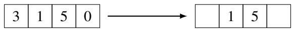
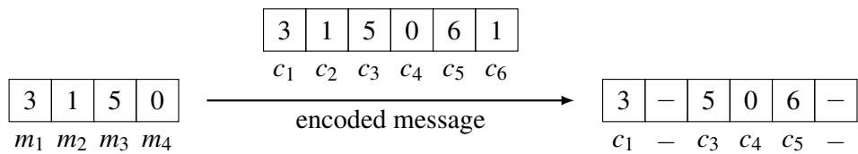
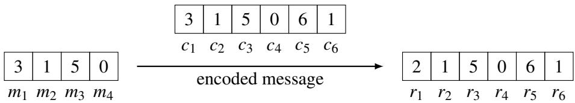
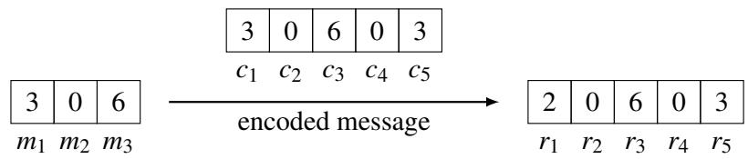

# 009 - 纠错码

## 1 纠错码
在本讲义中，我们将讨论通过不可靠的通信信道传输消息的问题。信道可能导致消息的某些部分（“数据包”，packets）丢失或丢弃；或者更严重的是，它可能导致某些数据包被损坏。我们将学习如何通过在消息中引入冗余来对其进行“编码”，以防止这两种类型的错误。这种编码方案被称为“纠错码”（error-correcting code）。纠错码是数学、计算机科学和电气工程领域的主要研究对象；它们属于一个被称为“信息论”（Information Theory）的领域，这是核心计算机科学之一。除了支持它们的优美理论（我们将在本讲义中略见一斑）之外，它们还具有巨大的实际重要性：每当你使用手机、卫星电视、DSP、电缆调制解调器、硬盘驱动器、CD-ROM、DVD 播放器等，或者在互联网上发送和接收数据时，你都在使用纠错码来确保信息被可靠地传输。纠错码还用于数据中心以及加速并行计算。

粗略地说，纠错码有两种不同的风格：一种是基于有限域上的多项式的**代数码**（algebraic codes），另一种是基于图论的**组合码**（combinatorial codes）。在本讲义中，我们将把重点放在代数码上，特别是所谓的 **Reed-Solomon 码**（以其两位发明者的名字命名）。在这样做的过程中，我们将充分利用我们在上一讲中学习到的多项式性质。

## 1.1 擦除错误
我们将考虑在不可靠信道上传输信息的两种情况。第一种情况以互联网为例，信息（例如一个文件）被分解成多个数据包，其不可靠性体现在一些数据包在传输过程中丢失，如下图所示：

我们将此类错误称为**擦除错误**（erasure errors）。假设消息由 $n$ 个数据包组成，并且假设在传输过程中最多丢失 $k$ 个数据包。我们将展示如何将由 $n$ 个数据包组成的初始消息编码为由 $n + k$ 个数据包组成的冗余编码，以便接收者可以从任何收到的 $n$ 个数据包中重构出原始消息。请注意，在这种设置下，数据包都带有标题标签，因此接收者确切地知道哪些数据包在传输过程中被丢弃了。

我们可以不失一般性地假设每个数据包的内容都是一个模 $q$ 的数字，其中 $q$ 是一个素数。例如，数据包的内容可能是一个 32 位的字符串，因此可以被视为一个介于 0 和 $2^{32} - 1$ 之间的数字；那么我们可以选择 $q$ 为任何大于 $2^{32}$ 的素数。$\mathrm{GF}(q)$ 上的多项式性质（即系数和值均模 $q$ 约简）非常适合解决这个问题，并且是这种纠错方案的支柱。

为了看清这一点，让我们用 $m_1, \dots, m_n$ 来表示要发送的消息，其中每个 $m_i$ 都是 $\mathrm{GF}(q)$ 中的一个数字，并做出以下关键观察：

1. 存在唯一的 $n - 1$ 次多项式 $P(x)$，使得对于 $1 \leq i \leq n$，有 $P(i) = m_i$。（即 $P(x)$ 包含了关于消息的所有信息，并且对 $P(i)$ 求值可以得到第 $i$ 个数据包的预期内容）。
2. 现在要发送的消息是 $m_1 = P(1), \dots, m_n = P(n)$。我们可以通过在点 $n + j$ 处对 $P(x)$ 求值来生成额外的数据包。（回想一下，我们传输的码字应该是冗余的，即它应该包含比原始消息更多的数据包，以弥补丢失的数据包。这就是**码字**（codeword）与**消息**（message）之间的区别。码字是传输的内容，且通过构造具有冗余性；而消息是用户给我们的东西，不一定包含任何冗余。）因此，传输的码字是 $c_1 = P(1), c_2 = P(2), \dots, c_{n+k} = P(n+k)$。由于我们是模 $q$ 运算，我们必须确保 $n + k \leq q$，但由于假设 $q$ 非常大，这个条件并不会构成严重的限制。
3. 我们可以从 $P(x)$ 在任何 $n$ 个互不相同的点处的值中唯一地重构出它，因为它具有 $n - 1$ 次幂。这意味着可以从任何 $n$ 个传输的数据包（而不仅仅是原始的 $n$ 个数据包！）中重构出 $P(x)$。一旦我们重构出了多项式 $P$，我们就可以在 $x = 1, \dots, n$ 处对 $P(x)$ 求值，以恢复原始消息 $m_1, \dots, m_n$。

## 示例
假设 Alice 想要给 Bob 发送一个包含 $n = 4$ 个数据包的消息，并且她想要防范 $k = 2$ 个数据包丢失。那么，假设数据包可以被编码为 0 到 6 之间的整数，Alice 可以在 GF(7) 上工作（因为 $7 \geq n + k = 6$；当然，在实际应用中，我们会在更大的域上工作！）。假设 Alice 想要发送给 Bob 的消息是 $m_1 = 3, m_2 = 1, m_3 = 5, m_4 = 0$。由这 4 个点描述的唯一的 $n - 1 = 3$ 次多项式是 $P(x) = x^3 + 4x^2 + 5$。

**练习**。我们使用模 7 的拉格朗日插值导出了这个多项式。请核实这一推导，并验证对于 $1 \leq i \leq 4$，确实有 $P(i) = m_i$。

由于 $k = 2$，Alice 必须在 2 个额外的点上对 $P(x)$ 求值：$P(5) = 6$ 和 $P(6) = 1$。现在，Alice 可以传输由 $n + k = 6$ 个数据包组成的码字，其中对于 $1 \leq j \leq 6$，$c_j = P(j)$。因此 Alice 将发送 $c_1 = P(1) = 3, c_2 = P(2) = 1, c_3 = P(3) = 5, c_4 = P(4) = 0, c_5 = P(5) = 6, c_6 = P(6) = 1$。

现在假设数据包 2 和 6 丢失了，在这种情况下我们的处境如下：

根据 Bob 收到的值（3, 5, 0 和 6），他使用拉格朗日插值法计算以下基多项式（其中所有内容都应解释为模 7）：

$$
\Delta_1(x) = \frac{(x - 3)(x - 4)(x - 5)}{-24} \equiv 2(x - 3)(x - 4)(x - 5) \pmod{7}
$$

$$
\Delta_3(x) = \frac{(x - 1)(x - 4)(x - 5)}{4} \equiv 2(x - 1)(x - 4)(x - 5) \pmod{7}
$$

$$
\Delta_4(x) = \frac{(x - 1)(x - 3)(x - 5)}{-3} \equiv 2(x - 1)(x - 3)(x - 5) \pmod{7}
$$

$$
\Delta_5(x) = \frac{(x - 1)(x - 3)(x - 4)}{8} \equiv (x - 1)(x - 3)(x - 4) \pmod{7}
$$

（注意，我们这里利用了 -24, 4, -3 和 8 (模 7) 的逆元分别是 2, 2, 2 和 1 这一事实。）然后他重构出多项式 $P(x) = 3 \cdot \Delta_1(x) + 5 \cdot \Delta_3(x) + 0 \cdot \Delta_4(x) + 6 \cdot \Delta_5(x) = x^3 + 4x^2 + 5 \pmod{7}$。Bob 然后计算 $m_2 = P(2) = 1$，这是原始码字中丢失的数据包。更一般地，无论哪两个数据包丢失，遵循完全相同的方法，Bob 总能重构出 $P(x)$，从而重构出原始的基础消息。

**练习**。检查 Bob 上述的计算过程，并验证他是否真的如所声称的那样重构出了正确的多项式。记住所有的算术运算都必须模 7 进行。

因此，这种纠错方案是理论最优的：它可以从任何收到的 $n$ 个字符中恢复传输消息的 $n$ 个字符，但从任何更少数量的字符进行恢复都是不可能的。

## 1.2 重温多项式插值
让我们简要偏离一下主题，讨论另一种多项式插值方法（不同于上一讲中讨论的拉格朗日插值），该方法在处理一般错误时将非常有用。我们需要让这里的底层线性代数更加显式化，以便我们能在今后的学习中更好地依靠它。

同样，算法的目标是输入 $d + 1$ 个点对 $(x_1, y_1), \dots, (x_{d+1}, y_{d+1})$，并输出多项式 $p(x) = a_d x^d + \dots + a_1 x + a_0$，使得对于 $i = 1$ 到 $d+1$，有 $p(x_i) = y_i$。

算法的第一步是写出一个由 $d + 1$ 个变量组成的包含 $d + 1$ 条线性方程的方程组：变量是多项式的系数 $a_0, \dots, a_d$均衡。每条方程是通过将 $x$ 固定为 $d + 1$ 个值 $x_1, \dots, x_{d+1}$ 中的一个而得到的。请注意，在 $p(x)$ 中，$x$ 是一个变量，而 $a_0, \dots, a_d$ 是固定的常数。在下面的方程组中，这些角色被互换了：$x_i$ 是固定的常数，而 $a_0, \dots, a_d$ 是变量。例如，第 $i$ 条方程是固定 $x$ 为 $x_i$，并令多项式的值为 $y_i$ 的结果：$a_d x_i^d + a_{d-1} x_i^{d-1} + \dots + a_0 = y_i$。

现在求解这些方程就能得到多项式 $p(x)$ 的系数。例如，假设给定三对点 $(-1, 2), (0, 1)$ 和 $(2, 5)$；我们的目标是构造出通过这些点的 2 次多项式 $p(x)$。第一条方程说明 $a_2 (-1)^2 + a_1 (-1) + a_0 = 2$。化简后得到 $a_2 - a_1 + a_0 = 2$。类似地，第二条方程说明 $a_2 (0)^2 + a_1 (0) + a_0 = 1$，即 $a_0 = 1$。而第三条方程说明 $a_2 (2)^2 + a_1 (2) + a_0 = 5$。因此我们得到以下方程组：

$$
a_2 - a_1 + a_0 = 2
$$

$$
a_0 = 1
$$

$$
4a_2 + 2a_1 + a_0 = 5
$$

代入 $a_0$ 并将第一条方程乘以 2 得到：

$$
2a_2 - 2a_1 = 2
$$

$$
4a_2 + 2a_1 = 4
$$

然后将这两条方程相加，我们发现 $6a_2 = 6$，所以 $a_2 = 1$，再代回可以发现 $a_1 = 0$。因此，我们确定了多项式 $p(x) = x^2 + 1$。为了更仔细地证明这种方法的合理性，我们必须证明此类方程组总是有解，并且该解是唯一的。幸运的是，我们上一讲中通过拉格朗日插值所做的工作已经确立了这一点。（你能看出来为什么吗？）这就是能够从不同角度看待同一个问题的优点之一。

## 1.3 一般错误
现在让我们回到纠错的主题，考虑一个更具挑战性的场景。假设 Alice 希望通过嘈杂的信道（例如通过调制解调器）与 Bob 通信。她的消息是 $m_1, \dots, m_n$，我们可以将 $m_i$ 视为字符（字节或是英文字母表中的字符）。现在的问题是，由于信道噪声，有些字符在传输过程中被损坏了。因此 Bob 收到的字符数量与 Alice 发送的一样多，但其中 $k$ 个被损坏了，且 Bob 完全不知道是哪 $k$ 个！你可以把这些看成是被恶意对手破坏的，该对手唯一的限制是能破坏的字符不超过 $k$ 个。从这种一般错误中恢复要比从擦除错误中恢复具有挑战性得多，尽管多项式再次成为了其中的关键。正如我们将看到的，Alice 仍然可以防范 $k$ 个一般错误，代价是仅多传输 $2k$ 个额外字符（是我们在上面看到的擦除情况下的两倍）。

我们将再次把每个字符视为模某个素数 $q$ 的数字。（对于英文字母表来说，$q$ 是某个大于 26 的素数。）和以前一样，我们可以用 $\mathrm{GF}(q)$ 上的 $n - 1$ 次多项式 $P(x)$ 来描述消息，使得 $P(1) = m_1, \dots, P(n) = m_n$。同样，为了应对错误，Alice 将通过在额外的点上对 $P(x)$ 求值来传输额外的字符。如前所述，为了抵御 $k$ 个一般错误，Alice 必须发送 $2k$ 个额外字符：因此编码后的码字为 $c_1, \dots, c_{n+2k}$，其中对于 $1 \leq j \leq n+2k$，$c_j = P(j)$，我们可以假设 Bob 收到的这些字符中（至少）有 $n+k$ 个是未损坏的。和以前一样，我们必须对 $q$ 施加温和的约束，使其足够大以满足 $q > n + 2k$。

例如，如果 Alice 想要通过调制解调器向 Bob 发送 $n = 4$ 个字符，且其中最多有 $k = 1$ 个字符被损坏，她必须冗余地发送由 6 个字符组成的编码消息。假设她想要传输与上述擦除示例中相同的消息 (3150)，且 $c_1$ 从 3 损坏为 2。这种情况可以由下图直观展现：

从 Bob 的角度来看，重构 Alice 的消息的问题等同于根据收到的 $n + 2k$ 个字符 $r_1, r_2, \dots, r_{n+2k}$ 来重构多项式 $P(x)$。换句话说，Bob 被给定了 $n + 2k$ 个模 $q$ 的值 $r_1, r_2, \dots, r_{n+2k}$，并保证存在一个 $\mathrm{GF}(q)$ 上的 $n - 1$ 次多项式 $P(x)$，使得对于 $1$ 到 $n + 2k$ 之间的 $n + k$ 个 $i$ 值，有 $P(i) = r_i$。Bob 必须从这些数据中重构出 $P(x)$（在上述示例中，$n + k = 5$，且 $r_2 = P(2) = 1, r_3 = P(3) = 5, r_4 = P(4) = 0, r_5 = P(5) = 6, r_6 = P(6) = 1$）。然而请注意，Bob 并不知道哪 $n + k$ 个值是正确的！

Bob 甚至拥有足够的信息来重构 $P(x)$ 吗？我们的第一个观察是，最多只存在一个次数最多为 $n - 1$ 的多项式 $P(x)$，满足在 1 到 $n + 2k$ 之间的至少 $n + k$ 个 $i$ 值上有 $P(i) = r_i$。为了看清这一点，假设对于 $n + k$ 个点有 $P(i) = r_i$，且对于 $n + k$ 个（可能不同）点有 $P'(i) = r_i$。由于总共只有 $n + 2k$ 个点，这两组点必然在 $n$ 个点上重叠，因此对于这 $n$ 个点有 $P(i) = r_i = P'(i)$，这意味着它们必须是相同的 $n - 1$ 次多项式。此外，我们观察到原始多项式在 $n + k$ 个点上满足 $P(i) = r_i$，因为最多有 $k$ 个错误。因此，$P(x)$ 是唯一与 Bob 的信息一致的多项式。

总结一下，Bob 的任务是找到一个 $n - 1$ 次多项式 $P(x)$，使得对于至少 $n + k$ 个 $i$ 值，有 $P(i) = r_i$。如果他能做到这一点， he can be sure that the polynomial he has found is in fact the original polynomial $P(x)$.

但是 Bob 怎样才能高效地找到这样的多项式呢？手头的问题是 $k$ 个错误的位置。令 $e_1, \dots, e_k$ 为发生错误的 $k$ 个位置（使得对于所有 $i \notin \{e_1, \dots, e_k\}$，有 $P(i) = r_i$）。Bob 不知道这些错误在哪里，所以他不知道 $e_1, \dots, e_k$ 的值。

现在 Bob 可以尝试猜测 $k$ 个错误的位置，但这太费时间了（实际上这需要指数级的时间）。相反，Bob 将采用一个基于以下定义的巧妙技巧。考虑所谓的**错误定位多项式** (error-locator polynomial)：

$$
E(x) = (x - e_1)(x - e_2) \dots (x - e_k).
$$

请注意 $E(x)$ 是一个 $k$ 次多项式（因为 $x$ 出现了 $k$ 次）。还请注意 Bob 并不显式地知道这个多项式，因为他不知道错误的位置 $e_i$。然而，他将符号化地使用该多项式，并最终计算出其中出现的 $e_i$ 值！

让我们对这个多项式做一个简单但至关重要的观察：

$$
P(i)E(i) = r_i E(i) \quad \text{对于} \ 1 \leq i \leq n + 2k. \tag{1}
$$

为了看清这一点，请注意，在未发生错误的点 $i$ 上，由于在这些点上有 $P(i) = r_i$，因此等式成立；而在发生错误的点 $i$ 上，由于此时 $E(i) = 0$，等式显然也成立。

这一观察构成了 Berlekamp 和 Welch 发明的一种非常聪明算法的基础。更仔细地查看 (1) 中的等式，我们将展示它们可以对应于 $n + 2k$ 个变量组成的 $n + 2k$ 条线性方程，从中可以很容易地推导出错误的位置和 $P(x)$ 的系数（类似于我们在上一节中看到的插值方案）。

定义多项式 $Q(x) := P(x)E(x)$，它的次数为 $n + k - 1$，因此由 $n + k$ 个系数 $a_0, a_1, \dots, a_{n+k-1}$ 描述。错误定位多项式 $E(x) = (x - e_1) \dots (x - e_k)$ 的次数为 $k$，由 $k + 1$ 个系数 $b_0, b_1, \dots, b_k$ 来描述，但最高位系数（$x^k$ 的系数 $b_k$）始终为 1。因此我们可以写成：

$$
Q(x) = a_{n+k-1}x^{n+k-1} + a_{n+k-2}x^{n+k-2} + \dots + a_1 x + a_0;
$$

$$
E(x) = x^k + b_{k-1}x^{k-1} + \dots + b_1 x + b_0.
$$

（记住我们还不知道任何系数 $a_i$ 或 $b_i$。）

现在注意到，将 $Q(x) = P(x)E(x)$ 代入 (1)，我们得到 $n + 2k$ 条方程：

$$
Q(i) = r_i E(i) \quad \text{对于} \ 1 \leq i \leq n + 2k.
$$

使用 $Q(x)$ 和 $E(x)$ 的系数写出第 $i$ 条方程，得到：

$$
a_{n+k-1}i^{n+k-1} + a_{n+k-2}i^{n+k-2} + \dots + a_1 i + a_0 = r_i(i^k + b_{k-1}i^{k-1} + \dots + b_1 i + b_0) \pmod{q}.
$$

这是一组 $n + 2k$ 条线性方程，对应于 $i$ 的每个值，含有 $n + 2k$ 个未知数 $a_0, a_1, \dots, a_{n+k-1}, b_0, b_1, \dots, b_{k-1}$。我们可以解这个线性方程组并得到 $E(x)$ 和 $Q(x)$。然后我们可以计算比例 $\frac{Q(x)}{E(x)}$ 来获得 $P(x)$。通过示例可以最好地说明这一点。

**示例**。假设我们正在 $\mathrm{GF}(7)$ 上工作，Alice 想要通过调制解调器向 Bob 发送 $n = 3$ 个字符“3”，“0”和“6”。类比于英文字母表，这相当于只使用字母表的前 7 个字母，其中 $a=0, \dots, g=6$。所以 Alice 希望 Bob 接收到的消息是“dag”。然后 Alice 进行插值（例如，使用拉格朗日：练习！）找到多项式

$$
P(x) = x^2 + x + 1,
$$

这是唯一的 $\mathrm{GF}(7)$ 上的 2 次多项式，满足 $P(1) = 3, P(2) = 0, P(3) = 6$。

假设 Alice 知道最多可能有 $k = 1$ 个字符被损坏；那么她需要向 Bob 传输 $n + 2k = 5$ 个字符 $P(1) = 3, P(2) = 0, P(3) = 6, P(4) = 0, P(5) = 3$。假设 $P(1)$ 实际上被损坏了，Bob 收到的字符是 2 而不是 3（即 Alice 发送了编码后的码字“dagad”，但 Bob 收到的却是“cagad”）。综上所述，我们的情况如下：

令 $E(x) = (x - e_1) = x + b_0$ 为错误定位多项式——记住，Bob 还不知道 $e_1 = -b_0$ 是多少，因为他不知道错误发生在哪里——并令 $Q(x) = a_3 x^3 + a_2 x^2 + a_1 x + a_0$（这里的系数 $a_i$ 同样是未知的）。现在 Bob 只需要将 $i = 1, i = 2, \dots, i = 5$ 代入上述 (1) 中的方程 $Q(i) = r_i E(i)$，并进行化简，得到含五个未知数的五条线性方程（请记住我们是在模 7 下运算，且 $r_i$ 是 Bob 收到的第 $i$ 个字符的值）：

$$
a_3 + a_2 + a_1 + a_0 + 5b_0 = 2
$$

$$
a_3 + 4a_2 + 2a_1 + a_0 = 0
$$

$$
6a_3 + 2a_2 + 3a_1 + a_0 + b_0 = 4
$$

$$
a_3 + 2a_2 + 4a_1 + a_0 = 0
$$

$$
6a_3 + 4a_2 + 5a_1 + a_0 + 4b_0 = 1
$$

Bob 然后解这个线性方程组，发现 $a_3 = 1, a_2 = 0, a_1 = 0, a_0 = 6$ 且 $b_0 = 6$（均模 7）。这给了他多项式 $Q(x) = x^3 + 6$ 和 $E(x) = x + 6 = x - 1$。（作为检查，$E(x) = x - 1$ 意味着错误的位置在 $e_1 = 1$，这是正确的，因为第一个字符从“d”损坏为了“c”。）然后他可以通过计算商来求得 $P(x)$：

$$
P(x) = \frac{Q(x)}{E(x)} = \frac{x^3 + 6}{x - 1} = x^2 + x + 1 \pmod{7}.
$$

Bob 注意到第一个字符被损坏了（因为 $e_1 = 1$），所以既然他已经有了 $P(x)$，他只需要计算 $P(1) = 3 = \mathrm{'d'}$，就得到了原始的、未损坏的消息“dag”。

**练习**。通过 $i = \{1, 2, 3, 4, 5\}$ 的等式 $Q(i) = r_i E(i)$ 验证上述方程组的推导过程。此外，解这些方程（这有点乏味，但不难！）并检查你的解是否与上面的结果一致。记住所有的算术运算都应模 7 进行。

**练习**。针对第二个字符从“0”损坏为“5”且所有其他字符未损坏的情况，重新做一遍上述示例。

## 细节讨论
有两点需要进一步讨论。我们如何知道这 $n + 2k$ 条方程是相容的？如果它们没有解怎么办？这很简单。这些方程一定是相容的，因为由 $Q(x) = P(x)E(x)$ 以及实际的错误定位多项式 $E(x)$ 构成了一组解！

一个更有趣的问题是：我们如何知道这 $n + 2k$ 条方程是独立的，也就是说，我们如何知道除了我们要寻找的真实解之外，不存在其他虚假的解？用更数学的话来说，假设我们构造的解是 $Q'(x), E'(x)$；我们如何知道这个解满足 $E'(x)$ 整除 $Q'(x)$ 且 $\frac{Q'(x)}{E'(x)} = \frac{Q(x)}{E(x)} = P(x)$？

为了看清这是真的，我们首先注意到，根据我们计算 $Q'(x), E'(x)$ 的方法，我们知道对于 $1 \leq i \leq n + 2k$，有 $Q'(i) = r_i E'(i)$；当然，根据定义，对于相同的 $i$ 值，我们也有 $Q(i) = r_i E(i)$。将第一个等式乘以 $E(i)$，第二个等式乘以 $E'(i)$，我们得到

$$
Q'(i)E(i) = Q(i)E'(i) \quad \text{对于} \ 1 \leq i \leq n + 2k, \tag{2}
$$

因为两边都等于 $r_i E(i)E'(i)$。方程 (2) 告诉我们，两个多项式 $Q(x)E'(x)$ 和 $Q'(x)E(x)$ 在 $n + 2k$ 个点上相等。但是这两个多项式的次数均为 $n + 2k - 1$，因此它们完全由在 $n + 2k$ 个点上的值确定。因此，由于它们在 $n + 2k$ 个点上一致，它们必须是同一个多项式，即对于所有 $x$，都有 $Q(x)E'(x) = Q'(x)E(x)$。现在我们可以除以多项式 $E(x)E'(x)$（根据构造，它不是零多项式）得到 $\frac{Q'(x)}{E'(x)} = \frac{Q(x)}{E(x)} = P(x)$，这正是我们想要的结果。因此，我们可以确信我们找到的任何解都是正确的。

**练习（较难）**。解 $Q'(x), E'(x)$ 总是唯一的吗？上述分析告诉我们，其比例必须始终满足 $\frac{Q'(x)}{E'(x)} = \frac{Q(x)}{E(x)} = P(x)$，但并不能保证 $Q'(x) = Q(x)$ 且 $E'(x) = E(x)$。提示：在我们的上述示例中，如果实际上没有字符被损坏（尽管 Alice 仍然假设可能有 $k=1$ 个字符被损坏），会发生什么？试着在这种情况下写出并求解方程组。你应该会得到一整簇解，对应于 $b_0 \in \mathrm{GF}(7)$ 的每个可能值。（因为在这种情况下没有错误，所以 $b_0$ 是不确定的。）其他值可以用 $b_0$ 来表示：$a_3 = 1, a_2 = 1+b_0, a_1 = 1+b_0, a_0 = b_0$。但是，无论 $b_0$ 的值是多少，其商均为 $\frac{Q(x)}{E(x)} = \frac{x^3 + (1 + b_0)x^2 + (1 + b_0)x + b_0}{x + b_0} = x^2 + x + 1$，因此我们再次恢复了 $P(x)$（正如我们根据前一段的论证所知道的那样）。