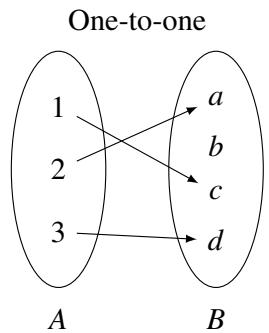
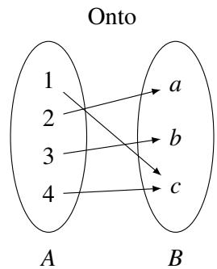
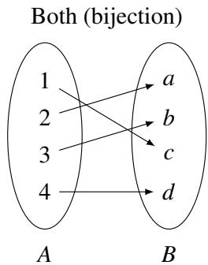
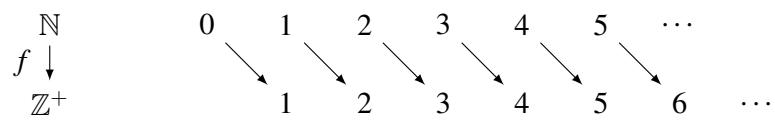
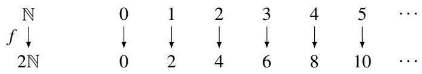
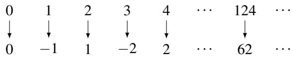
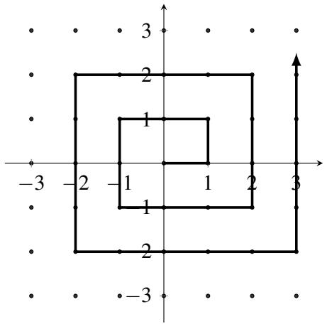
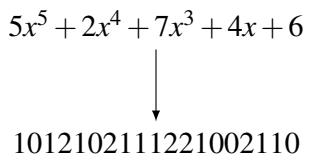
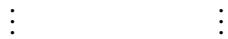
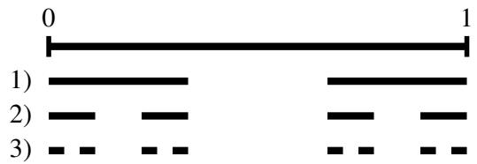

# 010 - 迈向无穷：可数性与可计算性

接下来的两份讲义将两个乍一看似乎毫无关系的主题联系在一起：无穷的本质（更具体地说，是不同级别的无穷之间的区别），以及计算和证明的根本性质。在第一份讲义中，我们将重点关注无穷的概念，然后在第二份讲义中转向与计算的联系。

## 1 双射
两个有限集具有相同的大小，当且仅当它们的元素可以配对，使得一个集合中的每个元素在另一个集合中都有唯一的伴侣，反之亦然。我们通过双射的概念将这一思想形式化。

考虑一个函数（或映射）$f$，它将集合 $A$（称为 $f$ 的**定义域**，domain）的元素映射到集合 $B$（称为 $f$ 的**值域**，range）的元素。由于 $f$ 是一个函数，它必须为每个元素 $x \in A$（“输入”）指定恰好一个元素 $f(x) \in B$（“输出”）。回想一下，我们将其记为 $f: A \to B$。我们说 $f$ 是一个**双射**（bijection），如果每个元素 $a \in A$ 都有唯一的像 $b = f(a) \in B$，且每个元素 $b \in B$ 都有唯一的原像 $a \in A : f(a) = b$。

如果 $f$ 将不同的输入映射到不同的输出，则 $f$ 是一个**一对一函数**（或称为**单射**，injection）。更准确地说，如果以下条件成立，则 $f$ 是一对一的：$(\forall x \in A) (\forall y \in A) (x \neq y \implies f(x) \neq f(y))$。

如果 $f$ “命中”了值域中的每个元素（即，值域中的每个元素至少有一个原像），则 $f$ 是**满射的**（或称为**映上的**，onto/surjective）。更准确地说，如果以下条件成立，则函数 $f$ 是满射的：$(\forall y \in B) (\exists x \in A) (f(x) = y)$。

这里有一些简单的例子来帮助直观地理解单射、满射和双射：

注意，根据上述定义，$f$ 是双射当且仅当它既是单射又是满射。

**练习**。令 $f: A \to B$ 为双射。证明 $f$ 具有反函数 $f^{-1}: B \to A$，满足对于所有 $a \in A$ 有 $f^{-1}(f(a)) = a$，且 $f^{-1}$ 也是双射。

## 2 基数
我们如何确定两个集合是否具有相同的**基数**（cardinality，或称“大小”）？令人安心的是，这个问题的答案就在小学早期的记忆中：通过展示两个集合元素之间的配对。更正式地说，我们需要展示两个集合之间的一个双射 $f$。双射建立了两集合元素之间的一一对应或配对关系。我们已经在上面看到了这对于有限集是如何工作的。在本讲义的其余部分，我们将看到它告诉了我们关于无穷集的什么。

关于无穷集的第一个问题是：自然数 $\mathbb{N}$ 是否比正整数 $\mathbb{Z}^+$ 更多？人们很容易回答“是”，因为每个正整数也都是自然数，但自然数多了一个元素 $0 \notin \mathbb{Z}^+$。然而，通过更仔细地观察，我们发现可以如下定义自然数与正整数之间的双射：

更准确地说，这个映射定义为对于所有 $n \in \mathbb{N}$，$f(n) = n + 1$。为什么这个映射是双射？显而易见，函数 $f: \mathbb{N} \to \mathbb{Z}^+$ 是满射，因为每个正整数都被命中了。它也是单射，因为没有两个自然数具有相同的像。（$n$ 的像是 $f(n) = n + 1$，所以如果 $f(n) = f(m)$，则必须有 $n = m$。）由于我们已经展示了 $\mathbb{N}$ 与 $\mathbb{Z}^+$ 之间的双射，这告诉我们，自然数的数量与正整数一样多！（非常）非正式地说，我们已经证明了“$\infty + 1 = \infty$”。

那么偶自然数集合 $2\mathbb{N} = \{0, 2, 4, 6, \dots\}$ 呢？在前一个例子中，区别仅在于一个元素。但在本例中，自然数的数量似乎是偶自然数的两倍。既然 $\mathbb{N}$ 还包含了所有奇自然数，其基数肯定比 $2\mathbb{N}$ 大吧？尽管这看起来像是一项更困难的任务，但让我们尝试使用映射 $f(n) = 2n$（对于所有 $n \in \mathbb{N}$）来寻找这两个集合之间的双射：

本例中的映射也是一个双射。$f$ 显然是单射，因为不同的自然数映射到不同的偶自然数（由于 $2n = 2m$ 意味着 $n = m$）。$f$ 也是满射，因为值域中的每个 $n$ 都被命中了：它的原像为 $\frac{n}{2}$。由于我们找到了这两个集合之间的双射，这告诉我们实际上 $\mathbb{N}$ 和 $2\mathbb{N}$ 具有相同的基数！

那么所有整数的集合 $\mathbb{Z}$ 呢？乍一看，由于它包含了无穷多个负数，整数集显然比自然数集大。然而事实证明，可以找到这两个集合之间的双射，这意味着这两个集合的大小相同！考虑以下映射 $f$：

换句话说，我们的函数定义如下：

$$
f(n) = \begin{cases} \frac{n}{2} & \text{如果 } n \text{ 是偶数} \\ -\frac{n+1}{2} & \text{如果 } n \text{ 是奇数} \end{cases}
$$

我们将通过证明该函数 $f: \mathbb{N} \to \mathbb{Z}$ 既是单射又是满射来证明它是双射。

**证明（单射）**：假设 $f(x) = f(y)$。那么它们必须具有相同的符号。因此要么 $f(x) = \frac{x}{2}$ 且 $f(y) = \frac{y}{2}$（当 $x, y$ 均为偶数时），要么 $f(x) = -\frac{x+1}{2}$ 且 $f(y) = -\frac{y+1}{2}$（当 $x, y$ 均为奇数时）。在前一种情况下，$f(x) = f(y) \implies \frac{x}{2} = \frac{y}{2} \implies x = y$。在后一种情况下，$f(x) = f(y) \implies -\frac{x+1}{2} = -\frac{y+1}{2} \implies x = y$。由于函数对偶数产生非负结果，对奇数产生负结果，因此 $x$ 和 $y$ 必须奇偶性相同。所以在所有情况下都有 $x = y$，因此 $f$ 是单射。

**证明（满射）**：如果 $y \in \mathbb{Z}$ 是非负的，那么 $x = 2y$ 是一个偶自然数且满足 $f(x) = y$。因此 $y$ 有原像。如果 $y$ 是负数，那么 $x = -(2y + 1)$ 是一个奇自然数（例如 $y = -1 \implies x = 1, y = -2 \implies x = 3$）且满足 $f(x) = y$。因此 $y$ 有原像。由于每个 $y \in \mathbb{Z}$ 都有原像，所以 $f$ 是满射。

由于 $f$ 是双射，这告诉我们 $\mathbb{N}$ 和 $\mathbb{Z}$ 的大小相同。

现在给出一个重要的定义。

**定义 10.1**：如果在一个集合 $S$ 与 $\mathbb{N}$ 或 $\mathbb{N}$ 的某个子集之间存在双射，我们说该集合 $S$ 是**可数的** (countable)。

因此，任何有限集 $S$ 都是可数的（因为在 $S$ 与子集 $\{0, 1, 2, \dots, m-1\}$ 之间存在双射，其中 $m = |S|$ 是 $S$ 的大小）。并且我们已经看到了三个无限可数集的例子：$\mathbb{Z}^+$ 和 $2\mathbb{N}$ 显然是可数的，因为它们本身就是 $\mathbb{N}$ 的子集；而 $\mathbb{Z}$ 是可数的，因为我们刚刚看到了它与 $\mathbb{N}$ 之间的双射。

那么所有有理数的集合呢？回想一下 $\mathbb{Q} = \{ \frac{x}{y} \mid x, y \in \mathbb{Z}, y \neq 0 \}$。有理数的数量肯定比自然数多吧？毕竟，在任何两个自然数之间都有无穷多个有理数。令人惊讶的是，这两个集合具有相同的基数！为了看清这一点，让我们引入一种稍微不同的比较两个集合基数的方法。

如果存在一个单射函数 $f: A \to B$，那么 $A$ 的基数小于或等于 $B$ 的基数。现在为了展示 $A$ 和 $B$ 的基数相同，我们可以展示 $|A| \leq |B|$ 且 $|B| \leq |A|$。这对应于展示存在一个单射函数 $f: A \to B$ 和一个单射函数 $g: B \to A$。这两个单射函数的存在意味着存在一个双射 $h: A \to B$，从而展示了 $A$ 和 $B$ 具有相同的基数。这个事实的证明（被称为 **Cantor-Bernstein 定理**）实际上相当困难，我们在此将略过它。

回到自然数与有理数的比较。首先，显而易见 $| \mathbb{N} | \leq | \mathbb{Q} |$，因为 $\mathbb{N} \subseteq \mathbb{Q}$。所以我们现在的目标是证明也有 $| \mathbb{Q} | \leq | \mathbb{N} |$。为此，我们必须展示一个单射 $f: \mathbb{Q} \to \mathbb{N}$。下面这张螺旋图传达了这种单射的思想：

每个有理数 $\frac{a}{b}$（写成其最简形式，使得 $\operatorname{gcd}(a, b) = 1$）都由所示的无限二维网格（对应于 $\mathbb{Z} \times \mathbb{Z}$，即所有整数对的集合）中的点 $(a, b)$ 表示。注意，并非网格上的所有点都是有理数的有效表示：例如，$x$ 轴上的所有点都有 $b = 0$，因此都不是有效的（除了点 $(0, 0)$，我们取它来代表有理数 0）；像 $(2, 8)$ 和 $(-1, -4)$ 这样的点也是无效的，因为有理数 $\frac{1}{4}$ 由 $(1, 4)$ 表示。但在这种表示法下，$\mathbb{Z} \times \mathbb{Z}$ 肯定包含了所有有理数，所以如果我们能想出从 $\mathbb{Z} \times \mathbb{Z}$ 到 $\mathbb{N}$ 的单射，那么这也是一个从 $\mathbb{Q}$ 到 $\mathbb{N}$ 的单射（为什么？）。

这个想法是将每个数对 $(a, b)$ 映射到它沿螺旋路径（从原点开始）所处的位置。（因此，例如 $(0, 0) \to 0$、$(1, 0) \to 1$、$(1, 1) \to 2$、$(0, 1) \to 3$ 等等。）显而易见，这个映射将每一对整数单射地映射到一个自然数，因为每一对都在螺旋上占据一个唯一的位置。

这告诉我们 $| \mathbb{Q} | \leq | \mathbb{N} |$。由于我们之前观察到也有 $| \mathbb{N} | \leq | \mathbb{Q} |$，根据 Cantor-Bernstein 定理，$\mathbb{N}$ 和 $\mathbb{Q}$ 具有相同的基数。

**练习**。证明所有自然数有序对的集合 $\mathbb{N} \times \mathbb{N}$ 是可数的。

我们的下一个例子涉及所有二进制字符串（长度任意且有限）的集合，记作 $\{0, 1\}^*$。尽管该集合包含无限长度的字符串，但事实证明它与 $\mathbb{N}$ 具有相同的基数。为了看清这一点，我们按如下方式建立一个双射 $f: \{0, 1\}^* \to \mathbb{N}$。注意，只要以某种方式枚举 $\{0, 1\}^*$ 的元素，使得每个字符串都在列表中恰好出现一次，就足够了。然后我们令 $f(n)$ 为列表中的第 $n$ 个字符串，从而得到我们的双射。我们如何枚举 $\{0, 1\}^*$ 中的字符串呢？一种自然的方法是按长度递增的顺序排列，然后在每种长度的字符串内部，按照字典序（或者等效地，将它们视为二进制数时的数值递增顺序）排列。这意味着列表看起来像：

$$
\varepsilon, 0, 1, 00, 01, 10, 11, 000, 001, 010, 011, 100, 101, 110, 111, 0000, \dots
$$

其中 $\varepsilon$ 表示空字符串（唯一的 0 长度字符串）。显而易见，该列表包每个且仅包含每个二进制字符串一次，因此我们如愿得到了与 $\mathbb{N}$ 的双射。

我们最后一个可数集的例子是系数为自然数的所有多项式的集合，记作 $\mathbb{N}(x)$。为了看到这个集合是可数的，我们将利用前一个例子的变体。首先注意，通过与 $\{0, 1\}^*$ 基本相同的论证，我们可以看出所有三进制字符串 $\{0, 1, 2\}^*$ (即字母表 $\{0, 1, 2\}$ 上的字符串) 构成的集合是可数的。为了看清 $\mathbb{N}(x)$ 是可数的，展示一个单射 $f: \mathbb{N}(x) \to \{0, 1, 2\}^*$ 就足够了，这反过来又会给出从 $\mathbb{N}(x)$ 到 $\mathbb{N}$ 的单射。（显而易见存在从 $\mathbb{N}$ 到 $\mathbb{N}(x)$ 的单射，因为每个自然数 $n$ 本身就是一个平凡的多项式，即常数多项式 $n$。）

我们如何定义 $f$？让我们先看一个例子，即多项式 $p(x) = 5x^5 + 2x^4 + 7x^3 + 4x + 6$。我们可以将 $p(x)$ 的系数列出如下：(5, 2, 7, 0, 4, 6)。然后我们可以将这些系数写成二进制字符串：(101, 10, 111, 0, 100, 110)。现在，我们可以构造一个三进制字符串，在每个二进制系数之间插入一个 “2” 作为分隔符（忽略且跳过值为 0 的系数，或者是把 0 也转为二进制）。更准确地说，我们如下所示地将 $p(x)$ 映射到一个三进制字符串：

很容易核实这确实是一个单射，因为只需读出每对连续的 2 之间的系数，就能从该三进制字符串中唯一地恢复原始多项式。（请注意，这个映射 $f: \mathbb{N}(x) \to \{0, 1, 2\}^*$ 不是满射的（因此不是双射），因为许多三进制字符串不会是任何多项式的像；例如，任何包含带前导零的二进制子序列的三进制字符串都会是这种情况。）

因此，我们得到了一个从 $\mathbb{N}(x)$ 到 $\mathbb{N}$ 的单射，所以 $\mathbb{N}(x)$ 是可数的。

## 3 康托尔对角线法
我们已经确定 $\mathbb{N}, \mathbb{Z}, \mathbb{Q}$ 都具有相同的基数。那么实数集 $\mathbb{R}$ 呢？它们肯定也是可数的吧？毕竟，有理数和实数一样都是稠密的（即在任何两个有理数 $a, b$ 之间都有一个有理数，即 $\frac{a+b}{2}$）。事实上，在任何两个实数之间总有一个有理数。因此，出乎意料的是，实数竟然比有理数多。也就是说，在有理数（或自然数）与实数之间不存在双射。我们现在将使用康托尔提出的一个优美论证来证明这一点，即所谓的**对角线法** (diagonalization)。事实上，我们将展示一个更强的结论：区间 [0, 1] 内的实数是不可数的！

**练习**。展示如何在任何两个（不同的）实数之间找到一个有理数。

在进行证明之前，请回想一下，任何实数都可以唯一地写成没有尾随零的无限小数。特别地，区间 [0, 1] 内的一个实数可以写成 $0.d_1 d_2 d_3 \dots$。在这种表示法中，例如我们将 1 写成 0.999...，将 0.5 写成 0.4999...。（因此，有理数始终表示为循环小数，而无理数则表示为非循环小数。对我们而言，重要的是所有这些表达式都是无限长且唯一的。）

**定理 10.1**：实数区间 $\mathbb{R}[0, 1]$（从而实数集 $\mathbb{R}$ 本身）是不可数的。

**证明**：假设为了导出矛盾，存在一个双射 $f: \mathbb{N} \to \mathbb{R}[0, 1]$。那么，我们可以将实数枚举在一个无限列表中 $f(0), f(1), f(2), \dots$，如下所示：

$$
f(0) = 0. \textcircled{5} 2 1 4 9 3 5 6 \dots
$$

$$
f(1) = 0. 1 \textcircled{4} 1 6 2 9 8 5 \dots
$$

$$
f(2) = 0. 9 4 \textcircled{7} 8 2 7 1 2 \dots
$$

$$
f(3) = 0. 5 3 0 \textcircled{9} 8 1 7 5 \dots
$$

现在考虑实数 $r$，其无限小数展开由上表中的对角线元素（图中圈出的部分）给出：也就是说，$r = 0.5479\dots$。我们利用 $r$ 构造一个新的实数 $s$，方法是修改 $r$ 的每一位数字，例如将每个数字 $d$ 替换为 $d + 2 \pmod{10}$；因此在我们的上述例子中，$s = 0.7691\dots$。我们声称 $s$ 并不出现在我们的无限实数列表中。如果要导出矛盾，假设它出现在列表中，且它是列表中的第 $n$ 个数 $f(n)$。但根据构造，$s$ 在第 $n+1$ 位小数上与 $f(n)$ 不同，因此这两个数字不可能相等！所以我们构造了一个不在 $f$ 的值域中的实数 $s$。但这与 $f$ 是双射的断言相矛盾。因此实数是不可数的。 $\square$

让我们说明一下，我们通过加 $2 \pmod{10}$ 而不是加 1 来修改每一位数字的原因是，同一个实数可以有两个十进制展开；例如 $0.999 \dots = 1.000 \dots$。但如果两个实数的任何一位数字之差大于 1，它们就不可能相等。因此，我们的断言是完全安全的。（另一种避免潜在陷阱的方法是将每个数字替换为从范围 $\{1, 2, \dots, 8\}$ 中选择的某个不同数字。）

利用康托尔对角线法，我们证明了 $\mathbb{R}$ 是不可数的。由于我们对 $\mathbb{R}$ 和 $\mathbb{Q}$ 得到了戏剧性不同的结果（前者不可数，后者可数），我们确实应该回头考虑一下，如果我们尝试用对角线法来证明区间 [0, 1] 内的有理数不可数会发生什么。假设为了导出矛盾，我们的双射函数 $f: \mathbb{N} \to \mathbb{Q}[0, 1]$ 产生了以下映射：

$$
\begin{aligned} f(0) &= 0. \textcircled{1} 4 0 0 0 \dots \\ f(1) &= 0. 5 \textcircled{9} 2 4 5 \dots \\ f(2) &= 0. 2 1 \textcircled{4} 2 1 \dots \\ \vdots & \quad \vdots \end{aligned}
$$

这一次，让我们考虑通过修改对角线的每一位数字所得到的数 $q$，例如将每个数字 $d$ 替换为 $d + 2 \pmod{10}$。那么在上述例子中，$q = 0.316\dots$，我们想要尝试证明它不会出现在我们的无限有理数列表中。然而，我们并不知道 $q$ 是有理数（事实上，$q$ 的十进制展开极不可能是周期性的）。这就是该方法应用于有理数时失效的原因。当处理实数时，修改后的对角线数字被保证是一个实数。

## 4 康托尔集
康托尔集是一个涉及区间 [0, 1] 内实数的非凡集合构造。该集合是通过无限次重复移除线段的中间三分之一而定义的，从原始区间开始。例如，第一次迭代涉及移除（开）区间 $(\frac{1}{3}, \frac{2}{3})$，剩下 $[0, \frac{1}{3}] \cup [\frac{2}{3}, 1]$。然后我们继续移除这两个剩余区间中每一个的中间三分之一，依此类推。前三次迭代如下图所示：

康托尔集包含了所有未被移除的点：$C = \{x : x \text{ 未被移除}\}$。在这一过程被重复无限次后，原始单位区间还剩下多少？首先，我们从一个长度为 1 的区间开始，在第一次迭代后我们移除了其中的 $\frac{1}{3}$，剩下 $\frac{2}{3}$。在第二次迭代中，我们保留了原始区间的 $\frac{2}{3} \times \frac{2}{3}$。由于我们将这些迭代重复无穷多次，我们剩下：

$$
1 \longrightarrow \frac{2}{3} \longrightarrow \frac{2}{3} \times \frac{2}{3} \longrightarrow \frac{2}{3} \times \frac{2}{3} \times \frac{2}{3} \longrightarrow \dots \longrightarrow \lim_{n \rightarrow \infty} \left(\frac{2}{3}\right)^n = 0
$$

根据计算，我们已经从原始区间中移除了所有内容！这是否意味着康托尔集是空的？不，并不意味着。它的意思是康托尔集的测度为零；康托尔集由孤立的点组成，不包含任何非平凡区间。事实上，康托尔集不仅非空，而且是不可数的！

为了看清原因，让我们首先对三进制字符串做一个观察。在三进制记数法中，所有字符串都由来自集合 $\{0, 1, 2\}$ 的数字（称为 “trits”）组成。区间 [0, 1] 内的所有实数都可以用三进制表示。（例如，$\frac{1}{3}$ 可以写成 0.1，或者等效地写成 0.0222...，而 $\frac{2}{3}$ 可以写成 0.2 或 0.1222...。）因此，在第一次迭代中，移除的中间三分之一包含所有形式为 0.1xxxxx 的三进制数。第一次移除后剩下的三进制数都可以表示为 0.0xxxxx... 或 0.2xxxxx... 的形式（这里我们必须对区间的端点稍微小心一点；但我们可以通过将 $\frac{1}{3}$ 写为 0.02222... 且将 $\frac{2}{3}$ 写为 0.2 来处理它们）。第二次迭代移除了形式为 0.01xxxxx 和 0.21xxxxx 的三进制数（即任何在第二位有 1 的数）。第三次迭代移除了第三位上的 1，依此类推。因此，剩下的就是所有仅由 0 和 2 组成的三进制数。因此我们证明了：

$$
C = \{x \in [0, 1] : x \text{ 具有仅包含 0 和 2 的三进制表示} \}.
$$

最后，利用这一特征，我们可以建立一个从 $C$ 到 [0, 1] 的满射映射 $f$。由于我们已经知道 [0, 1] 是不可数的，这也就意味着 $C$ 也是不可数的。映射 $f$ 定义如下：对于 $x \in C$，$f(x)$ 定义为将 $x$ 的三进制表示的每一位数字除以 2 得到的二进制小数。因此，例如如果 $x = 0.0220$（三进制），那么 $f(x)$ 就是二进制小数 0.0110。由于所有二进制小数 $0.xxxxx\dots$ 的集合与实数区间 [0, 1] 处于一一对应关系，且映射 $f$ 是满射的，因为每个二进制小数都是某个三进制字符串在 $f$ 下的像（通过将每个二进制数字加倍得到）。这完成了关于 $C$ 不可数的证明。

## 5 幂集与更高阶的无穷
令 $S$ 为任意集合。那么 $S$ 的**幂集** (power set)，记作 $\mathcal{P}(S)$，是由 $S$ 的所有子集构成的集合。更正式地定义为：$\mathcal{P}(S) = \{T : T \subseteq S\}$。例如，如果 $S = \{1, 2, 3\}$，那么 $\mathcal{P}(S) = \{\emptyset, \{1\}, \{2\}, \{3\}, \{1, 2\}, \{1, 3\}, \{2, 3\}, \{1, 2, 3\}\}$。

$\mathcal{P}(S)$ 的基数是多少？如果 $|S| = k$ 是有限的，那么 $|\mathcal{P}(S)| = 2^k$。为了看清这一点，让我们把 $S$ 的每个子集看作对应一个 $k$ 位字符串，其中第 $i$ 位的 1 表示 $S$ 的第 $i$ 个元素在子集中，0 表示不在。在上述例子中，子集 $\{1, 3\}$ 对应于字符串 101。既然长度为 $k$ 的二进制字符串的数量是 $2^k$（因为每个位有两个选择），因此 $|\mathcal{P}(S)| = 2^k$。所以对于有限集 $S$，幂集的基数呈指数级大于 $S$ 的基数。

那无限（可数）集呢？我们声称从 $S$ 到 $\mathcal{P}(S)$ 不存在双射，因此 $\mathcal{P}(S)$ 并不是可数的。因此，例如，自然数的所有子集的集合是不可数的，尽管自然数集本身是可数的。

**定理 10.2**：$|\mathcal{P}(\mathbb{N})| > |\mathbb{N}|$。

**证明**：假设为了导出矛盾，存在一个双射 $f: \mathbb{N} \to \mathcal{P}(\mathbb{N})$。回想一下，我们可以用一个二进制字符串来表示一个子集，每一位对应于 $\mathbb{N}$ 的一个元素。（所以，既然 $\mathbb{N}$ 是无限的，该字符串也将是无限长的。对比之前讨论的 $\{0, 1\}^*$ 情况，它由所有有限长度的二进制字符串组成。）考虑如下的对角线图示，其中函数 $f$ 将自然数 $x$ 映射到对应于 $\mathbb{N}$ 的子集的二进制字符串：

$$
\begin{array}{c|ccccccc} & 0 & 1 & 2 & 3 & 4 & 5 & \dots \\ \hline 0 & \boxed{1} & 0 & 0 & 0 & 0 & 0 & \dots \\ 1 & 0 & \boxed{0} & 0 & 0 & 0 & 0 & \dots \\ 2 & 1 & 0 & \boxed{1} & 0 & 0 & 0 & \dots \\ \vdots & & & & & & & \dots \end{array}
$$

在本例中，我们分配了以下映射：$0 \to \{0\}, 1 \to \emptyset, 2 \to \{0, 2\}, \dots$（即第 $n$ 行描述第 $n$ 个子集，如下所示：如果第 $k$ 列有一个 1，那么 $k$ 就在这个子集中，否则就不在）。使用与之前类似的对角线论证，翻转对角线上的每个位：$1 \to 0, 0 \to 1$，并令 $s$ 为生成的二进制字符串。首先，我们必须展示这个新元素是 $\mathbb{N}$ 的一个子集。由于 $s$ 是一个无限二进制字符串，对应于 $\mathbb{N}$ 的一个子集，这显然成立。现在假设 $s$ 是第 $n$ 个二进制字符串。但这是不可能的，因为 $s$ 的第 $n$ 位与对角线的第 $n$ 位不同（位被翻转了）。所以它并不在我们的列表中，但它本应在，因为 we assumed that the list enumerated all possible subsets of $\mathbb{N}$. 因此我们得到了矛盾，意味着 $\mathcal{P}(\mathbb{N})$ 是不可数的。 $\square$

因此，我们已经看到 $\mathcal{P}(\mathbb{N})$（自然数的幂集）的基数严格大于 $\mathbb{N}$ 本身的基数。$\mathbb{N}$ 的基数记作 $\aleph_0$（读作 “aleph null”），而 $\mathcal{P}(\mathbb{N})$ 的基数记作 $2^{\aleph_0}$。事实证明，$\mathcal{P}(\mathbb{N})$ 实际上与 $\mathbb{R}$（实数）具有相同的基数，事实上也与区间 [0, 1] 内的实数具有相同的基数。这一基数被称为 $\mathfrak{c}$，即“连续统的基数” (cardinality of the continuum)。所以我们知道 $2^{\aleph_0} = \mathfrak{c} > \aleph_0$。甚至更大的无穷基数（或称“无穷的阶”），记作 $\aleph_1, \aleph_2, \dots$，可以使用集合论的机制来定义；这些基数遵循（对门外汉来说有些古怪的）算术规则。现代数学中的几个基本问题都涉及这些对象。例如，著名的“连续统假设”断言 $\mathfrak{c} = \aleph_1$（这等价于说不存在基数严格介于自然数基数和实数基数之间的集合）。