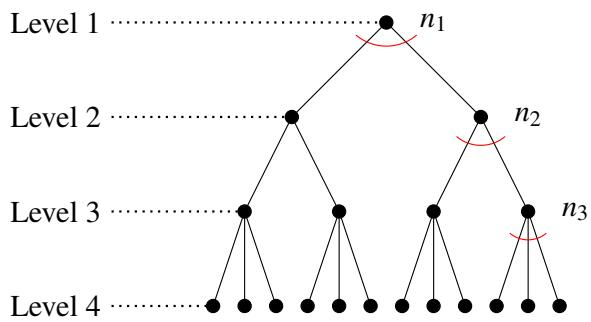
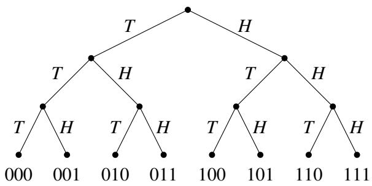
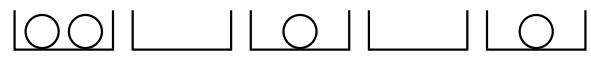
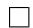

# 012 - 计数

本课程的下一个主要课题是概率论。假设你抛硬币一千次。正好得到 500 次正面的可能性有多大？那么 1000 次正面呢？事实证明，得到 500 次正面的几率大约是 $2 . 5 \%$ ，而得到 1000 次正面的几率微乎其微，我们不妨说这是不可能的。但在学习计算或估算几率或概率之前，你必须先学会**计数**（Counting）！这就是本节讲义的主题。

## 1 序列计数
我们首先考虑一个简单的场景。我们从一个拥有 $n$ 个元素的集合 $S = \{ 1 , 2 , \dots , n \}$ 中一次挑选 $k \leq n$ 个元素，同时将抽样后的元素从 $S$ 中移除。这种抽样类型被称为**不放回抽样**（Sampling without replacement）。我们希望计算执行此操作的不同方式的数量，并考虑元素被挑选的顺序。例如，当 $k = 2$ 时，先选 1 再选 2 被视为与先选 2 再选 1 不同的结果。提出该问题的另一种方式是：我们希望形成一个由 $k$ 个不同元素组成的有序序列，其中每个元素都从集合 $S$ 中挑选。有多少种不同的此类有序序列？

如果我们是在发牌，那么集合将是 ${ \cal S } = \{ 1 , \ldots , 5 2 \}$ ，其中每个数字代表 52 张牌中的一张。在这种情况下，挑选 $S$ 的一个元素是指发一张牌。请注意，一旦发了一张牌，它就不再在牌堆中，因此不能再次分发。因此，发出的 $k$ 张牌组成的手牌由集合 $S$ 中的 $k$ 个不同元素组成。

对于第一张牌，显而易见我们有 52 种不同的选择。但现在，第二张牌的可选方案取决于我们第一张挑选了哪张牌。关键的观察是，无论我们第一张选了哪张牌，第二张牌都恰好有 51 种选择。因此，选择前两张牌的总方式数是 $5 2 \times 5 1$ 。以同样的方式推理，无论我们对前两张牌的选择如何，第三张牌都恰好有 50 种选择。由此推得，三张牌的序列恰好有 $5 2 \times 5 1 \times 5 0$ 种。通常， $k$ 张牌的序列数量为 $5 2 \times 5 1 \times \cdots \times \left[ 5 2 - ( k - 1 ) \right]$ 。

这是计数第一法则的一个例子：

**计数第一法则**（First Rule of Counting）：如果一个对象可以通过连续的 $k$ 次选择来制成，其中进行第一次选择有 $n _ { 1 }$ 种方式，并且对于进行第一次选择的每种方式，进行第二次选择都有 $n _ { 2 }$ 种方式，并且对于进行第一次和第二次选择的每种方式，进行第三次选择都有 $n _ { 3 }$ 种方式，依此类推直到第 $n _ { k }$ 次选择，那么以此方式可以制成的不同对象的总数就是乘积 $n _ { 1 } \times n _ { 2 } \times n _ { 3 } \times \cdots \times n _ { k }$ 。

这里是可视化计数第一法则的另一种方式。考虑以下树状图：

它在根节点的深处分支因子为 $n _ { 1 }$ ，在第二级的每个顶点分支因子为 $n _ { 2 }$ ，……，在第 $k$ 级的每个顶点分支因子为 $n _ { k }$ 。从根节点到第 $k + 1$ 级顶点（即叶顶点）的每条路径都代表了通过一系列 $k$ 次选择来制成对象的一种可能方式。因此，可以制成的不同对象的数量等于树中叶子的数量。此外，树中叶子的数量是乘积 $n _ { 1 } \times n _ { 2 } \times n _ { 3 } \times \cdots \times n _ { k }$ 。例如，如果 $n _ { 1 } = 2$ ， $n _ { 2 } = 2$ ，且 $n _ { 3 } = 3$ ，那么就有 12 个叶子（即结果）。

## 2 集合计数
考虑一个稍微不同的问题。我们想挑选 $S = \{ 1 , 2 , \dots , n \}$ 的 $k$ 个不同元素（即不重复），但我们不在乎挑选这 $k$ 个元素的顺序。例如，挑选元素 $1 , \ldots , k$ 被视为与挑选元素 $2 , \ldots , k$ 且最后挑选 1（第 $k$ 个元素）相同的结果。那么，有多少种选择这些元素以获得相同结果的方法？

在分发一手牌时，比如一局扑克牌，统计不同手牌的数量（即发到手里的 5 张牌组成的集合）通常比统计它们被分发的顺序更自然。正如我们在第 1 节中看到的，如果我们考虑顺序，会有 $5 2 \cdot 5 1 \cdot 5 0 \cdot 4 9 \cdot 4 8 = { \frac { 5 2 ! } { 4 7 ! } }$ 种结果。但是有多少种不同的 5 张牌的手牌呢？提出该问题的另一种方式是：每种这样的 5 张牌手牌都只是 $S$ 的一个基数为 5 的子集。所以我们是在问 $S$ 有多少个 5 元子集？

这里有一个巧妙的技巧来计算具有恰好 5 个元素的 $S$ 的不同子集的数量。为每个这样的 5 元子集创建一个箱子。现在将所有 5 张牌的序列以自然的方式分发到这些箱子中：每个序列都被放入与其序列中 5 个元素的集合相对应的箱子中。因此，如果序列是 (2, 1, 3, 5, 4)，那么它就被放入标有 $\{ 1 , 2 , 3 , 4 , 5 \}$ 的箱子中。每个箱子放入了多少个序列？答案恰好是 5!，因为排列 5 张牌恰好有 5! 种不同的方式。

回想一下，我们的目标是计算 5 元子集的数量，现在这对应于箱子的数量。我们知道总共有 $\frac { 5 2 ! } { 4 7 ! }$ 个 5 张牌序列，并且每个箱子中放有 5! 个序列。箱子的总数因此是 $\frac { 5 2 ! } { 4 7 ! 5 ! }$ 。

这个数量 $\frac { n ! } { ( n - k ) ! k ! }$ 被如此频繁地使用，以至于它有一个专门的符号： $\binom { n } { k }$ ，读作 “n choose $k$ ”（n 选 k），它被称为**二项式系数**（Binomial coefficient）。这是从 $S$ 中挑选 $k$ 个不同元素的方式数，其中放置的顺序并不重要。等价地，它是从总共 $n$ 个不同对象中选择 $k$ 个对象的方式数，其中选择的顺序并不重要。

我们上面使用的技巧实际上是我们的计数第二法则：

**计数第二法则**（Second Rule of Counting）：假设一个对象是通过连续的选择制成的，并且进行选择的顺序并不重要。设 $A$ 为有序对象的集合，设 $B$ 为无序对象的集合。如果存在一个从 $A$ 到 $B$ 的 $m$ 对 1 函数 $f$ ，我们可以计算有序对象的数量（假装顺序很重要），然后除以 $m$ （每个无序对象对应的有序对象数量），即可得出 $| B |$ ，即无序对象的数量。

函数 $f$ 只是将有序结果放入与无序结果相对应的箱子中。在我们的扑克牌手牌例子中， $f$ 将函数定义域（有序 5 张牌结果的集合）中的 5! 个元素映射到值域（ $S$ 的 5 元子集的集合）中的一个元素。因此，函数值域中的元素数量为 $\frac { 5 2 ! } { 4 7 ! 5 ! }$ 。

## 3 放回抽样
有时我们希望考虑另一种抽样场景，即从 $S = \{ 1 , 2 , \dots , n \}$ 中选择一个元素后，将其放回 $S$ 中，以便我们可以再次选择它。假设我们仍然是每次挑选一个元素，总共从 $S$ 中挑选 $k$ 个元素，并且顺序很重要。在这种新的抽样方案下，我们可以获得多少种不同的 $k$ 个元素的序列？我们可以使用计数第一法则。由于我们在每次试验中都有 $n$ 种选择，因此 $n _ { 1 } = n _ { 2 } = \cdot \cdot \cdot = n _ { k } = n$ 。那么我们总共有 $n ^ { k }$ 个序列。

这种抽样类型被称为**放回抽样**（Sampling with replacement）；多次试验可以具有相同的结果。发牌是一种不放回抽样，因为两次试验不能具有相同的结果（一张牌不能发两次）。

### 3.1 抛硬币
让我们回到抛硬币。如果我们抛硬币 $k$ 次，会有多少种不同的结果？所谓结果，我们指的是由正面和反面组成的长度为 $k$ 的序列。假设我们用长度为 $k$ 的二进制字符串来表示每个结果，其中 0 对应反面 $( T )$ ， 1 对应正面 $( H )$ 。例如，字符串 001 将表示先得到 2 个反面，然后得到 1 个正面的结果。下面的树状图（其叶子与可能的结果集一一对应）说明了 $k = 3$ 时的实验：

这里 $S = \{ 0 , 1 \}$ 。这是一个放回抽样的案例；多次硬币翻转可能会导致反面（我们可以在多次试验中从集合 $S$ 中挑选元素 0）。顺序也很重要；例如，字符串 001 和 010 被视为不同的结果。根据上面的推理（使用计数第一法则），由于 $n = 2$ ，我们总共有 $n ^ { k } = 2 ^ { k }$ 种不同的结果。

### 3.2 掷骰子
假设我们掷两个骰子，那么 $k = 2$ ， $S = \{ 1 , 2 , 3 , 4 , 5 , 6 \}$ 。有多少种可能的结果？在这种情况下，顺序很重要；第一个骰子得到 1，第二个骰子得到 2，与第一个骰子得到 2，第二个骰子得到 1 是不同的。我们是在进行放回抽样，因为我们可以在两个骰子上获得相同的结果。

因此，这种情况与上面的抛硬币例子相同（顺序很重要且我们正在进行放回抽样），所以我们可以以同样的方式使用计数第一法则。因此，不同结果的数量为 $n ^ { 2 } = 6 ^ { 2 } = 3 6$ 。

### 3.3 放回抽样，但顺序并不重要
假设你有无限量的苹果、香蕉和橙子。你想选择 5 块水果来做水果沙拉。有多少种方法可以做到这一点？在这个例子中， $S = \{ 1 , 2 , 3 \}$ ，其中 1 代表苹果， 2 代表香蕉， 3 代表橙子。 $k = 5$ ，因为我们想选择 5 块水果。顺序并不重要；选择一个苹果，然后是一个香蕉，将导致与选择一个香蕉，然后是一个苹果相同的沙拉。

这种情况分析起来更加棘手。由于顺序并不重要，应用计数第二法则似乎很自然。让我们考虑这种方法。我们首先假装顺序很重要，并观察到如上所述，有序对象的数量为 $3 ^ { 5 }$ 。对于每个无序选项，有多少个有序选项？问题在于，这个数字取决于我们正在考虑哪个无序对象。假设无序对象是 5 根香蕉的结果。只有一个这样的有序结果。但如果我们考虑 4 根香蕉和 1 个苹果，则有 5 个这样的有序结果（表示为 12222, 21222, 22122, 22212, 22221）。

既然我们看到计数第二法则没有帮助，我们能否以不同的方式看待这个问题？让我们首先泛化回我们的原始设置：我们有一个集合 $S = \{ 1 , 2 , \dots , n \}$ ，我们想知道有多少种方法可以选择大小为 $k$ 的**多重集**（Multisets，即允许重复的集合）。值得注意的是，我们可以根据二进制字符串对这个问题进行建模，如下所述。

假设我们为 $S$ 的每个元素分配一个箱子，因此总共有 $n$ 个箱子。例如，如果我们选择了 2 个苹果和 1 个香蕉，箱子 1 将有 2 个元素，箱子 2 将有 1 个元素。为了计算多重集的数量，我们需要计算有多少种不同的方式可以用 $k$ 个元素填满这些箱子。我们不在乎箱子本身的顺序，只关心每个箱子包含 $k$ 个元素中的多少个。让我们用二进制字符串中的 0 表示 $k$ 个元素中的每一个，用 1 表示箱子之间的分隔。下图说明了 $S = \{ 1 , \ldots , 5 \}$ 且 $k = 4$ 时的一个放置示例：

  
001 101 10

现在，计算多重集的数量就相当于计算 $k$ 个 0 的放置方式数量。通过从不同的角度看问题，我们刚刚将一个看似非常复杂的问题简化为了一个关于二进制字符串的问题！

我们有多少种方式可以选择这些位置？我们的二进制字符串长度为 $k + n - 1$ ，我们要选择其中哪些 $k$ 个位置应该包含 0。剩下的 $n - 1$ 个位置将包含 1。一旦我们为一个零选择了一个位置，就不能再次选择它；不允许重复。先选位置 1 再选位置 2 与先选位置 2 再选位置 1 是一样的，所以顺序并不重要。由此推得，我们要计算的只是从 $k + n - 1$ 个元素中挑选 $k$ 个元素的方式数，不放回且放置顺序并不重要。如第 2 节所述，这由 $\binom { n + k - 1 } { k }$ 给出。因此，这就是从集合 $S$ 中选择大小为 $k$ 的多重集的方式数。

回到我们上面的例子，挑选 5 块水果的方式数恰好是 ${ \binom { 3 + 5 - 1 } { 5 } } = { \binom { 7 } { 5 } }$ 。

请注意，我们从一个看起来与之前例子非常不同的问题开始，但通过从特定的视角观察它，我们能够使用之前的技术（用于集合计数的技术）来找到解决方案！

从某种意义上说，我们发现了**计数第零法则**：

**计数第零法则**（Zeroth Rule of Counting）：如果一个集合 $A$ 可以与集合 $B$ 建立一一对应关系（即你可以找到两者之间的双射——一对互逆的映射，将 $A$ 的元素映射到 $B$ 的元素，反之亦然），那么 $| A | = | B |$ 。

这就是计数含义的核心，也是许多组合论断的关键，我们将在下一节进一步探讨。

## 4 组合证明
组合证明非常有趣，因为它们依赖于直观的计数论证，而不是繁琐的代数运算。它们通常感觉像是通过故事来证明——同一个故事，从多个角度讲述。

作为热身，让我们使用计数论证来证明二项式定理：

**定理 12.1**（二项式定理）。对于所有 $n \in \mathbb { N }$ ，

$$
(a + b) ^ {n} = \sum_ {k = 0} ^ {n} {\binom {n} {k}} a ^ {k} b ^ {n - k}.
$$

**证明**。左侧可以写成 $n$ 倍乘积 $( a + b ) ( a + b ) \cdots ( a + b )$ 。将这 $n$ 个因子标记为 $f _ { 1 } , f _ { 2 } , \ldots , f _ { n }$ 。当 $( a + b ) ( a + b ) \cdots ( a + b )$ 通过乘法展开时，它将产生 $2 ^ { n }$ 个单项式的和，并且对于和中的每个单项式，每个因子 $f _ { i }$ 贡献一个 $a$ 或一个 $b$ 。例如，在 $( a + b ) ( a + b ) = a ^ { 2 } + a b + b a + b ^ { 2 }$ 中， $a ^ { 2 }$ 是由 $f _ { 1 }$ 的 $a$ 和 $f _ { 2 }$ 的 $a$ 相乘形成的；ab 是由 $f _ { 1 }$ 的 $a$ 和 $f _ { 2 }$ 的 $b$ 相乘形成的；ba 是由 $f _ { 1 }$ 的 $b$ 和 $f _ { 2 }$ 的 $a$ 相乘形成的； $b ^ { 2 }$ 是由 $f _ { 1 }$ 的 $b$ 和 $f _ { 2 }$ 的 $b$ 相乘形成的。通常，当 $k$ 个 $a$ 的副本和 $n - k$ 个 $b$ 的副本相乘时，得到单项式 $a ^ { k } b ^ { n - k }$ 。从 $n$ 个因子 $f _ { 1 } , f _ { 2 } , \ldots , f _ { n }$ 中选择 $k$ 个 $a$ 的副本和 $n - k$ 个 $b$ 的副本恰好有 $\binom { n } { k }$ 种方式。 $\square$

这一众所周知的结果有众多应用。例如，利用定理 12.1 可以很容易地推导以下组合恒等式：

**推论 12.1**。对于所有 $n \in \mathbb { N } _ { i }$ ，

$$
\sum_ {k = 0} ^ {n} (- 1) ^ {k} \binom {n} {k} = 0.
$$

在下文中，我们将考虑更复杂的组合证明版本。其核心思想是证明一个给定等式的两边对应于对同一类对象计数的两种不同方式。在更高级的情况下，目标是在等式左侧计数的对象集合与等式右侧计数的对象集合之间建立双射。我们在下面阐述这些概念。

## 4.1 组合恒等式
利用组合论证，我们可以证明复杂的结论，例如

$$
\binom {n} {k + 1} = \binom {n - 1} {k} + \binom {n - 2} {k} + \dots + \binom {k} {k}, \tag {1}
$$

这被称为**曲棍球棒恒等式**（Hockey-stick identity）。你可以通过代数运算直接验证这个恒等式。但你也可以通过解释等式两边作为组合过程的含义来做到这一点。(1) 的左侧即是从集合 $S = \{ 1 , \ldots , n \}$ 中选择具有 $k + 1$ 个元素的子集 $X$ 的方式数。让我们考虑一个导致选择 $k + 1$ 个元素子集的不同过程。我们从挑选 $X$ 中编号最小的元素开始。如果我们挑选了 1，为了完成 $X$ 的构造，我们现在必须从 $S$ 中大于 1 的剩余 $n - 1$ 个元素中选择 $k$ 个元素；这可以通过 $\binom { n - 1 } { k }$ 种方式完成。如果是挑选了 2 作为编号最小的元素，那么我们必须从 $S$ 中大于 2 的剩余 $n - 2$ 个元素中选择 $k$ 个元素，这可以通过 $\binom { n - 2 } { k }$ 种方式完成。此外，所有这些子集都与那些编号最小元素为 1 的子集不同。所以我们应该将每种选择方式的数量加到总数中。按照这种方式进行，我们根据选择的第一个（即编号最小的）对象将过程分为不同的情况，从而得到：

$$
\text {选择的第一个元素是} \left\{ \begin{array}{c c} \text {元素 1，} & \text {导致剩余 } \binom {n - 1} {k} \text { 种方式，} \\ \text {元素 2，} & \text {导致剩余 } \binom {n - 2} {k} \text { 种方式，} \\ \text {元素 3，} & \text {导致剩余 } \binom {n - 3} {k} \text { 种方式，} \\ \vdots & \vdots \\ \text {元素 } (n - k), & \text {导致剩余 } \binom {k} {k} \text { 种方式。} \end{array} \right.
$$

这些因子对应于 (1) 右侧的各项。（注意，我们选择的编号最小的对象不能高于 $n - k$ ，因为我们必须选择 $k + 1$ 个不同的对象。）

我们将证明的另一个组合恒等式是

$$
\binom {n} {0} + \binom {n} {1} + \dots + \binom {n} {n} = 2 ^ {n}. \tag {2}
$$

这个恒等式实际上可以立即通过在上面的二项式定理中设置 $a = 1$ 和 $b = 1$ 得到，但我们将提供一个更直接的组合证明。假设我们有一个具有 $n$ 个不同元素的集合 $S$ 。在 (2) 的左侧， $\binom { n } { i }$ 计算了恰好选择大小为 $i$ 的 $S$ 子集的方式数；因此左侧的总和计算了 $S$ 的所有子集（任何大小）的总数。

我们断言 (2) 的右侧确实也计算了子集的总数。为了看到这一点，只需将子集与一个 $n$ 位向量对应起来，在每个位置 $j$ 上，如果第 $j$ 个元素在子集中，我们就放一个 1，否则放一个 0。因此，子集的数量等于 $n$ 位向量的数量，即 $2 ^ { n }$ （每个位有 2 种选择）。

让我们看一个例子，其中 $S = \{ 1 , 2 , 3 \}$ （因此 $n = 3$ ）。列举所有 $2 ^ { 3 } = 8$ 个可能的 $S$ 子集： $\emptyset , \{ 1 \} , \{ 2 \} , \{ 3 \} , \{ 1 , 2 \} , \{ 1 , 3 \} , \{ 2 , 3 \} , \{ 1 , 2 , 3 \}$ 。与这些子集相对应的八个 3 位向量分别是 $( 0 , 0 , 0 ) , ( 1 , 0 , 0 ) , ( 0 , 1 , 0 ) , ( 0 , 0 , 1 ) , ( 1 , 1 , 0 ) , ( 1 , 0 , 1 ) , ( 0 , 1 , 1 ) , ( 1 , 1 , 1 )$ 。在 (2) 的左侧，项 $\binom { 3 } { 0 }$ 计算了选择具有 0 个元素的 $S$ 子集的方式数；只有一个这样的子集，即空集 $\emptyset = \{ \}$ 。选择具有 1 个元素的子集有 ${ \binom { 3 } { 1 } } = 3$ 种方式，选择具有 2 个元素的子集有 $\binom { 3 } { 2 } = 3$ 种方式，选择具有 3 个元素的子集有 ${ \binom { 3 } { 3 } } = 1$ 种方式（即由 $S$ 的每个元素组成的子集）。将它们相加，我们得到 $1 + 3 + 3 + 1 = 8$ ，正如预期的那样。

## 4.2 排列与错排
**问题**：假设我们收集 $n$ 名学生的作业，随机打乱它们，然后还给学生。如果我们将这个实验重复很多次，平均会有多少学生收到自己的作业？

起初这可能看起来是一个相当具有挑战性的问题，但在本课程稍后的部分，一旦你掌握了概率论的一些基本工具，你就能在几行之内回答这个问题。现在，让我们把这个问题翻译成数学陈述，并考虑一个相关的计数问题。

将作业标记为 $1 , 2 , \ldots , n$ ，并令 $\pi _ { i }$ 表示返还给第 $i$ 个学生的作业。那么，向量 $\pmb { \pi } = ( \pi _ { 1 } , \ldots , \pi _ { n } )$ 对应于集合 $\{ 1 , \ldots , n \}$ 的一个排列。注意 $\pi _ { 1 } , \ldots , \pi _ { n } \in \{ 1 , 2 , \ldots , n \}$ 都是截然不同的，所以 $\{ 1 , \ldots , n \}$ 中的每个元素在排列 $\pi$ 中恰好出现一次。总共有 $n!$ 个截然不同的 $\{ 1 , \ldots , n \}$ 排列。

在这种情况下，第 $i$ 个学生收到自己的作业，当且仅当 $\pi _ { i } = i$ 。那么问题“有多少学生收到自己的作业？”就翻译成了有多少个索引（i）满足 $\pi _ { i } = i$ 的问题。这些被称为排列 $\pi$ 的**不动点**（Fixed points）。为了具体阐述这个概念，让我们考虑 $n = 3$ 的例子。表 1 显示了 $\{ 1 , 2 , 3 \}$ 的所有 $3 ! = 6$ 个排列的完整列表，以及相应的不动点数量。

表 1： $\{ 1 , 2 , 3 \}$ 的排列及其不动点数量。

| $(\pi_1, \pi_2, \pi_3)$ | 不动点数量 |
| :--- | :--- |
| (1,2,3) | 3 |
| (1,3,2) | 1 |
| (2,1,3) | 1 |
| (2,3,1) | 0 |
| (3,1,2) | 0 |
| (3,2,1) | 1 |

我们现在考虑一个关于**错排**（Derangements）的有趣计数问题，其定义如下。

**定义 12.1**（错排）。没有不动点的排列被称为错排。

令 $D _ { n }$ 表示 $\{ 1 , 2 , \ldots , n \}$ 的错排数量。从表 1 中可以看出， $D _ { 3 } = 2$ ；具体来说，错排是 (2, 3, 1) 和 (3, 1, 2)。我们的目标是找到一个关于 $n$ 的函数 $D _ { n }$ 公式，适用于所有 $n \in \mathbb { Z } ^ { + }$ 。我们将学习两种不同的方法来解决这个问题。

第一种方法涉及组合证明。为了具体起见，让我们考虑 $n = 4$ 的情况。表 2a 列出了 $\{ 1 , 2 , 3 , 4 \}$ 的所有错排，每一行对应一个错排。在第一个错排中，请注意以蓝色显示的项对应于 $\{ 1 , 2 \}$ 的一个错排。在第二个和第三个错排中，以红色显示的项与表 2b 中所示的 $\{ 1 , 2 , 3 \}$ 的错排呈一一对应关系。请注意，表 2a 中的红色 4 满足与表 2b 中的数字 3 相同的约束；具体来说，前者中 $\pi _ { 3 } \neq 4$ ，后者中 $\pi _ { 3 } \neq 3$ 。总之，上述讨论表明 $D _ { 4 }$ 与 $D _ { 2 }$ 和 $D _ { 3 }$ 相关。以下定理使这种关系正式化。

表 2：错排列表。(a) $n = 4$ 。(b) $n = 3$ 。

| (a) | | | | (b) | | |
| :--- | :--- | :--- | :--- | :--- | :--- | :--- |
| $\pi_1$ | $\pi_2$ | $\pi_3$ | $\pi_4$ | $\pi_1$ | $\pi_2$ | $\pi_3$ |
| 2 | 1 | 4 | 3 | 2 | 3 | 1 |
| 2 | 4 | 1 | 3 | 3 | 1 | 2 |
| 4 | 1 | 2 | 3 | | | |
| 4 | 3 | 2 | 1 | | | |
| 3 | 4 | 2 | 1 | | | |
| 2 | 3 | 4 | 1 | | | |
| 3 | 4 | 1 | 2 | | | |
| 4 | 3 | 1 | 2 | | | |
| 3 | 1 | 4 | 2 | | | |

**定理 12.2**。对于任意正整数 $n \geq 3$ ， $\{ 1 , \ldots , n \}$ 的错排数量 $D _ { n }$ 满足

$$
D _ {n} = (n - 1) \left(D _ {n - 1} + D _ {n - 2}\right). \tag {3}
$$

**证明**。我们通过建立相关的双射来提供组合证明。在 $\{ 1 , \ldots , n \}$ 的一个错排 $( \pi _ { 1 } , \ldots , \pi _ { n } )$ 中，假设 $\pi _ { n } = j \in \{ 1 , \ldots , n - 1 \}$ ；即在排列下 $n$ 映射到的元素是 $j$ 。 $j$ 有 $n - 1$ 种选择，这产生了 (3) 中的乘法因子 $( n - 1 )$ 。（排除 $j = n$ 的情况，因为错排不能满足 $\pi _ { n } = n$ 。）对于给定的 $j \in \{ 1 , \ldots , n - 1 \}$ 值，有两种情况需要考虑：

情况 1：如果 $\pi _ { j } = n$ ，那么 $j$ 和 $n$ 互换了位置，此时剩余元素的错排集与 $\{ 1 , \ldots , n - 2 \}$ 的错排集之间存在一一对应关系。这产生了 $D _ { n - 2 }$ 。

情况 2：如果 $\pi _ { j } \neq n$ ，那么 $n$ 满足与 $j$ 相同的约束，因此 $\{ 1 , \ldots , j - 1 , j + 1 , \ldots , n \}$ 的错排集与 $\{ 1 , \ldots , n - 1 \}$ 的错排集之间存在一一对应关系。这产生了 $D _ { n - 1 }$ 。

至此完成了对 (3) 的推导。

结合边界条件 $D _ { 1 } = 0$ 和 $D _ { 2 } = 1$ （请核实），利用 (3) 中的递归和记忆化，可以高效地（关于 $n$ 是线性时间）确定 $D _ { n }$ 。事实上，该递归可以解析求解，得到以下显式公式（见练习 2）：

$$
D _ {n} = n! \sum_ {k = 0} ^ {n} \frac {(- 1) ^ {k}}{k !}. \tag {4}
$$

提出 (3) 中的递归并求解它需要一定的创造力。如前所述，处理这个计数问题还有另一种方法，事实证明这是一种更直接的方法。这种替代方法利用了一个强大的工具，称为容斥原理，我们现在对其进行描述。

## 5 容斥原理
在本节中，我们将学习一个有用的公式，它可以用来计数对象而不会出现重复计数。我们从一个熟悉的例子开始。设 $A _ { 1 }$ 和 $A _ { 2 }$ 是同一个有限集合 $A$ 的两个子集，假设我们想计算 $A _ { 1 } \cup A _ { 2 }$ 中的元素数量。如果 $A _ { 1 }$ 和 $A _ { 2 }$ 是不相交的，那么显然 $| A _ { 1 } \cup A _ { 2 } | = | A _ { 1 } | + | A _ { 2 } |$ 。然而，如果 $A _ { 1 }$ 和 $A _ { 2 }$ 有公共元素，那么在之前的公式中，这些元素将被计算两次。为了修正这种重复计数，我们需要从 $| A _ { 1 } | + | A _ { 2 } |$ 中减去 $| A _ { 1 } \cap A _ { 2 } |$ ，从而得到

$$
\left| A _ {1} \cup A _ {2} \right| = \left| A _ {1} \right| + \left| A _ {2} \right| - \left| A _ {1} \cap A _ {2} \right|.
$$

容斥原理将这一概念推广到了任意数量的子集。

**定理 12.3**（容斥原理）。设 $A _ { 1 } , \ldots , A _ { n }$ 是同一个有限集合 $A$ 的任意子集。那么，

$$
\left| A _ {1} \cup \dots \cup A _ {n} \right| = \sum_ {k = 1} ^ {n} (- 1) ^ {k - 1} \sum_ {S \subseteq \{1, \dots , n \}: | S | = k} \left| \cap_ {i \in S} A _ {i} \right|. \tag {5}
$$

**备注**：

1. (5) 中的内层求和是对 $\{ 1 , 2 , \ldots , n \}$ 的所有大小为 $k$ 的子集进行的。更明确地说，(5) 可以写成

$$
\begin{array}{l} \left| A _ {1} \cup \dots \cup A _ {n} \right| = \sum_ {i = 1} ^ {n} \left| A _ {i} \right| - \sum_ {i <   j} \left| A _ {i} \cap A _ {j} \right| + \sum_ {i <   j <   k} \left| A _ {i} \cap A _ {j} \cap A _ {k} \right| - \sum_ {i <   j <   k <   l} \left| A _ {i} \cap A _ {j} \cap A _ {k} \cap A _ {l} \right| + \dots \\ + (- 1) ^ {n - 1} \left| A _ {1} \cap A _ {2} \cap \dots \cap A _ {n} \right|, \tag {6} \\ \end{array}
$$

其中 $\sum _ { i < j }$ 表示对满足 $i < j$ 的所有 $i , j \in \{ 1 , \ldots , n \}$ 进行求和，依此类推。

2. 证明定理 12.3 的标准方法是对 $n$ 使用归纳法。在这里，我们将提供一个组合证明。

**证明**。首先，请注意如果 $a \notin A _ { 1 } \cup \cdots \cup A _ { n }$ ，那么对于所有 $i \in \{ 1 , \ldots , n \}$ ， $a \notin A _ { i }$ ，因此对于任何 $S \subseteq \{ 1 , \ldots , n \}$ ， $a \notin \cap _ { i \in S } A _ { i }$ ，所以它不会被 (5) 的右侧 (RHS) 计算。现在我们证明如果 $a \in A _ { 1 } \cup \cdots \cup A _ { n }$ ，那么它恰好被 RHS 计算一次。定义索引集 $M \subseteq \{ 1 , \ldots , n \}$ 为

$$
M = \{i \in \{1, \dots , n \} \mid a \in A _ {i} \};
$$

即 $a \in A _ { j }$ 当且仅当 $i \in M$ 。注意 $m : = | M | \geq 1$ ，因为 $a \in A _ { 1 } \cup \cdots \cup A _ { n }$ 。显然，如果 $S \not \subseteq M$ ，那么 $a \notin \cap _ { i \in S } A _ { i }$ （即如果 $S$ 包含一个不在 $M$ 中的索引 $i$ ，那么 $a \notin A _ { i }$ ，因此 $a \notin \cap _ { i \in S } A _ { i }$ ）。此外，对于 $M$ 的任何非空子集 $S \subseteq M$ ， $a \in \cap _ { i \in S } A _ { i }$ 。因此， $a$ 在 (5) 的 RHS 中被计算的次数为

$$
\sum_ {k = 1} ^ {m} (- 1) ^ {k - 1} \sum_ {S \subseteq M: | S | = k} 1 = \sum_ {k = 1} ^ {m} (- 1) ^ {k - 1} \binom {m} {k} = 1,
$$

其中第一个等号源于 $M$ 的截然不同的 $k$ 元子集的数量是 $\binom { m } { k }$ ，而第二个等号源于推论 12.1。 $\square$

**应用：再谈错排**

我们现在通过应用定理 12.3 来推导错排数量 $D _ { n }$ 的公式 (4)，以此展示该定理的威力。

令 $A _ { i }$ 表示 $\{ 1 , \ldots , n \}$ 的所有以 $i$ 为不动点的排列构成的集合。那么，由于 $\{ 1 , \ldots , n \}$ 共有 $n!$ 个截然不同的排列，且 $| A _ { 1 } \cup A _ { 2 } \cup \ldots \cup A _ { n } |$ 计算了至少有一个不动点的排列数量，因此有

$$
D _ {n} = n! - \left| A _ {1} \cup A _ {2} \cup \dots \cup A _ {n} \right|. \tag {7}
$$

$A _ { i }$ 的基数是多少？我们知道 $i$ 映射到 $i$ ，而剩余的 $n - 1$ 个元素可以任意排列。因此， $| A _ { i } | = ( n - 1 ) !$ 。类似地，对于 $i \neq j$ ， $i$ 映射到 $i$ ， $j$ 映射到 $j$ ，而剩余的 $n - 2$ 个元素可以任意排列，故我们得出 $| A _ { i } \cap A _ { j } | = ( n - 2 ) !$ 。一般地，对于任何大小为 $| S | = k$ 的子集 $S \subseteq \{ 1 , \ldots , n \}$ ， $| \cap _ { i \in S } A _ { i } | = ( n - k ) !$ ，而共有 $\binom { n } { k }$ 个此类子集。因此，(5) 中的容斥公式给出

$$
\left| A _ {1} \cup A _ {2} \cup \dots \cup A _ {n} \right| = \sum_ {k = 1} ^ {n} (- 1) ^ {k - 1} {\binom {n} {k}} (n - k)! = \sum_ {k = 1} ^ {n} (- 1) ^ {k - 1} \frac {n !}{k ! (n - k) !} (n - k)! = n! \sum_ {k = 1} ^ {n} \frac {(- 1) ^ {k - 1}}{k !}.
$$

将此结果代入 (7) 得到

$$
D _ {n} = n! - n! \sum_ {k = 1} ^ {n} \frac {(- 1) ^ {k - 1}}{k !} = n! \sum_ {k = 0} ^ {n} \frac {(- 1) ^ {k}}{k !}.
$$

## 6 练习
1. 提供推论 12.1 的直接组合证明。
2. 利用 (3) 和边界条件 $D _ { 1 } = 0$ 和 $D _ { 2 } = 1$ 推导公式 (4)。[提示：对于 $n \geq 2$ ，定义 $Q _ { n } = D _ { n } - n D _ { n - 1 }$ 并获得 $Q _ { n }$ 的递归式。]
3. 利用归纳法证明定理 12.3。