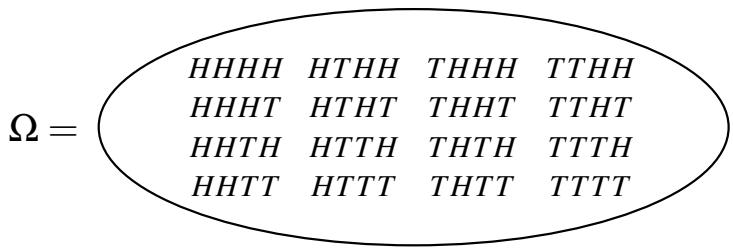
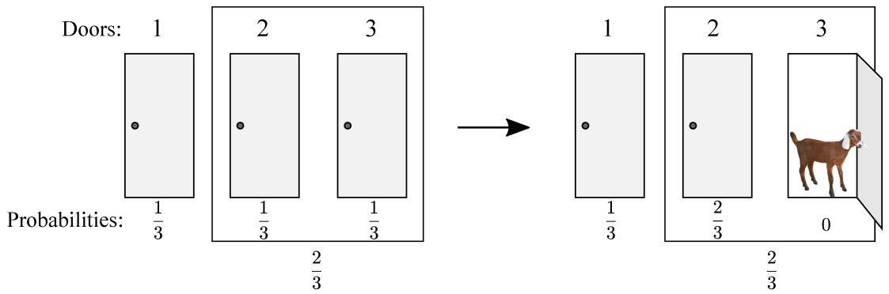

# 013 - 离散概率入门

概率论起源于赌博——分析卡牌游戏、骰子、轮盘。如今，它已成为工程和科学领域的必备工具。在 EECS 中同样如此，其用途广泛涉及算法、系统、控制、信号处理、学习理论和人工智能（AI）。

以下是一些关于概率的典型陈述：

1. 在 5 张牌的扑克牌中获得同花的概率大约是千分之二。
2. 在输入不是合数时，该随机素性测试算法输出“素数”的概率至多是万亿分之一。
3. 在此负载均衡方案中，任何处理器处理超过 12 个请求的概率是微乎其微的。
4. 系统故障之间的平均时间大约是 3 天。
5. 在 2040 年之前，北加州发生 8.0 级地震的几率为 $30 \%$ 。

所有此类陈述中都隐含了潜在**概率空间**（Probability space）的概念。这可能是我们自己构建的随机实验的结果（如上述 1、2 和 3），或者我们对现实世界建立的某些模型（如上述 4 和 5）。除非我们指定所讨论的概率空间，否则这些陈述没有任何意义：出于这个原因，像 5 这样的陈述（通常在没有这种背景的情况下做出）几乎是没有内容的。

在本节讲义中，我们将尝试更清楚地理解这一切。这里的第一个重要概念是**随机实验**（Random experiment）。我们将首先介绍实验所有可能结果的集合，称为**样本空间**（Sample space）。样本空间的每个元素都被分配了一个概率，它告诉我们当我们真正执行实验时，该结果发生的可能性。

## 1 随机实验
通常，一个随机实验包括从基数为 $n$ 的集合 $S$ 中抽取 $k$ 个元素的样本。此类实验的可能结果正是我们在讲义 12 中计数的对象。回想讲义 12，我们考虑了四种可能的计数场景，取决于我们是进行有放回抽样还是无放回抽样，以及挑选 $k$ 个元素的顺序是否重要。我们的随机实验情况也是如此。随机实验的结果被称为**样本点**（Sample point），而样本空间（通常用 $\Omega$ 表示）是实验所有可能结果的集合。

这种实验的一个例子是抛硬币 4 次。在这种情况下， $S = \{ H , T \}$ ，我们正在进行有放回地抽取 4 个元素。HT HT 是样本点的一个例子，样本空间 $\Omega$ 有 16 个元素，如下图所示：

我们如何确定实验中每个特定结果（例如 HHT H）的几率？为了做到这一点，我们需要为每个样本点定义概率，如下所述。

## 2 概率空间
**概率空间**（Probability space）由样本空间 $\Omega$ 以及每个样本点 $\omega$ 的概率 $\mathbb { P } [ \omega ]$ （通常也表示为 $\operatorname* { P r } [ \omega ] )$ 组成，满足：

•（非负性）：对于所有 $\omega \in \Omega$ ， $0 \leq \mathbb { P } [ \omega ] \leq 1$ 。
•（总和为 1）： $\sum _ { \omega \in \Omega } \mathbb { P } [ \omega ] = 1$ ，即所有结果的概率之和为 1。

（从技术上讲， $\mathbb { P }$ 是定义在 $\Omega$ 的特定子集集合上的实值函数，称为**概率测度**（Probability measure）。）为样本点分配概率最简单的方法是均匀分配：如果 $| \Omega | = N$ ，那么对于所有 $\omega \in \Omega$ ， $\mathbb { P } [ \omega ] = \frac { 1 } { N }$ 。例如，如果我们抛一枚均匀的硬币 4 次，16 个样本点（如上图所示）中的每一个都被分配了 $\frac { 1 } { 1 6 }$ 的概率。我们很快就会看到非均匀概率空间的例子。

在进行实验后，我们通常对某个**事件**（Event）是否发生感兴趣。例如，我们可能对在四次抛硬币中恰好出现 2 个正面 $( H )$ 的事件感兴趣。我们如何根据样本空间 $\Omega$ 正式定义事件的概念？答案是将事件“恰好 2 个正面”与所有那些恰好有两个正面的结果集合等同起来，即： $\{ H H T T , H T H T , H T T H , T H H T , T H T H , T T H H \} \subset \Omega$ 。因此，正式地说，一个事件 $A$ 只是样本空间 $\Omega$ 的一个子集，即 $A \subseteq \Omega$ 。

我们应该如何定义事件 $A$ 的概率？自然地，我们应该只需要将 $A$ 中样本点的概率相加即可。对于任何事件 $A \subseteq \Omega$ ，我们定义 $A$ 的概率为

$$
\mathbb {P} [ A ] = \sum_ {\boldsymbol {\omega} \in A} \mathbb {P} [ \boldsymbol {\omega} ].
$$

请注意，对于所有 $A \subseteq \Omega$ ， $0 \leq \mathbb { P } [ A ] \leq 1$ ，且 $\mathbb { P } [ \Omega ] = 1$ 。在四次抛硬币中恰好获得两个 $H$ 的概率可以使用此定义计算如下。事件 $A$ 由所有恰好有两个 $H$ 的序列组成，因此 $| A | = \binom { 4 } { 2 } = 6$ 。对于这个例子，抛掷四次硬币有 $2 ^ { 4 } = 1 6$ 种可能的结果。因此，每个样本点 $\omega \in A$ 的概率为 $\frac { 1 } { 1 6 }$ ；由于 $A$ 中有六个样本点，我们得出 $\mathbb { P } [ A ] = 6 \cdot \frac { 1 } { 1 6 } = \frac { 3 } { 8 }$ 。

## 3 示例
我们现在将研究随机实验及其相应样本空间的示例，以及可能的概率空间和事件。

### 3.1 抛硬币
假设我们有一枚硬币， $\mathbb { P } [ H ] = p$ 且 $\mathbb { P } [ T ] = 1 - p$ ，我们的实验包括抛硬币 4 次。样本空间 $\Omega$ 由前一页图中所示的十六种可能的 $H$ 和 $T$ 序列组成。

概率空间取决于 $p$ 。如果 $p = \frac { 1 } { 2 }$ ，则概率被均匀分配；每个样本点的概率为 $\frac { 1 } { 1 6 }$ 。如果 $p = \frac { 2 } { 3 }$ 呢？那么概率就不同了。例如， $\mathbb { P } [ H H H H ] = \frac { 2 } { 3 } \times \frac { 2 } { 3 } \times \frac { 2 } { 3 } \times \frac { 2 } { 3 } = \frac { 1 6 } { 8 1 }$ ，而 $\mathbb { P } [ T T H H ] = \frac { 1 } { 3 } \times \frac { 1 } { 3 } \times \frac { 2 } { 3 } \times \frac { 2 } { 3 } = \frac { 4 } { 8 1 }$ 。（注意：我们在这里只是简单地将概率相乘；我们稍后会解释为什么对于这个例子这是正确的做法。并不总是可以像这样将概率相乘。）

在这种情况下我们可以考虑什么类型的事件？令 $A$ 为四次硬币抛掷结果全部相同的事件。那么 $A = \{ H H H H , T T T T \}$ 。HHHH 的概率为 $\left( \frac { 2 } { 3 } \right) ^ { 4 }$ ， T T T T 的概率为 $\left( \frac { 1 } { 3 } \right) ^ { 4 }$ 。因此， $\mathbb { P } [ A ] = \mathbb { P } [ H H H H ] + \mathbb { P } [ T T T T ] = \left( \frac { 2 } { 3 } \right) ^ { 4 } + \left( \frac { 1 } { 3 } \right) ^ { 4 } = \frac { 1 7 } { 8 1 }$ 。

接下来，考虑有两个头（正面）的事件 $B$ 。任何具有两个正面（如 HT HT）的特定结果的概率为 $\left( \frac { 2 } { 3 } \right) ^ { 2 } \left( \frac { 1 } { 3 } \right) ^ { 2 }$ 。有多少种这样的结果？有 $\binom { 4 } { 2 } = 6$ 种选择正面位置的方法，这些选择完全指定了序列。所以， $\mathbb { P } [ B ] = 6 \left( \frac { 2 } { 3 } \right) ^ { 2 } \left( \frac { 1 } { 3 } \right) ^ { 2 } = \frac { 2 4 } { 8 1 } = \frac { 8 } { 2 7 }$ 。

更一般地，如果我们抛硬币 $n$ 次，我们会得到一个基数为 $2 ^ { n }$ 的样本空间 $\Omega$ 。样本点是所有可能的长度为 $n$ 的 $H$ 和 $T$ 序列。如果硬币的 $\mathbb { P } [ H ] = p$ ，并且如果我们考虑任何具有恰好 $r$ 个 $H$ 的 $n$ 次硬币抛掷序列，那么该序列的概率为 $p ^ { r } ( 1 - p ) ^ { n - r }$ 。

现在考虑事件 $C$ ，即当我们抛硬币 $n$ 次时得到恰好 $r$ 个 $H$ 。该事件恰好由 $\binom { n } { r }$ 个样本点组成，且每个样本点的概率为 $p ^ { r } ( 1 - p ) ^ { n - r }$ 。所以， $\mathbb { P } [ C ] = \binom { n } { r } p ^ { r } ( 1 - p ) ^ { n - r }$ 。

有偏硬币抛掷序列出现在许多背景中：例如，它们可能会模拟一个故障系统的 $n$ 次独立试验，该系统每次以概率 $p$ 发生故障。

### 3.2 掷骰子
考虑掷两个公平的骰子。在这个实验中， $\Omega = \{ ( i , j ) : 1 \le i , j \le 6 \}$ 。概率空间是均匀的，即所有样本点都有相同的概率 $\frac { 1 } { | \Omega | } = \frac { 1 } { 3 6 }$ 。因此，任何事件 $A$ 的概率为

$$
\mathbb {P} [ A ] = \frac {\# \text {样本点在 } A \text { 中的数量}}{\# \text {样本点在 } \Omega \text { 中的数量}} = \frac {| A |}{| \Omega |}.
$$

所以，对于均匀空间，计算概率简化为计数样本点！

现在考虑两个事件：事件 $A$ 是两个骰子之和至少为 10，以及事件 $B$ 是至少有一个 6。通过列举每个事件中包含的样本点，可以很容易地证明 $| A | = 6$ 且 $| B | = 1 1$ 。那么，根据上面的观察，得出 $\mathbb { P } [ A ] = \frac { 6 } { 3 6 } = \frac { 1 } { 6 }$ 且 $\mathbb { P } [ B ] = \frac { 1 1 } { 3 6 }$ 。

### 3.3 洗牌
考虑洗一副标准扑克牌的随机实验。这里， $\Omega$ 等于牌组的所有 52! 种排列的集合。我们假设概率空间是均匀的。（请注意，我们在这里实际上是在讨论洗牌的理想数学模型；在现实生活中，我们的洗牌总会有一点偏差。然而，数学模型已经足够接近并具有实用性。）我们可以将此实验推广到随机“洗”任意 $n$ 个项目。例如，假设我们收集班级中 $n$ 名学生的作业，然后随机重新分发，每人一份。结果是作业的随机排列，每个结果的概率为 $\frac { 1 } { n ! }$ 。

### 3.4 扑克牌手牌
这是另一个实验：洗一副牌并分发一手扑克牌。在这种情况下， $S$ 是 52 张牌的集合，我们的样本空间 $\Omega = \{ \text{所有可能的扑克牌手牌} \}$ ，这对应于从大小为 $n = 5 2$ 的集合中不放回地选择 $k = 5$ 个对象，且顺序并不重要。因此，正如我们在讲义 12 中看到的， $| \Omega | = \binom { 5 2 } { 5 } = \frac { 5 2 \times 5 1 \times 5 0 \times 4 9 \times 4 8 } { 5 \times 4 \times 3 \times 2 \times 1 } = 2 , 5 9 8 , 9 6 0$ 。假设牌组洗得很均匀，每个结果的概率是等可能的，因此我们处理的是均匀概率空间。

令 $A$ 为扑克牌手牌全为同花的事件。（对于那些不熟悉扑克的人来说，同花是指所有牌的花色都相同，比如红心。）由于概率空间是均匀的，计算 $\mathbb { P } [ A ]$ 简化为计算 $| A |$ ，即同花手牌的数量。每种花色有 13 张牌，所以每种花色的同花数量为 $\binom { 1 3 } { 5 }$ 。因此，同花的总数为 $4 \times \binom { 1 3 } { 5 }$ 。那么我们有

$$
\mathbb {P} [ \text {手牌是同花} ] = \frac {4 \times \binom {1 3} {5}}{\binom {5 2} {5}} = 4 \times \frac {1 3 !}{5 ! 8 !} \times \frac {5 ! 4 7 !}{5 2 !} = 4 \times \frac {1 3 \cdot 1 2 \cdot 1 1 \cdot 1 0 \cdot 9}{5 2 \cdot 5 1 \cdot 5 0 \cdot 4 9 \cdot 4 8} \approx 0. 0 0 2.
$$

### 3.5 球与箱子
在这个实验中，我们将 20 个（有标签的）球扔进 10 个（有标签的）箱子中。假设每个球都有相同的可能性落入任何箱子，而不受其他球的影响。

如果你希望根据从基数为 $n$ 的集合 $S$ 中取 $k$ 个元素的序列来理解这种情况：集合 $S$ 由 10 个箱子组成，我们正在进行 $k = 2 0$ 次有放回抽样。抽样的顺序很重要，因为球是有标签的。

样本空间 $\Omega$ 等于 $\{ ( b _ { 1 } , b _ { 2 } , \dotsc , b _ { 2 0 } ) : \text{对于每个 } i = 1 , \ldots , 2 0 , 1 \leq b _ { i } \leq 1 0 \}$ ，其中分量 $b _ { i }$ 表示球 $i$ 落入的箱子。样本空间基数 $| \Omega |$ 等于 $1 0 ^ { 2 0 }$ ，因为序列中的每个元素 $b _ { i }$ 都有 10 种可能的选择，且序列中有 20 个元素。更一般地，如果我们把 $m$ 个球投入到 $n$ 个箱子中，我们就有一个大小为 $n ^ { m }$ 的样本空间。概率空间是均匀的；正如我们之前所说，每个球都有相同的可能性落入任何箱子。

令 $A$ 为箱子 1 是空的事件。由于概率空间是均匀的，我们只需要计算有多少个结果具有此性质。这正是所有 20 个球掉进剩下的 9 个箱子的方式数，即 $9 ^ { 2 0 }$ 。因此， $\mathbb { P } [ A ] = \frac { 9 ^ { 2 0 } } { 1 0 ^ { 2 0 } } = \left( \frac { 9 } { 1 0 } \right) ^ { 2 0 } \approx 0 . 1 2$ 。

令 $B$ 为箱子 1 包含至少一个球的事件。此事件是 $A$ 的补集 $\bar { A }$ ，即它由那些不在 $A$ 中的确切样本点组成。所以 $\mathbb { P } [ B ] = 1 - \mathbb { P } [ A ] \approx 0 . 8 8$ 。更一般地，如果我们把 $m$ 个球投入到 $n$ 个箱子中，我们有：

$$
\mathbb {P} [ \text {箱子 1 为空} ] = \left(\frac {n - 1}{n}\right) ^ {m} = \left(1 - \frac {1}{n}\right) ^ {m}.
$$

正如我们将要看到的，球与箱子是计算机科学中经常出现的另一个概率空间：例如，我们可以将其视为一种负载均衡方案的建模，其中每个作业都被分给一台随机的处理器。

它也是我们之前考虑过的问题的更通用模型。例如，抛掷公平硬币 4 次是球数 $( m )$ 为 4 且箱数 $( n )$ 为 2 的特殊情况。掷两个骰子是 $m = 2$ 且 $n = 6$ 的特殊情况。

### 3.6 生日悖论
“生日悖论”是一个著名的现象，它探讨了一组人中两个人生日相同的几率。它之所以被称为“悖论”，不是因为逻辑上的矛盾，而是因为它违背了直觉。为了便于计算，我们将一年的天数定为 365 天。那么 $S = \{ 1 , \ldots , 3 6 5 \}$ ，随机实验包括从 $S$ 中有放回地抽取 $n$ 个元素的样本，其中这些元素是一组中 $n$ 个人的出生日期。那么 $| \Omega | = 3 6 5 ^ { n }$ 。这是因为每个样本点都是 $n$ 个人可能生日的序列；所以序列中有 $n$ 个点，每个点有 365 个可能的值。

令 $A$ 为至少有一对人生日相同的事件。如果我们想确定 $\mathbb { P } [ A ]$ ，那么计算 $A$ 的补集的概率可能会更简单；即 $\mathbb { P } [ \bar { A } ]$ ，其中 $\bar { A }$ 是没有两个人生日相同的事件。由于 $\mathbb { P } [ A ] = 1 - \mathbb { P } [ \bar { A } ]$ ，我们就可以很容易地计算出 $\mathbb { P } [ A ]$ 。

我们再次在一个均匀概率空间中工作，所以我们只需要确定 $| \bar { A } |$ 。等价地，我们正在计算没有两个人生日相同的方式数。第一个人有 365 种选择，第二个人有 364 种，……，第 $n$ 个人有 $3 6 5 - n + 1$ 种选择，总共有 $3 6 5 \times 3 6 4 \times \cdots \times ( 3 6 5 - n + 1 )$ 种。这只是讲义 12 中计数第一法则的一个应用；我们是在进行无放回抽样（因为我们需要避免碰撞），且顺序很重要。

总之，我们有

$$
\mathbb {P} [ \bar {A} ] = \frac {| \bar {A} |}{| \Omega |} = \frac {3 6 5 \times 3 6 4 \times \cdots \times (3 6 5 - n + 1)}{3 6 5 ^ {n}},
$$

所以 $\mathbb { P } [ A ] = 1 - \mathbb { P } [ \bar { A } ] = 1 - \frac { 3 6 5 \times 3 6 4 \times \cdots \times ( 3 6 5 - n + 1 ) } { 3 6 5 ^ { n } }$ 。这使我们能够计算出 $\mathbb { P } [ A ]$ 随人数 $n$ 变化的函数。当然，随着 $n$ 的增加， $\mathbb { P } [ A ]$ 也会增加。事实上，当人数 $n = 2 3$ 时，你应该愿意打赌至少有一对人生日相同，因为那时 $\mathbb { P } [ A ]$ 大于 $50 \%$ 。对于 $n = 6 0$ 人， $\mathbb { P } [ A ]$ 超过 $9 9 \%$ 。

### 3.7 蒙提·霍尔问题
这个例子大致基于 20 世纪 70 年代由蒙提·霍尔主持的一档著名的电视游戏节目。参赛者面前有三扇门；其中一扇门后面是一件有价值的奖品（一辆车），另外两扇门后面是山羊。参赛者选一扇门（但不打开它）。然后霍尔的助手（卡罗尔）打开另外两扇门中的一扇，露出一只山羊（因为卡罗尔知道奖品在哪里，她总能做到这一点）。然后，参赛者可以选择坚持选目前的门，或者换到另一扇没打开的门。当且仅当他们选择的门是正确的那扇门时，参赛者赢得奖品。问题是：如果参赛者换门，他/她获胜的机会是否更大？

直觉上，似乎显而易见的是，既然卡罗尔打开一扇门后只剩下两扇门，它们的概率必定相等。所以你可能会倾向于得出结论，参赛者坚持还是换门都无所谓。我们将看到，实际上，如果参赛者使用换门策略，他或她选中汽车的机会更大。我们将首先给出一个直观的图片化论证，然后采用更严谨的概率方法来处理这个问题。

要理解为什么换门符合参赛者的最佳利益，请考虑以下几点。起初，当参赛者选择这扇门时，他或她有 $1/3$ 的机会选中汽车。这一定意味着其他门组合起来有 $2/3$ 的获胜机会。但是在卡罗尔打开一扇后面有山羊的门之后，这些概率是如何变化的呢？嗯，参赛者最初选择的那扇门仍然有 $1/3$ 的获胜机会，而卡罗尔打开的那扇门已经没有获胜的机会了。那么最后一扇门呢？它必须有 $2/3$ 的机会包含汽车，因此如果参赛者换门，他或她获胜的机会就会更高。这个论证可以用下面的图片很好地总结：

这里的样本空间是什么？嗯，我们可以使用 $( i , j , k )$ 形式的三元组来描述游戏的结果（直到参赛者做出最终决定的那一刻），其中 $i , j , k \in \{ 1 , 2 , 3 \}$ 。 $i , j , k$ 分别指定了奖品的位置、参赛者最初选择的门以及卡罗尔打开的门。注意，有些三元组是不可能的：例如，(1, 2, 1) 是不可能的，因为卡罗尔从不打开奖品门。将样本空间看作一个树状结构，首先选择 $i$ ，然后选择 $j$ ，最后选择 $k$ （取决于 $i$ 和 $j$ ），我们看到恰好有 12 个样本点。

在这里为样本点分配概率需要确定一些假设：

• 奖品等可能地在三扇门中的任何一扇后面。
• 最初，参赛者等可能地挑选三扇门中的任何一扇。
• 如果参赛者碰巧选中了奖品门（这样卡罗尔就有两扇可能的门可以打开），卡罗尔等可能地挑选其中任何一扇。（实际上，无论卡罗尔如何挑选门，我们的计算结果都将是相同的。）

由此，我们可以为每个样本点分配一个概率。例如，点 (2, 1, 3) 对应于奖品放在 2 号门后面（概率为 $1/3$ ），参赛者挑选 1 号门（概率为 $1/3$ ），卡罗尔打开 3 号门（概率为 1，因为她别无选择）。所以

$$
\mathbb {P} [ (2, 1, 3) ] = \frac {1}{3} \times \frac {1}{3} \times 1 = \frac {1}{9}.
$$

[注意：这里我们再次在没有适当理由的情况下将概率相乘！] 请注意，有六种此类结果，其特征是 $i \neq j$ （因此 $k$ 必须与两者都不同）。另一方面，我们有

$$
\mathbb {P} [ (1, 1, 2) ] = \frac {1}{3} \times \frac {1}{3} \times \frac {1}{2} = \frac {1}{1 8}.
$$

有六种此类结果满足 $i = j$ 。这些是所有可能的结果，所以我们已经完全定义了我们的概率空间。为了核对我们的计算，我们注意到所有结果的概率总和为 $( 6 \times \frac { 1 } { 9 } ) + ( 6 \times \frac { 1 } { 1 8 } ) = 1$ 。

让我们回到蒙提·霍尔问题。回想一下，我们想要调查“坚持”策略和“换门”策略的相对优劣。假设参赛者决定换门。我们感兴趣的事件 $W$ 是参赛者获胜的事件。哪些样本点 $( i , j , k )$ 在 $W$ 中？嗯，既然参赛者换门了，他们最初的选择 $j$ 就不可能等于奖品门 $i$ 。而所有这种类型的结果都对应参赛者的获胜，因为卡罗尔必须打开第二个非奖品门，留下参赛者换到奖品门。所以 $W$ 由我们之前分析中的第一类所有结果组成；回想一下，其中有六个，每个概率为 $\frac { 1 } { 9 }$ 。所以 $\mathbb { P } [ W ] = \frac { 6 } { 9 } = \frac { 2 } { 3 }$ 。也就是说，使用换门策略，参赛者获胜的概率为 $2/3$ 。凭直觉应该很清楚（而且很容易正式检查——试试看！），在坚持策略下，他们的获胜概率是 $1/3$ 。（在这种情况下，参赛者实际上只是在随机挑选一扇门。）所以通过换门，参赛者实际上极大地提高了他们的胜算！

## 4 总结
蒙提·霍尔的例子很好地解释了系统地进行概率计算而非凭“直觉”的重要性。回想我们所有计算中的关键步骤：

• 什么是样本空间（即实验及其可能结果的集合）？
• 每个结果（样本点）的概率是多少？
• 我们感兴趣的事件是什么（即样本空间的哪个子集）？
• 最后，通过将事件中包含的样本点的概率相加来计算事件的概率。

每当你遇到概率问题时，你都应该始终回到这些基础知识，以避免潜在的陷阱。即使是有经验的研究人员在忘记这样做时也会犯错——当时许多拥有博士学位的人向报社提交了许多错误的“证明”，声称蒙提·霍尔问题中的换门策略并不能提高胜算。