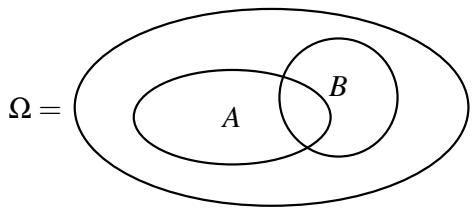
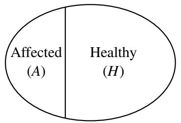
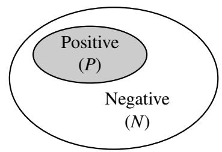
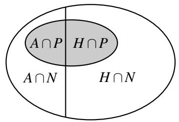
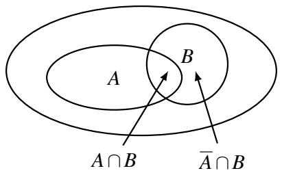
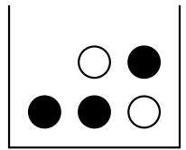
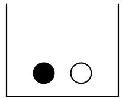
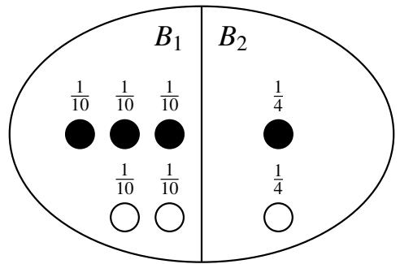

# 014 - 条件概率、独立性和事件组合

抛硬币的关键特性之一是**独立性**（Independence）：如果你抛一枚均匀的硬币十次并得到十个 $T$ （反面），这并不会增加下一次抛硬币出现 $H$ （正面）的可能性。它出现 $H$ 的概率仍然正好是 $50 \%$ 。

相比之下，假设在发牌时，前十张牌全是红色（红桃或方块）。下张牌是红色的概率是多少？我们开始时恰好有 26 张红牌和 26 张黑牌。但在发完前十张牌后，我们知道牌堆里还有 16 张红牌和 26 张黑牌。所以下一张牌是红色的概率是 $\frac { 1 6 } { 4 2 }$ 。所以与抛硬币的情况不同，现在抽到红牌的概率不再独立于之前发出的牌。这就是我们要在本节讲义中探讨的现象。

## 1 条件概率
让我们考虑一个样本空间较小的例子。假设我们将 $m = 4$ 个有标签的球扔进 $n = 3$ 个有标签的箱子中；这是一个具有 $3 ^ { 4 } = 8 1$ 个样本点的均匀样本空间。从上一节讲义中，我们已经知道第一个箱子为空的概率是 $( 1 - \frac { 1 } { 3 } ) ^ { 4 } = ( \frac { 2 } { 3 } ) ^ { 4 } = \frac { 1 6 } { 8 1 }$ 。在已知第二个箱子为空的情况下，该事件发生的概率是多少？令 $A$ 表示第一个箱子为空的事件， $B$ 表示第二个箱子为空的事件。使用条件概率的语言，我们希望计算概率 $\mathbb { P } [ A \mid B ]$ ，读作“在 $B$ 给定的条件下 $A$ 的条件概率”。

在 $B$ 事件保证发生的情况下，我们应该如何计算 $\mathbb { P } [ A \mid B ]$ 呢？由于事件 $B$ 肯定会发生，我们不需要查看整个样本空间 $\Omega$ ，而只需要查看仅由 $B$ 中的样本点组成的较小样本空间。就下图而言，我们不再观察大椭圆，而只观察标有 $B$ 的椭圆：

在事件 $B$ 发生的情况下，每个样本点 $\omega \in B$ 的概率应该是多少？如果它们都只是单纯地继承了 $\Omega$ 中的概率，那么这些概率的总和将是 $\sum _ { \omega \in B } \mathbb { P } [ \omega ] = \mathbb { P } [ B ]$ ，这通常小于 1。因此，为了得到正确的归一化，我们需要将每个样本点的概率按 $\frac { 1 } { \mathbb { P } [ B ] }$ 的比例进行缩放。也就是说，对于每个样本点 $\omega \in B$ ，新的概率变为

$$
\mathbb {P} [ \boldsymbol {\omega} \mid B ] = \frac {\mathbb {P} [ \boldsymbol {\omega} ]}{\mathbb {P} [ B ]}.
$$

现在很清楚如何计算 $\mathbb { P } [ A \mid B ]$ 了：即，我们只需将落在 $A$ 和 $B$ 中的所有样本点的缩放概率相加：

$$
\mathbb {P} [ A \mid B ] = \sum_ {\omega \in A \cap B} \mathbb {P} [ \omega \mid B ] = \sum_ {\omega \in A \cap B} \frac {\mathbb {P} [ \omega ]}{\mathbb {P} [ B ]} = \frac {\mathbb {P} [ A \cap B ]}{\mathbb {P} [ B ]}.
$$

**定义 14.1**（条件概率）。对于同一概率空间中 $\mathbb { P } [ B ] > 0$ 的事件 $A , B \subseteq \Omega$ ，给定 $B$ 时 $A$ 的**条件概率**（Conditional probability）为

$$
\mathbb {P} [ A \mid B ] = \frac {\mathbb {P} [ A \cap B ]}{\mathbb {P} [ B ]}.
$$

回到我们的球和箱子的例子，为了计算 $\mathbb { P } [ A \mid B ]$ ，我们需要算出 $\mathbb { P } [ A \cap B ]$ 。但是 $A \cap B$ 是前两个箱子都为空的事件，即所有四个球都落在第三个箱子里。所以 $\mathbb { P } [ A \cap B ] = \frac { 1 } { 8 1 }$ （为什么？）。因此，

$$
\mathbb {P} [ A \mid B ] = \frac {\mathbb {P} [ A \cap B ]}{\mathbb {P} [ B ]} = \frac {1 / 8 1}{1 6 / 8 1} = \frac {1}{1 6}.
$$

不出所料， $\mathbb { P } [ A \mid B ] = \frac { 1 } { 1 6 } = 0 . 0 6 2 5$ 远小于 $\mathbb { P } [ A ] = \frac { 1 6 } { 8 1 } \approx 0 . 1 9 7 5$ ；已知箱子 2 为空后，箱子 1 也为空的可能性显着降低。

### 示例：发牌
让我们应用上述思想来计算：在发两张牌且已知第一张牌是 $A$ 时，第二张牌也是 $A$ 的概率。令 $B$ 为第一张牌是 $A$ 的事件，令 $A$ 为第二张牌是 $A$ 的事件。

为了计算 $\mathbb { P } [ A \mid B ]$ ，我们需要算出 $\mathbb { P } [ A \cap B ]$ 。这是两张牌都是 $A$ 的概率。请注意，样本空间中有 $52 \times 51$ 个样本点，因为每个样本点都是由两张牌组成的序列。如果两张牌都是 $A$ ，则样本点在 $A \cap B$ 中。这可以通过 $4 \times 3 = 1 2$ 种方式发生。

由于每个样本点的概率相等， $\mathbb { P } [ A \cap B ] = \frac { 1 2 } { 5 2 \times 5 1 }$ ，而第一次抽取得到 $A$ 的概率 $\mathbb { P } [ B ]$ 为 $\frac { 4 } { 5 2 }$ 。因此，

$$
\mathbb {P} [ A \mid B ] = \frac {\mathbb {P} [ A \cap B ]}{\mathbb {P} [ B ]} = \frac {3}{5 1},
$$

这小于 $\mathbb { P } [ A ] = \frac { 4 } { 5 2 } = \frac { 1 } { 1 3 }$ （见练习 1）。因此，如果第一张牌是 $A$ ，那么第二张牌也是 $A$ 的可能性就会降低。

## 2 贝叶斯推断
既然我们已经引入了条件概率的概念，我们可以看看它在现实世界中是如何使用的。条件概率是**贝叶斯推断**（Bayesian inference）的核心，该学科广泛应用于机器学习、通信和信号处理等领域。贝叶斯推断是一种在进行观察后更新知识的方法。例如，我们可能对给定事件 $A$ 的概率有一个估计。在事件 $B$ 发生后，我们可以将此估计更新为 $\mathbb { P } [ A \mid B ]$ 。在这种解释中， $\mathbb { P } [ A ]$ 可以被认为是**先验概率**（Prior probability）：即在进行观察之前，我们对感兴趣的事件 $A$ 的似然性的评估。它反映了我们的先验知识。 $\mathbb { P } [ A \mid B ]$ 可以被解释为观察之后的 $A$ 的**后验概率**（Posterior probability）。它反映了我们更新后的知识。

这里有一个可以应用这种技术的例子。一家制药公司正在推销一种针对某种医疗疾病的新检测方法。根据临床试验，该检测具有以下特性：

1. 当应用于感染者时，检测在 $90 \%$ 的情况下结果呈阳性，在 $10 \%$ 的情况下结果呈阴性（这些被称为“假阴性”）。
2. 当应用于健康人时，检测在 $80 \%$ 的情况下结果呈阴性，在 $20 \%$ 的情况下结果呈阳性（这些被称为“假阳性”）。

假设该疾病在美国人口中的发病率为 $5 \%$ ；这就是我们的先验知识。当一个随机的人接受检测且检测结果呈阳性时，我们如何更新该人患有该疾病的概率？（请注意，这大概与人口中随机一人患有该疾病的简单概率不同，后者仅为 $\frac { 1 } { 2 } 0$ 。）这里隐含的概率空间是具有相等概率的全体美国人口。

此处的样本空间由美国的所有人组成——用 $N$ 表示他们的人数（因此 $N \approx 3 . 5$ 亿）。令 $A$ 为随机选择的人受感染的事件， $B$ 为随机选择的人检测呈阳性的事件。现在我们可以将上述信息改写为：

• $\mathbb { P } [ A ] = 0 . 0 5$ （美国人口的 $5 \%$ 受到感染）
• $\mathbb { P } [ B \mid A ] = 0 . 9$ （ $90 \%$ 的受感染者检测呈阳性）
• $\mathbb { P } [ B \mid \bar { A } ] = 0 . 2$ （ $20 \%$ 的健康人检测呈阳性）

我们要计算 $\mathbb { P } [ A \mid B ]$ 。我们可以按照以下步骤进行：

$$
\mathbb {P} [ A \mid B ] = \frac {\mathbb {P} [ A \cap B ]}{\mathbb {P} [ B ]} = \frac {\mathbb {P} [ B \mid A ] \mathbb {P} [ A ]}{\mathbb {P} [ B ]}. \tag {1}
$$

我们通过应用条件概率的定义得到了上面的第二个等式：

$$
\mathbb {P} [ B \mid A ] = \frac {\mathbb {P} [ A \cap B ]}{\mathbb {P} [ A ]}.
$$

为了评估 (1)，我们需要计算 $\mathbb { P } [ B ]$ 。这是随机一个人检测呈阳性的概率。为了计算这个值，我们可以将两个值相加：健康人检测呈阳性的概率 $\mathbb { P } [ \bar { A } \cap B ]$ 和受感染者检测呈阳性的概率 $\mathbb { P } [ A \cap B ]$ 。我们可以求和是因为事件 $\bar { A } \cap B$ 和 $A \cap B$ 不相交：

再次应用条件概率的定义，我们有：

$$
\begin{array}{l} \mathbb {P} [ B ] = \mathbb {P} [ A \cap B ] + \mathbb {P} [ \bar {A} \cap B ] = \mathbb {P} [ B \mid A ] \mathbb {P} [ A ] + \mathbb {P} [ B \mid \bar {A} ] \mathbb {P} [ \bar {A} ] \\ = \mathbb {P} [ B \mid A ] \mathbb {P} [ A ] + \mathbb {P} [ B \mid \bar {A} ] (1 - \mathbb {P} [ A ]). \tag {2} \\ \end{array}
$$

结合 (1) 和 (2)，我们已经根据 $\mathbb { P } [ A ] , \mathbb { P } [ B \mid A ]$ 和 $\mathbb { P } [ B \mid \bar { A } ]$ 表达了 $\mathbb { P } [ A \mid B ]$ ：

$$
\mathbb {P} [ A \mid B ] = \frac {\mathbb {P} [ B \mid A ] \mathbb {P} [ A ]}{\mathbb {P} [ B \mid A ] \mathbb {P} [ A ] + \mathbb {P} [ B \mid \bar {A} ] (1 - \mathbb {P} [ A ])}. \tag {3}
$$

代入上述数值，我们得到 $\mathbb { P } [ A \mid B ] = \frac { 9 } { 4 7 } \approx 0 . 1 9$ 。

方程 (3) 对于许多推断问题都很有用。我们已知 $\mathbb { P } [ A ]$ ，即感兴趣的事件 $A$ 发生的（无条件）概率。我们已知 $\mathbb { P } [ B \mid A ]$ 和 $\mathbb { P } [ B \mid \bar { A } ]$ ，它们量化了观察结果的噪声程度。（例如，如果 $\mathbb { P } [ B \mid A ] = 1$ 且 $\mathbb { P } [ B \mid \bar { A } ] = 0$ ，则观察结果完全没有噪声。）现在我们要计算 $\mathbb { P } [ A \mid B ]$ ，即已知观察结果的情况下，感兴趣的事件发生的概率。方程 (3) 允许我们做到这一点。

当然， (1) 到 (3) 是从概率的基本公理和条件概率的定义推导出来的，因此无论是否具有上述贝叶斯推断解释，它们都是正确的。然而，当我们应用概率论来研究推断问题时，这种解释非常有用。

## 3 贝叶斯法则和全概率公式
方程 (1) 和 (2) 本身非常有用。前者被称为**贝叶斯法则**（Bayes’ Rule），后者被称为**全概率公式**（Total Probability Rule）。当你想要计算 $\mathbb { P } [ A \mid B ]$ 但已知的是 $\mathbb { P } [ B \mid A ]$ 时，贝叶斯法则非常有用，即它允许我们“交换条件”。

全概率公式是“分情况讨论”策略的一种应用。有两种可能性：要么事件 $A$ 发生，要么 $A$ 不发生。如果 $A$ 发生， $B$ 发生的概率是 $\mathbb { P } [ B \mid A ]$ 。如果 $A$ 不发生， $B$ 发生的概率是 $\mathbb { P } [ B \mid \bar { A } ]$ 。如果我们知道或可以很容易地计算出这两个概率以及 $\mathbb { P } [ A ]$ ，那么全概率公式就能得出事件 $B$ 的概率。

### 3.1 示例
#### 网球比赛
你即将与一位随机选择的对手进行一场网球比赛，你希望计算自己获胜的概率。你知你的对手将是两个人中的一个， $X$ 或 $Y$ 。如果选中了 $X$ ，你获胜的概率为 0.7。如果选中了 $Y$ ，你获胜的概率为 0.3。你的对手是通过抛一枚有偏硬币选出的，选中 $X$ 的概率为 0.6。

首先让我们确定我们感兴趣的事件。令 $A$ 为你获胜的事件。令 $B _ { X }$ 为选中 $X$ 的事件，令 $B _ { Y }$ 为选中 $Y$ 的事件。我们希望计算 $\mathbb { P } [ A ]$ 。以下是我们目前已知的信息：

• $\mathbb { P } [ A \mid B _ { X } ] = 0 . 7$ （如果选中 $X$ ，你获胜的概率为 0.7）
• $\mathbb { P } [ A \mid B _ { Y } ] = 0 . 3$ （如果选中 $Y$ ，你获胜的概率为 0.3）
• $\mathbb { P } [ B _ { X } ] = 0 . 6$ （选中 $X$ 的概率为 0.6）
• $\mathbb { P } [ B _ { Y } ] = 0 . 4$ （选中 $Y$ 的概率为 0.4）

通过使用全概率公式，我们有 $\mathbb { P } [ A ] = \mathbb { P } [ A \mid B _ { X } ] \mathbb { P } [ B _ { X } ] + \mathbb { P } [ A \mid B _ { Y } ] \mathbb { P } [ B _ { Y } ]$ ，代入已知值得出 $\mathbb { P } [ A ] = ( 0 . 7 \times 0 . 6 ) + ( 0 . 3 \times 0 . 4 ) = 0 . 5 4$ 。

#### 球与箱子
想象我们有两个箱子，每个箱子都包含一定数量的黑球和白球：

箱子 1

箱子 2

假设以相等的概率选择这两个箱子中的一个，并从选中的箱子中均匀随机地抽取一个球。在已知抽到白球的情况下，我们选中箱子 1 的概率是多少，即 $\mathbb { P } [ \text{箱子 1} \mid \bigcirc ]$ ？

答案是 $\frac { 2 } { 3 }$ 吗？因为我们知道总共有三个白球，其中两个在箱子 1 中。这种推理是不正确的。相反，我们应该如下图所示，适当地缩放每个样本点：

该图显示样本空间 $\Omega$ 由事件 $B _ { 1 }$ （对应于箱子 1）和事件 $B _ { 2 }$ （对应于箱子 2）中的结果组成，即 $\Omega = B _ { 1 } \cup B _ { 2 }$ 。我们可以使用条件概率的定义发现：

$$
\mathbb {P} [ \text {箱子 1} \mid \bigcirc ] = \frac {\frac {1}{1 0} + \frac {1}{1 0}}{\frac {1}{1 0} + \frac {1}{1 0} + \frac {1}{4}} = \frac {\frac {2}{1 0}}{\frac {9}{2 0}} = \frac {4}{9}.
$$

让我们尝试使用贝叶斯法则来得导出这个概率。为了应用贝叶斯法则，我们需要计算 $\mathbb { P } [ \bigcirc \mid \text{箱子 1} ]$ 、 $\mathbb { P } [ \text{箱子 1} ]$ 和 $\mathbb { P } [ \bigcirc ]$ 。这里， $\mathbb { P } [ \bigcirc \mid \text{箱子 1} ]$ 是在选中箱子 1 的情况下我们抽取到白球的概率，即 $\frac { 2 } { 5 }$ 。根据问题的描述， $\mathbb { P } [ \text{箱子 1} ] = \frac { 1 } { 2 }$ 。最后，可以使用全概率公式计算 $\mathbb { P } [ \bigcirc ]$ ：

$$
\mathbb {P} [ \bigcirc ] = \mathbb {P} [ \bigcirc \mid \text {箱子 1} ] \times \mathbb {P} [ \text {箱子 1} ] + \mathbb {P} [ \bigcirc \mid \text {箱子 2} ] \times \mathbb {P} [ \text {箱子 2} ] = \frac {2}{5} \times \frac {1}{2} + \frac {1}{2} \times \frac {1}{2} = \frac {9}{2 0}.
$$

观察到我们可以在这里应用全概率公式，因为 $\mathbb { P } [ \text{箱子 1} ]$ 是 $\mathbb { P } [ \text{箱子 2} ]$ 的补集。最后，将上述值代入贝叶斯法则，我们得到在已知抽到白球的情况下，我们选中箱子 1 的概率：

$$
\mathbb {P} [ \text {箱子 1} \mid \bigcirc ] = \frac {\frac {2}{5} \times \frac {1}{2}}{\frac {9}{2 0}} = \frac {\frac {2}{1 0}}{\frac {9}{2 0}} = \frac {4}{9}.
$$

我们上面所做的一切就是将贝叶斯法则和全概率公式结合起来；这也是我们如何得到 (3) 的。等价地，我们本可以将适当的值代入 (3)。

### 3.2 推广
我们现在在更一般的背景下考虑贝叶斯法则和全概率公式。首先，我们如下定义事件的分割。

**定义 14.2**（事件的分割）。如果满足以下条件，我们说事件 $A$ 被分割为 $n$ 个事件 $A _ { 1 } , \ldots , A _ { n }$ ：

1. $A = A _ { 1 } \cup A _ { 2 } \cup \dots \cup A _ { n }$ ，且
2. 对于所有 $i \neq j$ ， $A _ { i } \cap A _ { j } = \emptyset$ （即 $A _ { 1 } , \ldots , A _ { n }$ 是互斥的）。

换句话说， $A$ 中的每个结果都恰好属于事件 $A _ { 1 } , \ldots , A _ { n }$ 中的一个。

现在，令 $A _ { 1 } , \ldots , A _ { n }$ 为样本空间 $\Omega$ 的一个分割。那么，任何事件 $B$ 的**全概率公式**为

$$
\mathbb {P} [ B ] = \sum_{i = 1}^n \mathbb {P} [ B \cap A_i ] = \sum_{i = 1}^n \mathbb {P} [ B \mid A_i ] \mathbb {P} [ A_i ], \tag {4}
$$

而假设 $\mathbb { P } [ B ] \neq 0$ ，**贝叶斯法则**由下式给出

$$
\mathbb {P} [ A_i \mid B ] = \frac {\mathbb {P} [ B \mid A_i ] \mathbb {P} [ A_i ]}{\mathbb {P} [ B ]} = \frac {\mathbb {P} [ B \mid A_i ] \mathbb {P} [ A_i ]}{\sum_{j = 1}^n \mathbb {P} [ B \mid A_j ] \mathbb {P} [ A_j ]}, \tag {5}
$$

其中第二个等式由全概率公式得出。

## 4 事件的组合
在计算机科学的大多数概率应用中，我们感兴趣的是诸如 $\bigcup _ { i = 1 } ^ { n } A _ { i }$ 和 $\bigcap _ { i = 1 } ^ { n } A _ { i }$ 之类的事物，其中 $A _ { i }$ 是简单事件（即，我们知道或可以很容易地计算出 $\mathbb { P } [ A _ { i } ]$ ）。交集 $\bigcap _ { i } A _ { i }$ 对应于事件 $A _ { i }$ 的逻辑“与”（AND），而并集 $\bigcup _ { i } A _ { i }$ 对应于它们的逻辑“或”（OR）。例如，如果 $A _ { i }$ 表示某种系统中发生类型 $i$ 故障的事件，则 $\bigcup _ { i } A _ { i }$ 是系统发生故障的事件。

通常，计算此类组合的概率可能非常困难。在本节中，我们将讨论一些可以进行此类计算的情况。让我们从独立事件开始，独立事件的交集计算相当简单。

### 4.1 独立事件
**定义 14.3**（独立性）。如果 $\mathbb { P } [ A \cap B ] = \mathbb { P } [ A ] \times \mathbb { P } [ B ]$ ，则称同一概率空间中的两个事件 $A , B$ 是**独立的**（Independent）。

此定义背后的直觉如下。假设 $\mathbb { P } [ B ] > 0$ 。那么我们有

$$
\mathbb {P} [ A \mid B ] = \frac {\mathbb {P} [ A \cap B ]}{\mathbb {P} [ B ]} = \frac {\mathbb {P} [ A ] \times \mathbb {P} [ B ]}{\mathbb {P} [ B ]} = \mathbb {P} [ A ].
$$

因此，独立性具有自然的含义，即“ $A$ 的概率不受 $B$ 是否发生的影响”。（通过对称论证，如果 $\mathbb { P } [ A ] > 0$ ，我们也有 $\mathbb { P } [ B \mid A ] = \mathbb { P } [ B ]$ 。）对于满足 $\mathbb { P } [ B ] > 0$ 的事件 $A , B$ ，条件 $\mathbb { P } [ A \mid B ] = \mathbb { P } [ A ]$ 实际上等价于独立性的定义。

我们之前提到的一些随机实验包含独立事件。例如，如果你抛两次硬币，第一次试验获得正面的事件独立于第二次试验获得正面的事件。掷两次骰子也是如此；每次试验的结果都是独立的。

上述定义可以推广到任何有限事件集：

**定义 14.4**（相互独立性）。如果对于大小为 $| I | \ge 2$ 的每个子集 $I \subseteq \{ 1 , \ldots , n \}$ ，满足以下条件，则称事件 $A _ { 1 } , \ldots , A _ { n }$ 是**相互独立的**（Mutually independent）：

$$
\mathbb {P} \left[ \bigcap_{i \in I} A_i \right] = \prod_{i \in I} \mathbb {P} [ A_i ]. \tag {6}
$$

相互独立性的等价定义如下。

**定义 14.5**（相互独立性）。如果对于所有 $B_i \in \{ A_i , \bar{A}_i \} , i = 1 , \ldots , n$ ，满足以下条件，则称事件 $A _ { 1 } , \ldots , A _ { n }$ 是**相互独立的**（Mutually independent）：

$$
\mathbb {P} [ B_1 \cap \dots \cap B_n ] = \prod_{i = 1}^n \mathbb {P} [ B_i ]. \tag {7}
$$

#### 备注
1. 在定义 14.4 中，(6) 需要对 $\{ 1 , \ldots , n \}$ 的每个大小为 $| I | \ge 2$ 的子集 $I$ 成立。由于 $| I | = 0$ 和 $| I | = 1$ 的情况不施加任何限制，因此省略。
2. 注意，(6) 对概率分布施加了 $2 ^ { n } - n - 1$ 个限制，而 (7) 定义了 $2 ^ { n }$ 个限制。事实证明，由 (7) 隐含的正好 $n + 1$ 个限制实际上是多余的。

对于相互独立的事件 $A _ { 1 } , \ldots , A _ { n }$ ，根据条件概率的定义不难检查得出：对于任何 $1 \le i \le n$ 以及任何子集 $I \subseteq \{ 1 , \ldots , n \} \setminus \{ i \}$ ，我们有

$$
\mathbb {P} \left[ A_i \mid \bigcap_{j \in I} A_j \right] = \mathbb {P} [ A_i ].
$$

请注意，每对事件的独立性（即所谓的**两两独立**，Pairwise independence）并不一定意味着相互独立。如下例所示，我们可以构造三个事件 $A , B , C$ ，使得每对事件都是独立的，但三元组 $A , B , C$ 不是相互独立的。

#### 示例：两两独立但不相互独立的事件
假设你抛一枚公平的硬币两次，令 $A$ 为第一次抛掷为 $H$ 的事件， $B$ 为第二次抛掷为 $H$ 的事件。现在令 $C$ 为两次抛掷结果相同的事件（即两次都是 $H$ 或两次都是 $T$ ）。当然 $A$ 和 $B$ 是独立的。更有趣的是， $A$ 和 $C$ 也是独立的：已知第一次抛掷出现 $H$ ，第二次抛掷与第一次相同的机会仍然是 $\frac { 1 } { 2 }$ 。另一种说法是 $\mathbb { P } [ A \cap C ] = \frac { 1 } { 4 } = \mathbb { P } [ A ] \mathbb { P } [ C ]$ ，因为 $A \cap C$ 是第一次抛掷为 $H$ 且第二次抛掷也为 $H$ 的事件。按照同样的推理， $B$ 和 $C$ 也是独立的。另一方面， $A, B$ 和 $C$ 不是相互独立的。例如，如果我们已知 $A$ 和 $B$ 发生，那么 $C$ 发生的概率为 1。所以，尽管 $A, B$ 和 $C$ 不是相互独立的，但它们中的每一对都是独立的。换句话说， $A, B$ 和 $C$ 是两两独立但不是相互独立的。

### 4.2 事件的交集
计算互位独立的事件交集的概率很容易；这直接遵循定义。我们只需将每个事件的概率相乘即可。对于非相互独立的事件，我们如何计算交集的概率？根据条件概率的定义，我们立即可以得到以下用于计算事件交集概率的**乘法法则**（Product Rule，有时也称为链式法则）。

**定理 14.1**（乘法法则）。对于任何事件 $A , B$ ，我们有

$$
\mathbb {P} [ A \cap B ] = \mathbb {P} [ A ] \mathbb {P} [ B \mid A ].
$$

更一般地，对于任何事件 $A _ { 1 } , \ldots , A _ { n }$ ，

$$
\mathbb {P} \left[ \bigcap_{i=1}^n A_i \right] = \mathbb {P} [ A_1 ] \times \mathbb {P} [ A_2 \mid A_1 ] \times \mathbb {P} [ A_3 \mid A_1 \cap A_2 ] \times \dots \times \mathbb {P} [ A_n \mid \bigcap_{i=1}^{n-1} A_i ].
$$

**证明**。第一个断言直接遵循 $\mathbb { P } [ B \mid A ]$ 的定义（事实上是 $n = 2$ 时第二个断言的特例）。

为了证明第二个断言，我们将对 $n$ （事件的数量）使用归纳法。基准情况是 $n = 1$ ，对应于 $\mathbb { P } [ A ] = \mathbb { P } [ A ]$ 的陈述，这显然成立。对于任意 $n > 1$ ，假设（归纳假设）：

$$
\mathbb {P} \left[ \bigcap_{i=1}^{n-1} A_i \right] = \mathbb {P} [ A_1 ] \times \mathbb {P} [ A_2 \mid A_1 ] \times \dots \times \mathbb {P} [ A_{n-1} \mid \bigcap_{i=1}^{n-2} A_i ].
$$

现在我们可以将条件概率的定义应用于两个事件 $A _ { n }$ 和 $\bigcap _ { i = 1 } ^ { n - 1 } A _ { i }$ ，从而推导出：

$$
\begin{array}{l} \mathbb {P} [ \bigcap_{i=1}^n A_i ] = \mathbb {P} [ A_n \cap (\bigcap_{i=1}^{n-1} A_i) ] \\ = \mathbb {P} \left[ A_n \mid \bigcap_{i=1}^{n-1} A_i \right] \times \mathbb {P} \left[ \bigcap_{i=1}^{n-1} A_i \right] \\ = \mathbb {P} \left[ A_n \mid \bigcap_{i=1}^{n-1} A_i \right] \times \mathbb {P} [ A_1 ] \times \mathbb {P} [ A_2 \mid A_1 ] \times \dots \times \mathbb {P} \left[ A_{n-1} \mid \bigcap_{i=1}^{n-2} A_i \right] \\ \end{array}
$$

其中在最后一行我们使用了归纳假设。这完成了归纳证明。 $\square$

当我们可以将样本空间视为一系列选择时，乘法法则特别有用。接下来的几个例子说明了这一点。

#### 示例：抛硬币
抛一枚公平的硬币三次。令 $A$ 为三次抛掷结果均为正面的事件。则 $A = A _ { 1 } \cap A _ { 2 } \cap A _ { 3 }$ ，其中 $A _ { i }$ 是第 $i$ 次抛掷为正面的事件。我们有：

$$
\begin{array}{l} \mathbb {P} [ A ] = \mathbb {P} [ A_1 ] \times \mathbb {P} [ A_2 \mid A_1 ] \times \mathbb {P} [ A_3 \mid A_1 \cap A_2 ] \\ = \mathbb {P} [ A_1 ] \times \mathbb {P} [ A_2 ] \times \mathbb {P} [ A_3 ] \\ = \frac {1}{2} \times \frac {1}{2} \times \frac {1}{2} = \frac {1}{8}. \\ \end{array}
$$

这里的第二行遵循抛掷是相互独立的事实。当然，从我们在上一节讲义中对概率空间的定义可以看出， $\mathbb { P } [ A ] = \frac { 1 } { 8 }$ 。审视此计算的另一种方式是，它证明了我们对概率空间的定义是合理的，并表明它与假设抛硬币是相互独立的一致。

如果硬币是有偏的，正面概率为 $p$ ，我们再次利用独立性得到：

$$
\mathbb {P} [ A ] = \mathbb {P} [ A_1 ] \times \mathbb {P} [ A_2 ] \times \mathbb {P} [ A_3 ] = p ^ 3.
$$

更一般地，任何包含 $k$ 个正面和 $n - k$ 个反面的 $n$ 次抛掷序列的概率是 $p ^ { k } ( 1 - p ) ^ { n - k }$ 。这实际上就是我们这样定义概率空间的原因：我们定义样本点的概率，以便抛硬币表现得相互独立。

#### 示例：重温蒙提霍尔问题
回想一下蒙提霍尔问题：有三个门，奖品在任何给定门后的概率是 $\frac { 1 } { 3 }$ 。另外两扇门后面是山羊。选手随机选择一扇门，主持人打开另外两扇门中的一扇，露出山羊。在这种背景下，我们如何计算交集？例如，选手选择 1 号门、奖品在 2 号门后、且主持人选择 3 号门的概率是多少？

令 $C _ { i }$ 为选手选择 $i$ 号门的事件， $P _ { i }$ 为奖品在 $i$ 号门后的事件， $H _ { i }$ 为主持人选择 $i$ 号门的事件。那么，根据乘法法则：

$$
\mathbb {P} [ C_1 \cap P_2 \cap H_3 ] = \mathbb {P} [ C_1 ] \times \mathbb {P} [ P_2 \mid C_1 ] \times \mathbb {P} [ H_3 \mid C_1 \cap P_2 ].
$$

$C _ { 1 }$ 的概率是 $\frac { 1 } { 3 }$ ，因为选手是随机选择门的。给定 $C _ { 1 }$ ， $P _ { 2 }$ 的概率仍然是 $\frac { 1 } { 3 }$ ，因为它们是独立的。给定事件 $C _ { 1 }$ 和 $P _ { 2 }$ ，主持人选择 3 号门的概率是 1；主持人不能选择 1 号门，因为选手已经选了它，主持人也不能选择 2 号门，因为主持人必须揭示山羊（而不是奖品）。因此：

$$
\mathbb {P} [ C_1 \cap P_2 \cap H_3 ] = \frac {1}{3} \times \frac {1}{3} \times 1 = \frac {1}{9}.
$$

观察到在这种背景下我们需要条件概率；如果我们只是简单地将每个事件的概率相乘，我们将得到 $\frac { 1 } { 2 7 }$ ，因为 $H _ { 3 }$ 的概率也是 $\frac { 1 } { 3 }$ （你能明白为什么吗？）。如果我们改变情况，转而询问选手选择 1 号门、奖品在 1 号门后、且主持人选择 3 号门的概率是多少？我们可以使用与上面相同的技术，但我们的最终答案将不同。这作为一个练习（见练习 4）。

现在，注意到 $\mathbb { P } [ H _ { 3 } \mid C _ { 1 } ] = \frac { 1 } { 2 }$ （见练习 5）且 $\mathbb { P } [ C _ { 1 } \cap H _ { 3 } ] = \mathbb { P } [ C _ { 1 } ] \mathbb { P } [ H _ { 3 } \mid C _ { 1 } ] = \frac { 1 } { 3 } \times \frac { 1 } { 2 } = \frac { 1 } { 6 }$ ，我们得到：

$$
\mathbb {P} [ P_2 \mid C_1 \cap H_3 ] = \frac {\mathbb {P} [ C_1 \cap P_2 \cap H_3 ]}{\mathbb {P} [ C_1 \cap H_3 ]} = \frac {\frac {1}{9}}{\frac {1}{6}} = \frac {2}{3},
$$

这是我们在上一节讲义中描述的相同结论的更正式推导。

#### 示例：扑克牌
让我们使用乘法法则以不同的方式计算同花（Flush）的概率。这等于 $4 \times \mathbb { P } [ A ]$ ，其中 $A$ 是红桃同花的概率。直观上，这应该很清楚，因为有 4 种花色；我们将在下一节中看到为什么这在形式上是正确的。我们可以写成 $A = \bigcap _ { i = 1 } ^ { 5 } A _ { i }$ ，其中 $A _ { i }$ 是我们挑选的第 $i$ 张牌是红桃的事件。所以 we have：

$$
\mathbb {P} [ A ] = \mathbb {P} [ A_1 ] \times \mathbb {P} [ A_2 \mid A_1 ] \times \dots \times \mathbb {P} [ A_5 \mid \bigcap_{i=1}^4 A_i ].
$$

显然 $\mathbb { P } [ A _ { 1 } ] = \frac { 1 3 } { 5 2 } = \frac { 1 } { 4 }$ 。那 $\mathbb { P } [ A _ { 2 } \mid A _ { 1 } ]$ 呢？嗯，由于我们以 $A _ { 1 }$ 为条件（第一张牌是红桃），第二张牌仅剩 51 种可能性，其中 12 个是红桃。所以 $\mathbb { P } [ A _ { 2 } \mid A _ { 1 } ] = \frac { 1 2 } { 5 1 }$ 。类似地， $\mathbb { P } [ A _ { 3 } \mid A _ { 1 } \cap A _ { 2 } ] = \frac { 1 1 } { 5 0 }$ ，依此类推。所以我们得到：

$$
4 \times \mathbb {P} [ A ] = 4 \times \frac {1 3}{5 2} \times \frac {1 2}{5 1} \times \frac {1 1}{5 0} \times \frac {1 0}{4 9} \times \frac {9}{4 8},
$$

这正是我们在上一节讲义中计算出的分数。

所以现在我们在许多概率空间中都有两种计算概率的方法。将这些不同的方法保留下来非常有用，既可以检查你的答案，也因为在某些情况下，其中一种方法比另一种更容易使用。

### 4.3 事件的并集
你正在拉斯维加斯，你发现了一个具有以下规则的新游戏。你选择一个 1 到 6 之间的数字。然后掷三个骰子。当且仅当你的数字出现在至少一个骰子上时，你就赢了。

赌场声称你获胜的机会是 $50 \%$ ，理由如下。令 $A$ 为你获胜的事件。我们可以写成 $A = A _ { 1 } \cup A _ { 2 } \cup A _ { 3 }$ ，其中 $A _ { i }$ 是你的数字出现在骰子 $i$ 上的事件。显然对于每个 $i$ ， $\mathbb { P } [ A _ { i } ] = \frac { 1 } { 6 }$ 。因此，他们声称：

$$
\mathbb {P} [ A ] = \mathbb {P} [ A_1 \cup A_2 \cup A_3 ] = \mathbb {P} [ A_1 ] + \mathbb {P} [ A_2 ] + \mathbb {P} [ A_3 ] = 3 \times \frac {1}{6} = \frac {1}{2}.
$$

这个计算正确吗？嗯，假设赌场投掷了六个骰子，只要你的数字出现至少一次你就赢了。那么类似的计算会说你获胜的概率为 $6 \times \frac { 1 } { 6 } = 1$ ，也就是说，肯定会赢！当骰子的数量多于 6 个时，情况变得更加荒谬。

问题在于事件 $A _ { i }$ 不是互斥的：即，存在一些属于多个 $A _ { i }$ 的样本点。（我们可能非常幸运，我们的数字可能出现在两个甚至所有三个骰子上。）所以，如果我们直接将 $\mathbb { P } [ A _ { i } ]$ 相加，我们就在不止一次地计算某些样本点。

幸运的是，在讲义 12 中我们学习了**容斥原理**（Principle of Inclusion-Exclusion），它允许我们处理这种情况。在定理 12.3 的证明中，结果表明每个 $\omega \not \in A _ { 1 } \cup \dots \cup A _ { n }$ 都不被容斥公式计算，而每个 $\omega \in A _ { 1 } \cup \dots \cup A _ { n }$ 都被该公式恰好计算一次。因此，我们不是在容斥公式中对 $\bigcap _ { i \in S } A _ { i }$ 的基数进行求和（带有适当的符号），而是对它们的概率 $\mathbb { P } [ \bigcap _ { i \in S } A _ { i } ]$ 进行求和，从而得到以下用于计算 $\mathbb { P } [ A _ { 1 } \cup \dots \cup A _ { n } ]$ 的有用公式：

**定理 14.2**（容斥原理）。令 $A _ { 1 } , \ldots , A _ { n }$ 为某个概率空间中的事件，其中 $n \ge 2$ 。那么，我们有：

$$
\mathbb {P} \left[ A_1 \cup \dots \cup A_n \right] = \sum_{k=1}^n (-1)^{k-1} \sum_{S \subseteq \{1, \dots, n\}: |S|=k} \mathbb {P} \left[ \bigcap_{i \in S} A_i \right]. \tag {8}
$$

(8) 的右侧可以写成：

$$
\mathbb {P} \left[ \bigcup_{i=1}^n A_i \right] = \sum_{i=1}^n \mathbb {P} [ A_i ] - \sum_{i<j} \mathbb {P} [ A_i \cap A_j ] + \sum_{i<j<k} \mathbb {P} [ A_i \cap A_j \cap A_k ] - \dots + (-1)^{n-1} \mathbb {P} [ A_1 \cap A_2 \cap \dots \cap A_n ],
$$

其中 $\textstyle \sum _ { i < j }$ 表示对所有满足 $i < j$ 的 $i , j \in \{ 1 , \ldots , n \}$ 求和，以此类推。也就是说，为了计算 $\mathbb { P } [ \cup _ { i } A _ { i } ]$ ，我们首先将事件概率 $\mathbb { P } [ A _ { i } ]$ 相加，然后减去所有两两交集的概率，然后加回所有三向交集的概率，依此类推。你可能想通过绘制维恩图来验证 $n = 3$ 的特殊情况。你可能还想通过归纳法证明一般 $n$ 的公式（其方式类似于上述乘法法则的证明）。

使用 (8)，在拉斯维加斯的新游戏中获得幸运的概率由下式给出：

$$
\mathbb {P} \left[ A_1 \cup A_2 \cup A_3 \right] = \mathbb {P} [ A_1 ] + \mathbb {P} [ A_2 ] + \mathbb {P} [ A_3 ] - \mathbb {P} [ A_1 \cap A_2 ] - \mathbb {P} [ A_1 \cap A_3 ] - \mathbb {P} [ A_2 \cap A_3 ] + \mathbb {P} [ A_1 \cap A_2 \cap A_3 ].
$$

现在这里的好消息是事件 $A _ { i }$ 是相互独立的（任何骰子的结果不取决于其他骰子的结果），所以 $\mathbb { P } [ A _ { i } \cap A _ { j } ] = \mathbb { P } [ A _ { i } ] \mathbb { P } [ A _ { j } ] = ( \frac { 1 } { 6 } ) ^ { 2 } = \frac { 1 } { 3 6 }$ ，同样 $\mathbb { P } [ A _ { 1 } \cap A _ { 2 } \cap A _ { 3 } ] = ( \frac { 1 } { 6 } ) ^ { 3 } = \frac { 1 } { 2 1 6 }$ 。所以，我们得到：

$$
\mathbb {P} \left[ A_1 \cup A_2 \cup A_3 \right] = \left( 3 \times \frac {1}{6} \right) - \left( 3 \times \frac {1}{3 6} \right) + \frac {1}{2 1 6} = \frac {9 1}{2 1 6} \approx 0.4 2.
$$

所以你的胜率比赌场声称的要差得多！

当 $n$ 很大时（即我们对许多事件的并集感兴趣），容斥公式基本上是无用的，因为它涉及计算每一个非空子集事件交集的概率：而这些共有 $2 ^ { n } - 1$ 个！有时我们可以仅查看它的前几项而忽略其余部分：注意，当 $k$ 为奇数时，求前 $k$ 项的和会给我们一个高估，而当 $k$ 为偶数时则低估，且这两种估计都会随着 $k$ 的增加而变得更好。

然而，在许多情况下，我们可以通过仅查看第一项来获得很大的进展：

1. **（互斥事件）** 如果事件 $A _ { 1 } , \ldots , A _ { n }$ 是互斥的（即对于所有 $i \neq j$ ， $A _ { i } \cap A _ { j } = \emptyset$ ），则：

$$
\mathbb {P} \left[ \bigcup_{i=1}^n A_i \right] = \sum_{i=1}^n \mathbb {P} [ A_i ].
$$

[请注意，我们在示例中已经多次使用了这一事实，例如在声称同花的概率是红桃同花概率的四倍时——显然不同花色的同花是互斥事件。]

2. **（并集上界）** 令 $A _ { 1 } , \ldots , A _ { n }$ 为某个概率空间中的事件。那么，对于所有 $n \in \mathbb { Z } ^ { + }$ ：

$$
\mathbb {P} \left[ \bigcup_{i=1}^n A_i \right] \le \sum_{i=1}^n \mathbb {P} [ A_i ]. \tag {9}
$$

这仅仅是说将 $\mathbb { P } [ A _ { i } ]$ 相加只能高估并集的概率。尽管看起来很粗略，但我们稍后将看到如何在计算机科学示例中有效地使用并集上界（Union Bound）。

## 5 练习
1. 假设从标准扑克牌中发出五张牌。令 $A _ { i }$ 为第 $i$ 张牌是 $A$ 的事件。证明对于所有 $i = 1 , \ldots , 5$ ， $\mathbb { P } [ A _ { i } ] = \frac { 1 } { 1 3 }$ 。
2. 证明方程 (4) 和 (5)。
3. 证明相互独立性的定义 14.4 和 14.5 是等效的。
4. 在蒙提霍尔问题中，找出 $\mathbb { P } [ C _ { 1 } \cap P _ { 1 } \cap H _ { 3 } ]$ 。
5. 在蒙提霍尔问题中，证明 $\mathbb { P } [ H _ { 3 } \mid C _ { 1 } ] = \frac { 1 } { 2 }$ 。
6. 证明 (9) 中的并集上界。