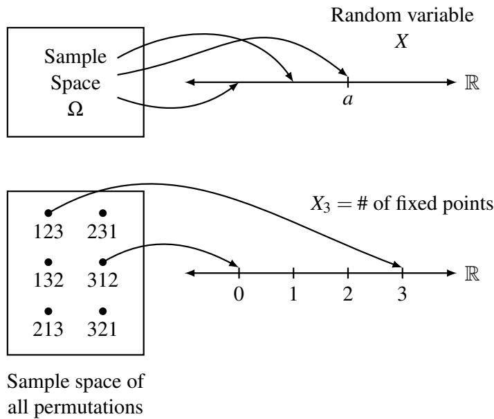
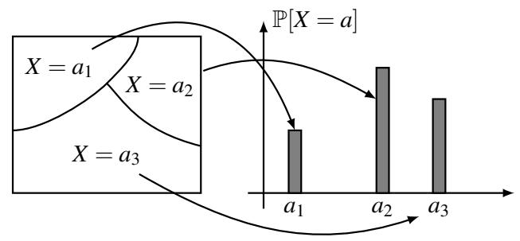
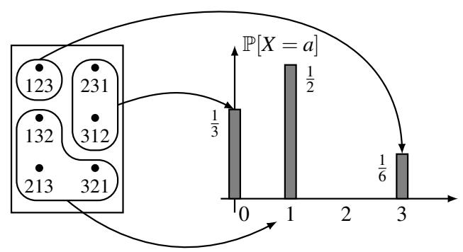
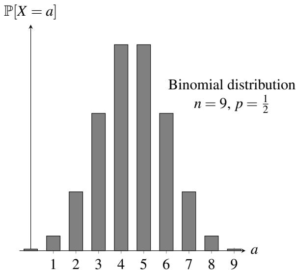
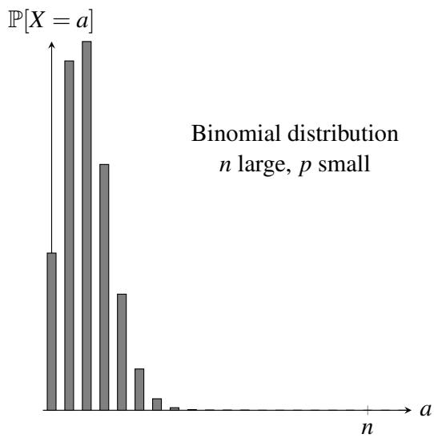
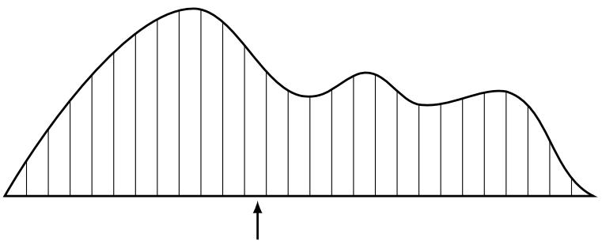

# 016 - 随机变量：分布与期望

回顾我们将概率实验设定为从一组可能值中抽取样本的过程，并为实验的每个可能结果分配一个概率。例如，如果我们抛一枚均匀硬币 $n$ 次，那么存在 $2 ^ { n }$ 个可能的结果，每个结果的可能性相等，概率为 $\textstyle \frac { 1 } { 2 ^ { n } }$ 。

现在假设我们想在实验中进行测量。例如，我们可以问在 $n$ 次硬币抛掷中正面朝上的次数是多少；将这个数字称为 $X$ 。当然，$X$ 不是一个固定的数字，它取决于我们获得的实际硬币翻转序列。例如，如果 $n = 4$ 并且我们观察到结果 $\omega = H T H H$ ，那么 $X = 3$ ；而如果我们观察到结果 $\omega = H T H T$ ，那么 $X = 2$ 。在这个 $n$ 次硬币抛掷的例子中，我们只知道 $X$ 是 0 到 $n$ 之间的整数，但在观察到 $n$ 次硬币翻转的实际结果并计算有多少个正面之前，我们并不知道它的确切值。因为每个可能的结果都被分配了一个概率，所以值 $X$ 对于它可以取的每个可能值也带有概率。下表列出了在 $n = 4$ 次硬币抛掷的示例中 $X$ 可以取的所有可能值，以及它们各自的概率。

<table><tr><td>结果 ω</td><td>X 的值（正面个数）</td><td>发生的概率</td></tr><tr><td>TTTT</td><td>0</td><td>1/16</td></tr><tr><td>HTTT, THTT, TTHT, TTTH</td><td>1</td><td>4/16</td></tr><tr><td>HHTT, HTHT, HTTH, THHT, THTH, TTHH</td><td>2</td><td>6/16</td></tr><tr><td>HHHT, HHTH, HTHH, THHH</td><td>3</td><td>4/16</td></tr><tr><td>HHHH</td><td>4</td><td>1/16</td></tr></table>

这种取决于概率实验结果的值 $X$ 被称为**随机变量**（Random Variable，简称 $r.v.$ ）。正如我们从上面的例子中看到的，随机变量 $X$ 通常没有一个确定的值，而是对 $X$ 可以取的一组可能值有一个概率分布，这就是为什么它被称为随机的。因此，“n 次硬币抛掷中正面朝上的次数是多少？”这个问题并不完全有意义，因为答案 $X$ 是一个随机变量。但“n 次硬币抛掷中典型的正面次数是多少？”这个问题是有意义的 —— 它是在问，如果我们多次重复抛掷 $n$ 枚硬币的实验，$X$ （正面次数）的平均值是多少。这个平均值被称为 $X$ 的**期望**（Expectation），是实验最有用的总结（也称为统计量）之一。

## 1 随机变量
在我们正式阐述上述概念之前，让我们看另一个例子来加强对随机变量的概念理解。

## 置换的固定点
问题：假设我们收集 $n$ 名学生的作业，随机打乱后返还给学生。有多少名学生收到了自己的作业？

这里概率空间由作业的所有 $n!$ 种置换组成，每种置换的概率相等，均为 $\textstyle \frac { 1 } { n ! }$ 。如果我们把作业标记为 $1, 2, \ldots, n$ ，那么每个样本点都是一个置换 $\pmb { \pi } = ( \pi _ { 1 } , \ldots , \pi _ { n } )$ ，其中 $\pi _ { i }$ 是返还给第 $i$ 名学生的作业。如果 $\pi _ { i } = i$ ，即如果学生 $i$ 收到了自己的作业，我们称 $i$ 为 $\pi$ 的一个**固定点**（Fixed Point）。

正如上面的抛硬币案例一样，我们的问题没有简单的数值答案（例如 4），因为结果取决于我们选择的具体置换（即样本点）。让我们把固定点的数量称为 $X _ { n }$ ，它是一个在集合 $\{ 0, 1, 2, \ldots, n \}$ 中取值的随机变量。（实际上，$X _ { n } = n - 1$ 是不可能的：为什么？）

## 随机变量的正规定义
我们现在正式阐述上面讨论的概念。

**定义 16.1**（随机变量）。样本空间 $\Omega$ 上的**随机变量**（Random Variable） $X$ 是一个函数 $X \colon \Omega \to \mathbb { R }$ ，它为每个样本点 $\omega \in \Omega$ 分配一个实数 $X ( \omega )$ 。

在另行通知之前，我们将把注意力集中在**离散**（Discrete）的随机变量上，即它们在有限或可数无限的范围内取值。这意味着尽管我们将 $X$ 定义为从 $\Omega$ 到 $\mathbb { R }$ 的映射，但 $X$ 实际取的值集合 $\{ X ( \omega ) \colon \omega \in \Omega \}$ 是 $\mathbb { R }$ 的一个离散子集。

随机变量通常可以用图 1 所示的图像来可视化。请注意，“随机变量”这个词其实有点误导：它是一个函数，所以它本身并没有什么随机性，而且它绝对不是一个变量！随机的是实验中实现的样本点，从而导致了随机变量将样本点映射到的值。

  
图 1：随机变量在样本空间上定义的示意图。

**练习**。通过完成图 1 下方的图片，证明随机变量 $X _ { 3 }$ 唯一可能的值是 0、1 和 3，并且它们的概率分别为 $\textstyle \frac 1 3$ 、 $\textstyle \frac { 1 } { 2 }$ 和 $\textstyle \frac { 1 } { 6 }$ 。

## 2 概率分布
当我们在之前的讲义中介绍基本概率空间时，我们定义了两件事：

1. 样本空间 $\Omega$ ，由实验所有可能的结果（样本点）组成。
2. 每个样本点的概率。

类似地，关于任何随机变量，也有两件重要的事：

1. 它可以取的值的集合。
2. 它取这些值的概率。

由于随机变量定义在概率空间上，我们可以根据样本点的概率计算出这些概率。令 $a$ 为随机变量 $X$ 范围内的任何数字。那么集合

$$
\left\{\omega \in \Omega : X (\omega) = a \right\}
$$

是样本空间中的一个事件（因为它是一个 $\Omega$ 的子集）。我们通常把这个事件简写为 “$X = a$” 。由于 $X = a$ 是一个事件，我们可以讨论它的概率 $\mathbb { P } [ X = a ]$ 。对于 $a$ 的所有可能值，这些概率的集合被称为随机变量 $X$ 的**分布**（Distribution）。

**定义 16.2**（分布）。离散随机变量 $X$ 的**分布**（Distribution）是值集合 $\{ ( a, \mathbb { P } [ X = a ] ) : a \in \mathcal { A } \}$ ，其中 $\mathcal { A }$ 是 $X$ 所取的所有可能值的集合。

因此，我们上面置换示例中随机变量 $X$ 的分布是：

$$
\mathbb {P} [ X = 0 ] = \frac {1}{3}; \qquad \mathbb {P} [ X = 1 ] = \frac {1}{2}; \qquad \mathbb {P} [ X = 3 ] = \frac {1}{6}.
$$

如果需要，我们也可以对所有其他 $a$ 值写成 $\mathbb { P } [ X = a ] = 0$ 。

随机变量的分布可以可视化为条形图，如图 2 所示。 $x$ 轴表示随机变量可以承担的值。在值 $a$ 处的条形高度是概率 $\mathbb { P } [ X = a ]$ 。通过查看样本空间中对应事件的概率，可以计算出这些概率中的每一个。

请注意，对于 $a \in \mathcal { A }$ ，事件集合 $X = a$ 满足两个重要的性质：

* 任何两个具有 $a _ { 1 } \neq a _ { 2 }$ 的事件 $X = a _ { 1 }$ 和 $X = a _ { 2 }$ 都是互斥的。
* 所有这些事件的并集等于整个样本空间 $\Omega$ 。

因此，事件集合形成了样本空间的一个划分（见图 2）。这两个性质都直接源于 $X$ 是定义在 $\Omega$ 上的函数这一事实，即 $X$ 为 $\Omega$ 中的每一个可能的样本点分配一个唯一的值。所以，当我们对事件 $X = a$ 的概率求和时，我们实际上是对所有样本点的概率求和，得到总和正好为 1。

  
图 2：随机变量分布定义的示意图。

## 伯努利分布
一个简单但也非常有用的概率分布是取值在 $\{ 0, 1 \}$ 中的随机变量的**伯努利分布**（Bernoulli Distribution）：

$$
\mathbb {P} [ X = i ] = \left\{ \begin{array}{l l} p, & \text {若 } i = 1, \\ 1 - p, & \text {若 } i = 0, \end{array} \right.
$$

其中 $0 \leq p \leq 1$ 。我们说 $X$ 服从参数为 $p$ 的伯努利分布，并计作

$$
X \sim \operatorname {Bernoulli} (p) \qquad \text {或} \qquad X \sim \operatorname {Ber} (p).
$$

## 二项分布
让我们回到上面的抛硬币例子，在那里我们将随机变量 $X$ 定义为正面的数量。更正式地，考虑由 $n$ 次独立抛掷一枚以概率 $p$ 出现 $H$（正面）的有偏硬币组成的随机实验。每个样本点 $\omega$ 是抛掷序列，而 $X ( \omega )$ 被定义为 $\omega$ 中正面的数量。例如，当 $n = 3$ 时，$X ( T H H ) = 2$ 。

为了计算 $X$ 的分布，我们首先列举 $X$ 可以取的所有可能值。它们仅仅是 $0, 1, \ldots, n$ 。然后我们计算每个事件 $X = i$ 的概率，其中 $i = 0, 1, \ldots, n$ 。事件 $X = i$ 的概率是所有恰好有 $i$ 个正面的样本点的概率之和（例如，如果 $n = 3$ 且 $i = 2$ ，则会有三个这样的样本点 $\{ H H T, H T H, T H H \}$ ）。任何这样的样本点的概率都是 $p ^ { i } ( 1 - p ) ^ { n - i }$ ，因为硬币翻转是独立的。恰好有 $\binom { n } { i }$ 个这样的样本点。因此，

$$
\mathbb {P} [ X = i ] = \binom {n} {i} p ^ {i} (1 - p) ^ {n - i}, \quad \text {对于 } i = 0, 1, \dots , n. \tag {1}
$$

这种分布被称为**二项分布**（Binomial Distribution），是概率论中最重要的分布之一。服从这种分布的随机变量被称为二项随机变量，我们记作

$$
X \sim \operatorname {Bin} (n, p),
$$

其中 $n$ 表示试验次数，$p$ 表示成功的概率（在示例中为观察到 $H$ ）。二项分布的一个例子如图 3 所示。请注意，由于上述提到的 $X$ 的性质，必然有 $\textstyle \sum _ { i = 0 } ^ { n } \mathbb { P } [ X = i ] = 1$ ，这意味着 $\textstyle \sum _ { i = 0 } ^ { n } \binom { n } { i } p ^ { i } ( 1 - p ) ^ { n - i } = 1$ 。这为之前讲义中我们从组合学角度看过的二项式定理提供了一个概率证明，其中 $a = p$ 且 $b = 1 - p$ 。

  
图 3：两种 $( n, p )$ 选择下的二项分布。

虽然我们将二项分布定义为涉及抛硬币的实验，但这种分布对于模拟许多现实世界的问题非常有用。例如，考虑之前研究过的纠错问题。回想一下，我们想将 $n$ 个数据包编码为 $n + k$ 个数据包，使得接收者可以从收到的任何 $n$ 个数据包中重构原始的 $n$ 个数据包。但在实践中，丢失的数据包数量是随机的，那么我们如何选择冗余量 $k$ 呢？如果我们假设每个数据包丢失的概率为 $p$ 且丢包是相互独立的，那么如果我们发送 $n + k$ 个数据包，接收到的数据包数量就是一个服从二项分布的随机变量 $X$ ： $X \sim \operatorname {Bin} ( n + k, 1 - p )$ （我们抛了 $n + k$ 次硬币，每次硬币为正面（收到数据包）的概率为 $1 - p$ ）。因此，成功解码原始数据的概率为：

$$
\mathbb {P} [ X \geq n ] = \sum_ {i = n} ^ {n + k} \mathbb {P} [ X = i ] = \sum_ {i = n} ^ {n + k} \binom {n + k} {i} (1 - p) ^ {i} p ^ {n + k - i }.
$$

给定固定的 $n$ 和 $p$ ，我们可以选择 $k$ 使得该概率不小于（比如）0.99。

## 超几何分布
考虑一个装有 $N = B + W$ 个球的瓮，其中 $B$ 个是黑球， $W$ 个是白球。假设你随机地从瓮中**有放回**地抽取 $n \leq N$ 个球，并令 $X$ 表示样本中黑球的数量。 $X$ 的概率分布是什么？由于每次抽取看到黑球的概率独立于所有其他抽取，均为 $B / N$ ，因此 $X$ 服从参数为 $p = B / N$ 的二项分布 $\operatorname {Bin} ( n, p )$ 。

如果你随机地从瓮中**无放回**地抽取 $n \leq N$ 个球呢？在这种情况下，在第 $i$ 次抽取中看到黑球的概率取决于已经抽出的 $i - 1$ 个球的颜色；也就是说，与有放回抽样的情况不同，各次抽取是不独立的。在这种设定下，黑球数量 $Y$ 的概率分布可以通过如下方式找到。

由于抽取 $n$ 个球的所有方式都是等可能的，我们处于一个均匀概率空间 $\Omega$ 中，因此我们可以使用计数来计算概率。具体来说，对于任何 $k = 0, 1, \ldots, n$ ，我们有

$$
\mathbb {P} [ Y = k ] = \frac {\left| E _ {k} \right|}{\left| \Omega \right|}, \tag {2}
$$

其中 $E _ { k } \subseteq \Omega$ 是包含恰好 $k$ 个黑球的结果集合。可能的结果总数为 $| \Omega | = \binom { N } { n }$ 。包含恰好 $k$ 个黑球的结果总数为

$$
| E _ {k} | = \binom {B} {k} \binom {N - B} {n - k};
$$

之所以如此，是因为有 $\binom { B } { k }$ 种方式从瓮中的 $B$ 个黑球中选择 $k$ 个，以及 $\binom { N - B } { n - k }$ 种方式从瓮中的 $N - B$ 个白球中选择剩余的 $n - k$ 个。将这些计算代入 (2)，我们得出结论：

$$
\mathbb {P} [ Y = k ] = \frac {\binom {B} {k} \binom {N - B} {n - k}}{\binom {N} {n}},
$$

对于 $k \in \{ 0, 1, \ldots, n \}$ 。（注意，如果 $j > m$ ，则 $\binom { m } { j } = 0$ ，因此只有当 $\max ( 0, n + B - N ) \leq k \leq \min ( n, B )$ 时 $\mathbb { P } [ Y = k ] \neq 0$ 。）这种概率分布被称为参数为 $N, B, n$ 的**超几何分布**（Hypergeometric Distribution），我们记作

$$
Y \sim \operatorname {Hypergeometric} (N, B, n).
$$

## 3 多个随机变量与独立性
人们通常会对同一样本空间上的多个随机变量感兴趣。例如，考虑抛掷三枚硬币的样本空间。人们可以定义许多随机变量：例如，表示正面数量的随机变量 $X$ ，或者表示反面数量的随机变量 $Y$ ，或者表示第一次抛掷是否为 $H$ 的二进制随机变量 $Z$ 。请注意，对于每个样本点，任何随机变量都有一个特定值：例如，对于 $\omega = H T T$ ，我们有 $X ( \omega ) = 1$ , $Y ( \omega ) = 2$ , $Z ( \omega ) = 1$ 。

分布的概念随后可以扩展到多个随机变量取值组合的概率。

**定义 16.3**。两个离散随机变量 $X$ 和 $Y$ 的**联合分布**（Joint Distribution）是值集合 $\{ ( ( a, b ), \mathbb { P } [ X = a, Y = b ] ) : a \in \mathcal { A }, b \in \mathcal { B } \}$ ，其中 $\mathcal { A }$ 是 $X$ 所取的所有可能结果的集合， $\mathcal { B }$ 是 $Y$ 所取的所有可能结果的集合。

给定 $X$ 和 $Y$ 的联合分布， $X$ 的分布 $\mathbb { P } [ X = a ]$ 被称为 $X$ 的**边缘分布**（Marginal Distribution），可以通过对 $Y$ 的值求和来找到。也就是说，

$$
\mathbb {P} [ X = a ] = \sum_ {b \in \mathcal {B}} \mathbb {P} [ X = a, Y = b ].
$$

$Y$ 的边缘分布定义类似。

任意一组随机变量 $X _ { 1 } , \ldots , X _ { n }$ （例如， $X _ { i }$ 可以是 $n$ 次掷骰子序列中第 $i$ 次的值）的联合分布是 $\mathbb { P } [ X _ { 1 } = a _ { 1 } , \ldots , X _ { n } = a _ { n } ]$ ，其中 $a _ { i } \in \mathcal { A } _ { i }$ 且 $\mathcal { A } _ { i }$ 是 $X _ { i }$ 的可能值集合。 $X _ { i }$ 的边缘分布可以通过对其他变量的所有可能值求和来获得。

随机变量的独立性定义与事件的独立性定义类似：

**定义 16.4**（独立性）。如果对于所有值 $a, b$ ，事件 $X = a$ 和 $Y = b$ 都是独立的，则称同一概率空间上的随机变量 $X$ 和 $Y$ 是**独立**（Independent）的。等价地，独立随机变量的联合分布可以分解为

$$
\mathbb {P} [ X = a, Y = b ] = \mathbb {P} [ X = a ] \mathbb {P} [ Y = b ], \quad \forall a, b.
$$

两个以上随机变量的相互独立性定义类似。

独立随机变量的一个非常重要的例子是独立事件的指示随机变量。如果 $I _ { i }$ 表示第 $i$ 次抛硬币为 $H$ 的指示随机变量，那么 $I _ { 1 }, \ldots, I _ { n }$ 是相互独立的随机变量。这个例子引出了常用的短语 “**独立同分布**（Independent and Identically Distributed，简称 i.i.d.）随机变量集”。在这个例子中， $\{ I _ { 1 }, \ldots, I _ { n } \}$ 是一组 i.i.d. 指示随机变量。

## 4 期望
随机变量的分布包含了关于该随机变量的所有信息。然而，在大多数应用中，计算随机变量的完整分布是非常困难的。例如，考虑 $n = 20$ 的作业置换示例。原则上，我们必须枚举 $20! \approx 2.4 \times 10 ^ { 18 }$ 个样本点，计算每个点上的 $X$ 值，并统计 $X$ 取其每个可能值的点数（尽管在实践中我们可以简化这种计算）！此外，即使我们可以计算随机变量的完整分布，它通常也没有很强的信息性。

出于这些原因，我们寻求将分布总结为一种更紧凑、方便、且更易于计算的形式。最广泛使用的这种形式是随机变量的**期望**（Expectation，或称均值 Mean 或平均值 Average）。

**定义 16.5**（期望）。离散随机变量 $X$ 的**期望**（Expectation）定义为

$$
\mathbb {E} [ X ] = \sum_ {a \in \mathcal {A}} a \times \mathbb {P} [ X = a ], \tag {3}
$$

其中求和是对随机变量所取的所有可能值进行的。

**技术说明**。只要 (3) 式右手边的和是绝对收敛的，即 $\textstyle \sum _ { a \in \mathcal { A } } | a | \times \mathbb { P } [ X = a ] < \infty$ ，期望就是定义良好的。存在期望不存在的离散随机变量，例如分布为 $\mathbb { P } [ X = i ] = \frac { 6 } { \pi ^ { 2 } i ^ { 2 } }$ （对于所有正整数 $i$ ）的随机变量 $X$ 。（这里系数 $\frac { 6 } { \pi ^ { 2 } }$ 的原因是为了使概率之和为 1，因为 $\textstyle \sum _ { i = 1 } ^ { \infty } \frac { 1 } { i ^ { 2 } } = \frac { \pi ^ { 2 } } { 6 }$ 。）

对于只有 3 名学生的更简单的置换示例，期望是

$$
\mathbb {E} [ X ] = \left(0 \times \frac {1}{3}\right) + \left(1 \times \frac {1}{2}\right) + \left(3 \times \frac {1}{6}\right) = 0 + \frac {1}{2} + \frac {1}{2} = 1.
$$

也就是说，三个物品的置换中固定点的期望数量正好是 1。

期望在某种意义上可以被看作是随机变量的一个 “典型” 值（尽管请注意， $\mathbb { E } [ X ]$ 实际上可能不是 $X$ 可以取的值）。对于给定的随机变量，期望具有多大的代表性是一个非常重要的问题，我们将在后面的课程中回顾。

这里是随机变量期望的一个物理阐释：想象如图 4 所示，刻出一个概率分布的木质轮廓图。那么分布的期望值就是该物体的平衡点（直接位于重心下方）。

  
图 4：将期望值作为平衡点的物理阐释。

## 4.1 示例
1. 单个筛子。掷一次公平的筛子，令 $X$ 为出现的点数。那么 $X$ 以每个 $\textstyle \frac { 1 } { 6 }$ 的概率取值 $1, 2, \ldots, 6$ ，所以

$$
\mathbb {E} [ X ] = \frac {1}{6} (1 + 2 + 3 + 4 + 5 + 6) = \frac {2 1}{6} = \frac {7}{2}.
$$

注意 $X$ 实际上从未取到其期望值 $\textstyle \frac { 7 } { 2 }$ 。

2. 两个筛子。掷两个公平的筛子，令 $X$ 为它们的点数之和。那么 $X$ 的分布为

<table><tr><td>a</td><td>2</td><td>3</td><td>4</td><td>5</td><td>6</td><td>7</td><td>8</td><td>9</td><td>10</td><td>11</td><td>12</td></tr><tr><td>P[X=a]</td><td>1/36</td><td>1/18</td><td>1/12</td><td>1/9</td><td>5/36</td><td>1/6</td><td>5/36</td><td>1/9</td><td>1/12</td><td>1/18</td><td>1/36</td></tr></table>

因此期望是

$$
\mathbb {E} [ X ] = \left(2 \times \frac {1}{3 6}\right) + \left(3 \times \frac {1}{1 8}\right) + \left(4 \times \frac {1}{1 2}\right) + \dots + \left(1 2 \times \frac {1}{3 6}\right) = 7.
$$

3. 轮盘赌 (Roulette)。旋转一个轮盘（回想一下轮盘有 38 个槽位：数字 1, 2, . . . , 36，其中一半是红色，一半是黑色，加上 0 和 00，它们是绿色）。你在黑色上押注 $\$ 1$ 。如果出现黑色数字，你收回本金并获得 $\$ 1$ ；否则你输掉本金。令 $X$ 为你在一次游戏中的净收益。那么 $X$ 可以取值 $+1$ 和 $-1$ ，且 $\mathbb { P } [ X = 1 ] = \frac { 1 8 } { 3 8 }$ ， $\mathbb { P } [ X = - 1 ] = \frac { 2 0 } { 3 8 }$ 。因此，

$$
\mathbb {E} [ X ] = \left(1 \times \frac {1 8}{3 8}\right) + \left(- 1 \times \frac {2 0}{3 8}\right) = - \frac {1}{1 9};
$$

也就是说，你预计每局游戏平均损失约 5 美分。注意那些零是如何向赌场倾斜平衡的！

## 4.2 期望的线性性质
到目前为止，我们都是通过“蛮力”计算期望的：即，我们写出整个分布，然后将所有可能值对随机变量的贡献加起来。期望的真正威力在于，在许多现实生活中的例子中，可以使用一个简单的捷径更轻松地计算它们。这个捷径如下：

**定理 16.1**。对于同一概率空间上的任何两个随机变量 $X$ 和 $Y$ ，我们有

$$
\mathbb {E} [ X + Y ] = \mathbb {E} [ X ] + \mathbb {E} [ Y ].
$$

此外，对于任何常数 $c$ ，我们有

$$
\mathbb {E} [ c X ] = c \mathbb {E} [ X ].
$$

**证明**。我们首先将期望的定义改写为一种更方便的形式。回想定义 16.5：

$$
\mathbb {E} [ X ] = \sum_ {a \in \mathcal {A}} a \times \mathbb {P} [ X = a ].
$$

考虑上述和式中的一个特定项 $a \times \mathbb { P } [ X = a ]$ 。请注意，根据定义， $\mathbb { P } [ X = a ]$ 是使 $X ( \omega ) = a$ 的那些样本点 $\omega$ 的 $\mathbb { P } [ \omega ]$ 之和。此外，我们知道每个样本点 $\omega \in \Omega$ 恰好位于这些事件 $X = a$ 中的一个。这意味着我们可以将上述定义改写为一种更冗长但等价的形式：

$$
\mathbb {E} [ X ] = \sum_ {\boldsymbol {\omega} \in \Omega} X (\boldsymbol {\omega}) \times \mathbb {P} [ \boldsymbol {\omega} ]. \tag {4}
$$

这个等价的期望定义将使目前的证明变得更容易（尽管它通常不太便于实际计算）。将 (4) 应用于 $\mathbb { E } [ X + Y ]$ 得到：

$$
\begin{array}{l} \mathbb {E} [ X + Y ] = \sum_ {\omega \in \Omega} (X + Y) (\omega) \times \mathbb {P} [ \omega ] \\ = \sum_ {\boldsymbol {\omega} \in \Omega} (X (\boldsymbol {\omega}) + Y (\boldsymbol {\omega})) \times \mathbb {P} [ \boldsymbol {\omega} ] \\ = \sum_ {\omega \in \Omega} (X (\omega) \times \mathbb {P} [ \omega ]) + \sum_ {\omega \in \Omega} (Y (\omega) \times \mathbb {P} [ \omega ]) \\ = \mathbb {E} [ X ] + \mathbb {E} [ Y ] \\ \end{array}
$$

在最后一步中，我们两次使用了 (4)。

这就完成了第一个等式的证明。第二个等式的证明要简单得多，留作练习。 $\square$

定理 16.1 非常强大：它表明随机变量之和的期望等于它们各自期望的和，而无需对这些随机变量作任何假设。我们可以使用定理 16.1 得出诸如 $\mathbb { E } [ 3 X - 5 Y ] = 3 \mathbb { E } [ X ] - 5 \mathbb { E } [ Y ]$ 之类的结论，无论 $X$ 和 $Y$ 是否独立。这一重要性质被称为**期望的线性性质**（Linearity of Expectation）。

**重要警示**：定理 16.1 并没有说 $\mathbb { E } [ X Y ] = \mathbb { E } [ X ] \mathbb { E } [ Y ]$ ，或者 $\mathbb { E } [ \frac { 1 } { X } ] = \frac { 1 } { \mathbb { E } [ X ] }$ 等。这些断言在一般情况下是不成立的。只有随机变量的和、差和倍数才表现得如此之好。

## 4.3 期望线性性质的应用
现在让我们看看定理 16.1 实际应用的一些例子。

1. 再次看两个筛子。这里有一种计算 $X$ （两个筛子点数之和）的远不那么痛苦的方法。注意 $X = Y _ { 1 } + Y _ { 2 }$ ，其中 $Y _ { i }$ 是第 $i$ 个筛子的点数。我们从 4.1 节的例 1 中知道 $\mathbb { E } [ Y _ { 1 } ] = \mathbb { E } [ Y _ { 2 } ] = \frac { 7 } { 2 }$ 。因此，根据定理 16.1，我们有 $\mathbb { E } [ X ] = \mathbb { E } [ Y _ { 1 } ] + \mathbb { E } [ Y _ { 2 } ] = 7$ 。

2. 更多的轮盘赌。假设我们玩 4.1 节提到的轮盘赌游戏 $n \geq 1$ 次。令 $X _ { n }$ 为我们的预期净收益。那么 $X _ { n } = Y _ { 1 } + Y _ { 2 } + \cdots + Y _ { n }$ ，其中 $Y _ { i }$ 是我们在第 $i$ 次游戏中的净收益。我们从之前知道对于每个 $i$ ， $\mathbb { E } [ Y _ { i } ] = - \frac { 1 } { 1 9 }$ 。因此，根据定理 16.1， $\mathbb { E } [ X _ { n } ] = \mathbb { E } [ Y _ { 1 } ] + \mathbb { E } [ Y _ { 2 } ] + \cdots + \mathbb { E } [ Y _ { n } ] = - \frac { n } { 1 9 }$ 。对于 $n = 1000$ ， $\mathbb { E } [ X _ { n } ] = - \frac { 1000 } { 1 9 } \approx - 53$ ，所以如果你玩 1000 局，你预计亏损约 $\$ 53$ 。

3. 置换的固定点。让我们回到有任意 $n$ 名学生的作业置换示例。令 $X _ { n }$ 表示打乱后收到自己作业的学生人数（或等价地，固定点的数量）。为了利用定理 16.1，我们需要将 $X _ { n }$ 写成更简单的随机变量之和。由于 $X _ { n }$ 统计某事发生的次数，我们可以使用以下有用的技巧将其写成一个和：

$$
X _ {n} = I _ {1} + I _ {2} + \dots + I _ {n}, \quad \text {其中 } I _ {i} = \left\{ \begin{array}{l l} 1, & \text {若学生 } i \text { 拿到自己的作业，} \\ 0, & \text {否则。} \end{array} \right. \tag {5}
$$

[你应该思考一下这个等式。记住所有的 $I _ { i }$ 都是随机变量。涉及随机变量的等式意味着什么？我们的意思是，在每个样本点 $\omega$ 处，都有 $X _ { n } ( \omega ) = I _ { 1 } ( \omega ) + I _ { 2 } ( \omega ) + \cdots + I _ { n } ( \omega )$ 。为什么这是真的？]

像 $I _ { i }$ 这样的伯努利随机变量被称为对应事件（在本例中，是学生 $i$ 拿到自己作业的事件）的**指示随机变量**（Indicator Random Variable）。对于指示随机变量，期望特别容易计算。具体来说，

$$
\mathbb {E} \left[ I _ {i} \right] = \left(0 \times \mathbb {P} \left[ I _ {i} = 0 \right]\right) + \left(1 \times \mathbb {P} \left[ I _ {i} = 1 \right]\right) = \mathbb {P} \left[ I _ {i} = 1 \right].
$$

在我们的例子中，我们有

$$
\mathbb {P} [ I _ {i} = 1 ] = \mathbb {P} [ \text {学生 } i \text { 拿到自己的作业} ] = \frac {1}{n}.
$$

我们现在可以将定理 16.1 应用于 (5)，得到

$$
\mathbb {E} \left[ X _ {n} \right] = \mathbb {E} \left[ I _ {1} \right] + \mathbb {E} \left[ I _ {2} \right] + \dots + \mathbb {E} \left[ I _ {n} \right] = n \times \frac {1}{n} = 1.
$$

所以，我们看到在规模为 $n$ 的班级中，拿到自己作业的学生的期望人数是 1。也就是说，在 $n$ 个物品的随机置换中，固定点的期望数量始终是 1，无论 $n$ 是多少！

4. 抛硬币。抛一枚公平硬币 $n \geq 1$ 次。令随机变量 $X _ { n }$ 为观察到的正面次数。与前面的例子一样，为了利用定理 16.1，我们写作

$$
X _ {n} = I _ {1} + I _ {2} + \dots + I _ {n},
$$

其中 $I _ { i }$ 是第 $i$ 次抛掷为 $H$ 的事件的指示随机变量。由于硬币是公平的，我们有

$$
\mathbb {E} \left[ I _ {i} \right] = \mathbb {P} \left[ I _ {i} = 1 \right] = \mathbb {P} [ \text {第 } i \text { 次抛掷为 } H ] = \frac {1}{2}.
$$

利用定理 16.1，我们因此得到

$$
\mathbb {E} \left[ X _ {n} \right] = \sum_ {i = 1} ^ {n} \frac {1}{2} = \frac {n}{2}.
$$

更一般地，在抛掷一枚以概率 $p$ 出现 $H$ 的有偏硬币 $n$ 次中， $\mathbb { E } [ X _ { n } ] = n p$ 。（检查这一点！）因此二项随机变量 $X \sim \operatorname {Bin} ( n, p )$ 的期望等于 $n p$ 。请注意，如果通过 (3) 中的期望定义和 (1) 中的二项随机变量分布直接计算得出这个结论，将会麻烦得多（尽管也是可能的）。

5. 球与箱子。将 $m$ 个球扔进 $n$ 个箱子。令随机变量 $X$ 为落在第一个箱子中的球数。那么 $X$ 的行为恰好类似于在 $m$ 次以 $\textstyle \mathbb { P } [ H ] = \frac { 1 } { n }$ 抛掷的有偏硬币中的正面次数（为什么？）。所以，从前面的例子中，我们得到 $\mathbb { E } [ X ] = \frac { m } { n }$ 。在 $m = n$ 的特殊情况下，任何箱子中球的期望数量为 1。如果我们想直接从 $X$ 的分布中计算这个值，就会陷入涉及二项式系数的复杂计算中。

这里是同一样本空间上的另一个例子。令随机变量 $Y _ { n }$ 为空箱子的数量。 $Y _ { n }$ 的分布令人望而生畏：为了对此有所感悟，你可能想写下 $m = n = 3$ （即 3 个球，3 个箱子）时的分布。然而，利用定理 16.1 计算期望 $\mathbb { E } [ Y _ { n } ]$ 却很容易。与前面的两个例子一样，我们写作

$$
Y _ {n} = I _ {1} + I _ {2} + \dots + I _ {n}, \tag {6}
$$

其中 $I _ { i }$ 是事件 “箱子 $i$ 为空” 的指示随机变量。 $I _ { i }$ 的期望很容易找到：

$$
\mathbb {E} \left[ I _ {i} \right] = \mathbb {P} \left[ I _ {i} = 1 \right] = \mathbb {P} [ \text {箱子 } i \text { 为空} ] = \left(1 - \frac {1}{n}\right) ^ {m},
$$

正如之前讨论过的。将定理 16.1 应用于 (6)，我们因此获得

$$
\mathbb {E} \left[ Y _ {n} \right] = \sum_ {i = 1} ^ {n} \mathbb {E} \left[ I _ {i} \right] = n \left(1 - \frac {1}{n}\right) ^ {m},
$$

一个非常容易推导的简单公式。让我们看看它在 $m = n$ （球数与箱数相同）这一特殊情况下的表现。在这种情况下，我们得到 $\mathbb { E } [ Y _ { n } ] = n ( 1 - \frac { 1 } { n } ) ^ { n }$ 。现在，量 $( 1 - \frac { 1 } { n } ) ^ { n }$ 可以被（对于足够大的 $n$ 值）近似为数字 $\textstyle \frac { 1 } { e }$ 。因此我们看到，对于大 $n$ ，

$$
\mathbb {E} \left[ Y _ {n} \right] \approx \frac {n}{e} \approx 0.368 n.
$$

底线是，如果我们把（例如）1000 个球扔进 1000 个箱子，空箱子的期望数量大约是 368。