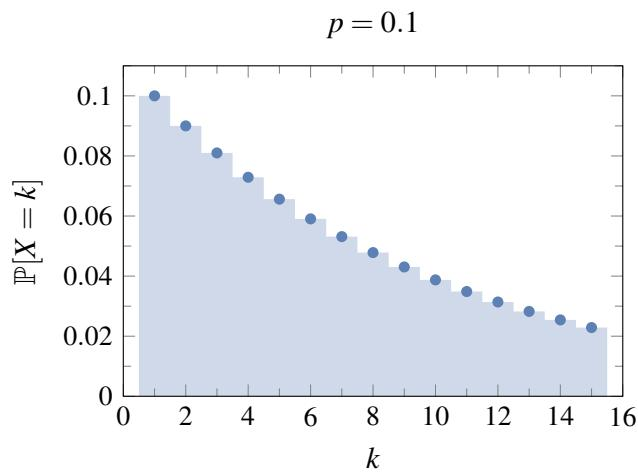
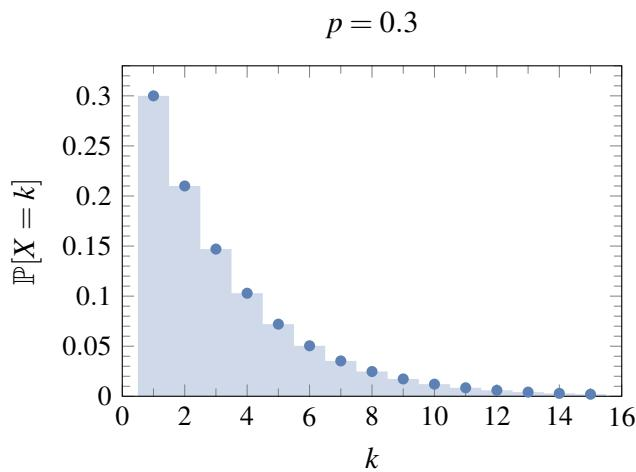
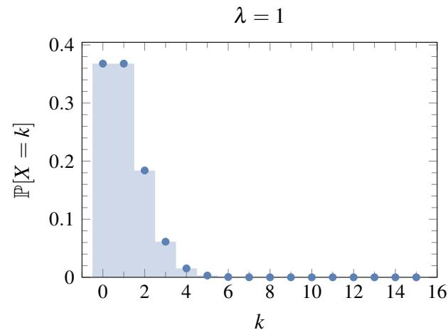
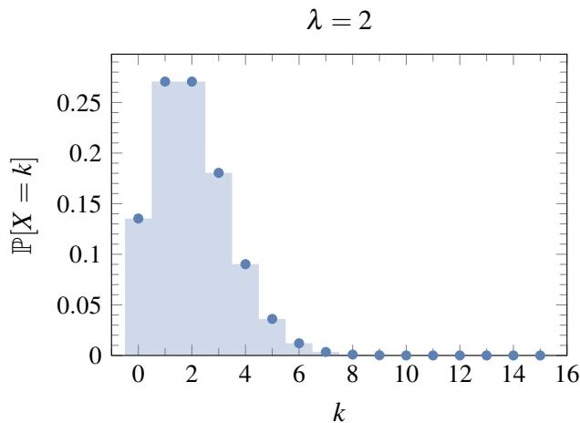
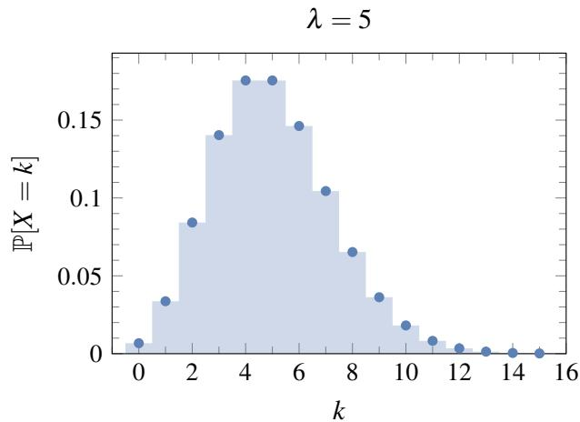
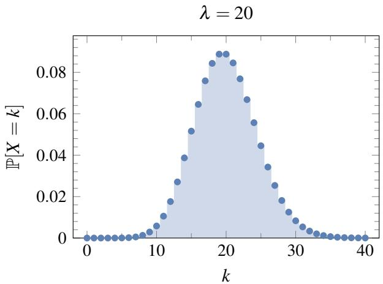

# 018 - 几何分布和泊松分布

回想我们关于抛掷有偏硬币 $n$ 次的基本概率实验。这是一个非常简单的模型，但其功能却出奇地强大。许多广泛用于模拟现实世界现象的重要概率分布都可以通过观察这个基本的抛硬币模型来导出。

第一个例子是之前介绍过的**二项分布** $X \sim \operatorname { Binomial } ( n, p )$ 。这是在 $n$ 次抛掷正面概率为 $p$ 的有偏硬币中，正面出现次数 $S _ { n }$ 的分布。回想 $S _ { n }$ 的分布对于 $k \in \{ 0, 1, \ldots , n \}$ 为 $\textstyle \mathbb { P } [ S _ { n } = k ] = \binom { n } { k } p ^ { k } ( 1 - p ) ^ { n - k }$ 。期望值为 $\mathbb { E } [ S _ { n } ] = n p$ ，方差为 $\operatorname { V a r } ( S _ { n } ) = n p ( 1 - p )$ 。二项分布经常被用来模拟重复实验中的成功次数。

## 1 几何分布
考虑重复抛掷一枚正面概率为 $p$ 的有偏硬币。令 $X$ 表示直到第一次出现正面所需的抛掷次数。那么 $X$ 是一个随机变量，其取值范围在正整数集 $\mathbb { Z } ^ { + }$ 中。 $X = i$ 这个事件等同于前 $i - 1$ 次抛掷均观察到反面，且在第 $i$ 次抛掷中得到正面的事件，其发生概率为 $( 1 - p ) ^ { i - 1 } p$ 。这样的随机变量被称为**几何随机变量**（Geometric Random Variable）。注意 $X$ 是无界的：也就是说，对于任何正整数 $i$ （无论多大）， $X = i$ 都有一定的正概率。

几何分布在应用中经常出现，因为我们通常对某个事件发生之前需要等待多长时间感兴趣：系统故障前运行了多少次？射击多少次才能击中目标？在找到一名民主党人之前需要多少民调样本？在成功到达目的地之前需要重新传输多少次数据包？等等。

**定义 18.1**（几何分布）。对于一个随机变量 $X$ ，如果

$$
\mathbb {P} [ X = i ] = (1 - p) ^ {i - 1} p, \quad \text {对于 } i = 1, 2, 3, \dots,
$$

则称其服从参数为 $p$ 的**几何分布**（Geometric Distribution）。这简记为 $X \sim \operatorname { Geometric } ( p )$ 或 $X \sim \operatorname { Geom } ( p )$ 。

作为一个快速检查，我们可以验证 $X$ 的总概率等于 1：

$$
\sum_ {i = 1} ^ {\infty} \mathbb {P} [ X = i ] = \sum_ {i = 1} ^ {\infty} (1 - p) ^ {i - 1} p = p \sum_ {i = 1} ^ {\infty} (1 - p) ^ {i - 1} = p \times \frac {1}{1 - (1 - p)} = 1,
$$

其中，在倒数第二步中我们使用了等比级数求和公式。

如果我们绘制 $X$ 的分布图（即将 $\mathbb { P } [ X = i ]$ 的值对应 $i$ 作图），我们会得到一条在每一步都按 $1 - p$ 倍数单调递减的曲线，如图 1 所示。

图 1： $p = 0.1$ 和 $p = 0.3$ 时几何分布 $\operatorname { Geometric } ( p )$ 的插图。

### 1.1 几何随机变量的均值和方差
现在让我们计算期望 $\mathbb { E } [ X ]$ 。直接应用期望的定义可得：

$$
\mathbb {E} [ X ] = \sum_ {i = 1} ^ {\infty} i \times \mathbb {P} [ X = i ] = p \sum_ {i = 1} ^ {\infty} i (1 - p) ^ {i - 1}.
$$

然而，最后这个求和式的计算有一点点棘手（尽管可以做到）。相反，我们将使用以下另一种期望公式，它简化了计算，并且其本身也非常有用。

**定理 18.1**（尾和公式/Tail Sum Formula）。令 $X$ 为取值于 $\{ 0, 1, 2, \ldots \}$ 的随机变量。则

$$
\mathbb {E} [ X ] = \sum_ {i = 1} ^ {\infty} \mathbb {P} [ X \geq i ].
$$

**证明**。为了符号方便，我们令 $p _ { i } = \mathbb { P } [ X = i ]$ ，对于 $i = 0, 1, 2, \ldots$ 。根据期望的定义，我们有

$$
\begin{array}{l} \mathbb {E} [ X ] = (0 \times p _ {0}) + (1 \times p _ {1}) + (2 \times p _ {2}) + (3 \times p _ {3}) + (4 \times p _ {4}) + \dots \\ = p _ {1} + \left(p _ {2} + p _ {2}\right) + \left(p _ {3} + p _ {3} + p _ {3}\right) + \left(p _ {4} + p _ {4} + p _ {4} + p _ {4}\right) + \dots \\ = (p _ {1} + p _ {2} + p _ {3} + p _ {4} + \dots) + (p _ {2} + p _ {3} + p _ {4} + \dots) + (p _ {3} + p _ {4} + \dots) + (p _ {4} + \dots) + \dots \\ = \mathbb {P} [ X \geq 1 ] + \mathbb {P} [ X \geq 2 ] + \mathbb {P} [ X \geq 3 ] + \mathbb {P} [ X \geq 4 ] + \dots . \\ \end{array}
$$

在第三行中，我们将各项重新组合成方便的无穷级数，而每个无穷级数恰好是 $X \geq i$ 对于每个 $i$ 的概率。你应该检查以确保你理解第四行是如何从第三行推导出来的。

让我们更正式地重复这个证明，这次使用更紧凑的数学符号：

$$
\mathbb {E} [ X ] = \sum_ {j = 1} ^ {\infty} j \times \mathbb {P} [ X = j ] = \sum_ {j = 1} ^ {\infty} \sum_ {i = 1} ^ {j} \mathbb {P} [ X = j ] = \sum_ {i = 1} ^ {\infty} \sum_ {j = i} ^ {\infty} \mathbb {P} [ X = j ] = \sum_ {i = 1} ^ {\infty} \mathbb {P} [ X \geq i ],
$$

其中第三个等号来自于交换求和顺序。 $\square$

我们现在可以使用定理 18.1 更容易地计算 $\mathbb { E } [ X ]$ 。

**定理 18.2**。对于 $X \sim \operatorname { Geometric } ( p )$ ，我们有 $\mathbb { E } [ X ] = \frac { 1 } { p }$ 。

**证明**。关键的观察是，对于几何随机变量 $X$ ，

$$
\mathbb {P} [ X \geq i ] = (1 - p) ^ {i - 1} \quad \text {对于 } i = 1, 2, \dots . \tag {1}
$$

我们可以简单地通过对 $j \geq i$ 的 $\mathbb { P } [ X = j ]$ 求和来得到这一点。另一种看待这一点的方法是指出事件 $X \geq i$ 意味着至少需要 $i$ 次抛掷。这等同于说前 $i - 1$ 次抛掷全部为反面，这个事件的概率恰好是 $( 1 - p ) ^ { i - 1 }$ 。现在，将 (1) 式代入定理 18.1，我们得到

$$
\mathbb {E} [ X ] = \sum_ {i = 1} ^ {\infty} \mathbb {P} [ X \geq i ] = \sum_ {i = 1} ^ {\infty} (1 - p) ^ {i - 1} = \frac {1}{1 - (1 - p)} = \frac {1}{p},
$$

这里我们使用了等比级数公式。 $\square$

所以，在有偏硬币直到第一次出现正面所需的期望抛掷次数是 $\frac { 1 } { p }$ 。因此对于公平硬币，直到第一次出现正面的期望抛掷次数是 2（但当然实际抛掷次数可以是任何正整数）。

现在让我们计算 $X$ 的方差。

**定理 18.3**。对于 $X \sim \operatorname { Geometric } ( p )$ ，我们有 $\operatorname { V a r } ( X ) = \frac { 1 - p } { p ^ { 2 } }$ 。

**证明**。我们使用公式

$$
\operatorname {V a r} (X) = \mathbb {E} [ X ^ {2} ] - (\mathbb {E} [ X ]) ^ {2} = \mathbb {E} [ X ^ {2} ] - \frac {1}{p ^ {2}}. \tag {2}
$$

因此我们只需要计算 $\mathbb { E } [ X ^ { 2 } ]$ ，我们可以使用如下的微积分技巧来做到。从

$$
\sum_ {i = 0} ^ {\infty} (1 - p) ^ {i} = \frac {1}{p}
$$

开始并对 $p$ 求导，我们得到

$$
\sum_ {i = 1} ^ {\infty} i (1 - p) ^ {i - 1} \times (-1) = - \frac {1}{p ^ {2}} \implies \sum_ {i = 1} ^ {\infty} i (1 - p) ^ {i - 1} = \frac {1}{p ^ {2}}. \tag {3}
$$

这里我们去掉了 $i = 0$ 的第一项（因为它的导数为零），并在等式两边乘以 $- 1$ 。（顺便注意，(3) 式给出了 $\mathbb { E } [ X ] = \frac { 1 } { p }$ 这一事实的另一种证明；为什么？）

现在我们将 (3) 式两边同时乘以 $( 1 - p )$ 并再次求导得到

$$
\frac {d}{d p} \left[ \sum_ {i = 1} ^ {\infty} i (1 - p) ^ {i} \right] = \frac {d}{d p} \left[ \frac {1 - p}{p ^ {2}} \right] \implies \sum_ {i = 1} ^ {\infty} i ^ {2} (1 - p) ^ {i - 1} \times (-1) = \frac {- p ^ {2} - 2 p (1 - p)}{p ^ {4}}
$$

$$
\implies \sum_ {i = 1} ^ {\infty} i ^ {2} (1 - p) ^ {i - 1} = \frac {p + 2 (1 - p)}{p ^ {3}} = \frac {2 - p}{p ^ {3}}.
$$

由于这里的左侧恰好是 $\frac { 1 } { p } \mathbb { E } [ X ^ { 2 } ]$ ，我们推断出

$$
\mathbb {E} \left[ X ^ {2} \right] = \frac {2 - p}{p ^ {2}}.
$$

最后，将其代入 (2) 式给出

$$
\operatorname {V a r} (X) = \frac {2 - p}{p ^ {2}} - \frac {1}{p ^ {2}} = \frac {1 - p}{p ^ {2}},
$$

正如所宣称的。 $\square$

### 1.2 无记忆性
几何分布具有一种特殊的性质，称为**无记忆性**（Memorylessness）。为了对这一性质有一些直观的认识，假设我们重新审视之前的启发性示例：重复抛掷一枚正面概率为 $p$ 的有偏硬币，令 $X$ 表示直到第一次出现正面所需的抛掷次数。因此， $X \sim \operatorname { Geometric } ( p )$ 。

正如我们所见，在得到第一个正面之前需要超过 $n$ 次抛掷的概率为 $\mathbb { P } [ X > n ] = ( 1 - p ) ^ { n }$ ，因为前 $n$ 次抛掷必须全部是反面。

如果我们已经抛掷了 $m$ 次硬币而没有得到正面呢？在得到第一个正面之前还需要额外抛掷超过 $n$ 次的概率是多少？我们可以计算这个概率为：

$$
\begin{array}{l} \mathbb {P} [ X > n + m \mid X > m ] = \frac {\mathbb {P} [ X > n + m ]}{\mathbb {P} [ X > m ]} \\ = \frac {(1 - p) ^ {n + m}}{(1 - p) ^ {m}} \\ = (1 - p) ^ {n} \\ = \mathbb {P} [ X > n ]. \\ \end{array}
$$

这给了我们几何分布无记忆性的正式表述：

$$
\mathbb {P} [ X > n + m \mid X > m ] = \mathbb {P} [ X > n ].
$$

几何分布在以下意义上是无记忆的：我们已经等待的时间长度不会影响我们获得第一个正面还需要等待的额外时间。（事实上，如果我们抛掷一枚公平硬币十次且每次都是反面，那么第 11 次抛掷出现正面的概率仍然是 $\frac { 1 } { 2 }$ 。）

### 1.3 应用：赠券收集问题
回想之前讲义中的**赠券收集问题**（Coupon Collecting Problem）：我们试图通过购买谷物盒来收集一套 $n$ 张不同的棒球卡，每盒谷物恰好包含一张随机卡片（在 $n$ 张卡片中均匀分布）。在收集到每张卡片至少一份拷贝之前，我们需要购买多少盒谷物？

令 $S _ { n }$ 表示为了收集全部 $n$ 张卡片而需要购买的盒子数量。 $S _ { n }$ 的分布很难直接计算（尝试对 $n = 3$ 进行计算），我们在之前的讲义中进行了一些计算来估计 $S _ { n }$ 的可能值。但如果我们只对期望值 $\mathbb { E } [ S _ { n } ]$ 感兴趣，那么我们可以利用期望的线性性质以及我们刚刚学到的关于几何分布的知识轻松地对其进行评估。

我们首先写出

$$
S _ {n} = X _ {1} + X _ {2} + \dots + X _ {n} \tag {4}
$$

表示更简单的随机变量 $X _ { i }$ 之和，其中 $X _ { i }$ 是我们在试图获得第 $i$ 张新卡片时购买的盒子数量（从刚获得第 $i - 1$ 张新卡片后立即开始计算）。有了这个定义，在继续之前请确保你相信 (4) 式。

$X _ { i }$ 的分布看起来像什么？嗯， $X _ { 1 }$ 是微不足道的：无论发生什么，我们总是在第一个盒子中得到一张新卡片（因为开始时我们一张也没有）。所以 $\mathbb { P } [ X _ { 1 } = 1 ] = 1$ ，因此 $\mathbb { E } [ X _ { 1 } ] = 1$ 。

那么 $X _ { 2 }$ 呢？每次我们买一个盒子，我们有 $\frac { 1 } { n }$ 的概率得到那张旧卡片，有 $\frac { n - 1 } { n }$ 的概率得到一张新卡片。所以我们可以把购买盒子看作抛掷一枚正面概率为 $p = \frac { n - 1 } { n }$ 的有偏硬币， $X _ { 2 }$ 就是直到第一次出现正面（新卡片）所需的抛掷次数。因此 $X _ { 2 }$ 服从参数为 $p = \frac { n - 1 } { n }$ 的几何分布，并且

$$
\mathbb {E} [ X _ {2} ] = \frac {n}{n - 1}.
$$

那么 $X _ { 3 }$ 呢？这与 $X _ { 2 }$ 非常相似，只是现在我们得到新卡片的概率只有 $\frac { n - 2 } { n }$ （因为已经有两张旧卡片了）。所以 $X _ { 3 }$ 服从参数为 $p = \frac { n - 2 } { n }$ 的几何分布，且

$$
\mathbb {E} [ X _ {3} ] = \frac {n}{n - 2}.
$$

以同样的方式推理，我们看到对于 $i = 1, 2, \ldots, n, X _ { i }$ 服从参数为 $p = \frac { n - i + 1 } { n }$ 的几何分布，因此

$$
\mathbb {E} [ X _ {i} ] = \frac {n}{n - i + 1}.
$$

最后，对 (4) 式应用期望的线性性质，我们得到

$$
\mathbb {E} [ S _ {n} ] = \sum_ {i = 1} ^ {n} \mathbb {E} [ X _ {i} ] = \frac {n}{n} + \frac {n}{n - 1} + \dots + \frac {n}{2} + \frac {n}{1} = n \sum_ {i = 1} ^ {n} \frac {1}{i}. \tag {5}
$$

这是 $\mathbb { E } [ S _ { n } ]$ 的精确表达式。我们可以通过注意 (5) 中的求和项实际上有一个非常好的近似值来获得一个更整洁的形式，即：

$$
\sum_ {i = 1} ^ {n} \frac {1}{i} \approx \ln n + \gamma_ {E},
$$

其中 $\gamma _ { E } = 0.5772 \dots$ 被称为欧拉常数（Euler's Constant）。

因此，收集 $n$ 张卡片所需的期望谷物盒数量约为 $n ( \ln n + \gamma )$ 。即使对于相当小的 $n$ 值，这也是 (5) 中精确公式的一个极好近似。例如，对于 $n = 100$ ，我们预计要购买大约 518 盒。

## 2 泊松分布
考虑盖革计数器的点击次数，它测量放射性发射。单位时间内此类点击的平均次数 $\lambda$ 是放射性的一种度量，但点击的实际次数会根据一种称为**泊松分布**（Poisson Distribution）的特定分布而波动。值得注意的是，平均值 $\lambda$ 完全决定了关于点击次数 $X$ 的概率分布。

**定义 18.2**（泊松分布）。对于一个随机变量 $X$ ，如果

$$
\mathbb {P} [ X = i ] = \frac {\lambda^ {i}}{i !} e ^ {- \lambda}, \quad \text {对于 } i = 0, 1, 2, \dots \tag {6}
$$

则称其服从参数为 $\lambda$ 的**泊松分布**（Poisson Distribution）。这简记为 $X \sim \operatorname { Poisson } ( \lambda )$ 。

为了确保这是一个有效的定义，让我们检查 (6) 式是否确实是一个分布，即概率之和是否为 1。我们有

$$
\sum_ {i = 0} ^ {\infty} \frac {\lambda^ {i}}{i !} e ^ {- \lambda} = e ^ {- \lambda} \sum_ {i = 0} ^ {\infty} \frac {\lambda^ {i}}{i !} = e ^ {- \lambda} \times e ^ {\lambda} = 1.
$$

在倒数第二步中，我们使用了泰勒级数展开 $\textstyle e ^ { x } = 1 + x + \frac { x ^ { 2 } } { 2 ! } + \frac { x ^ { 3 } } { 3 ! } + \cdots$ 。

泊松分布是所谓的 “稀有事件” 的广泛公认模型，例如掉线、放射性发射、染色体交叉、疾病病例数、每小时出生人数等。只要可以假设事件在连续区域（时间或空间）内以某种恒定密度 $\lambda$ 随机发生，且不相交子区域中的发生是独立的，该模型就是合适的。然后可以证明，单位大小区域内的发生次数应服从参数为 $\lambda$ 的泊松分布。

#### 示例

假设我们在写文章时，平均每页会有 1 个拼写错误。我们可以用参数 $\lambda = 1$ 的泊松随机变量 $X$ 来模拟。那么某一页有 5 个拼写错误的概率是

$$
\mathbb {P} [ X = 5 ] = \frac {1 ^ {5}}{5 !} e ^ {- 1} = \frac {1}{1 2 0 e} \approx \frac {1}{3 2 6}.
$$

现在假设这篇文章有 200 页。如果我们假设每页上的拼写错误数量是独立的，那么存在至少一页恰好有 5 个拼写错误的概率是

$$
\begin{array}{l} 1 - \prod_ {k = 1} ^ {2 0 0} \mathbb {P} [ \text {第 } k \text { 页没有 } 5 \text { 个拼写错误} ] \\ = 1 - \prod_ {k = 1} ^ {2 0 0} (1 - \mathbb {P} [ \text {第 } k \text { 页恰好有 } 5 \text { 个拼写错误} ]) \\ = 1 - \left(1 - \frac {1}{1 2 0 e}\right) ^ {2 0 0} \approx 0. 4 6, \\ \end{array}
$$

其中在最后一步中，我们使用了之前计算的 $\mathbb { P } [ X = 5 ]$ 的值。

### 2.1 泊松随机变量的均值和方差
现在让我们计算泊松随机变量的期望和方差。

**定理 18.4**。对于泊松随机变量 $X \sim \operatorname { Poisson } ( \lambda )$ ，我们有 $\mathbb { E } [ X ] = \lambda$ 且 $\operatorname { V a r } ( X ) = \lambda$ 。

**证明**。我们可以直接从期望的定义计算 $\mathbb { E } [ X ]$ ：

$$
\begin{array}{l} \mathbb {E} [ X ] = \sum_ {i = 0} ^ {\infty} i \times \mathbb {P} [ X = i ] \\ = \lambda e ^ {- \lambda} \sum_ {i = 1} ^ {\infty} \frac {\lambda^ {i - 1}}{(i - 1) !} \\ = \lambda . \\ \end{array}
$$

类似地，我们可以如下计算 $\mathbb { E } [ X ^ { 2 } ]$ ：

$$
\begin{array}{l} \mathbb {E} \left[ X ^ {2} \right] = \sum_ {i = 0} ^ {\infty} i ^ {2} \times \mathbb {P} [ X = i ] \\ = \sum_ {i = 1} ^ {\infty} i ^ {2} \frac {\lambda^ {i}}{i !} e ^ {- \lambda} \quad (i = 0 \text{ 项等于 0，所以我们将其略去}) \\ = \lambda e ^ {- \lambda} \sum_ {i = 1} ^ {\infty} i \frac {\lambda^ {i - 1}}{(i - 1) !} \\ = \lambda e ^ {- \lambda} \left[ \sum_ {i = 2} ^ {\infty} \frac {\lambda^ {i - 1}}{(i - 2) !} + \sum_ {i = 1} ^ {\infty} \frac {\lambda^ {i - 1}}{(i - 1) !} \right] \quad ( \text{将 } i \text{ 替换为 } (i - 1) + 1) \\ = \lambda e ^ {- \lambda} \left[ \lambda e ^ {\lambda} + e ^ {\lambda} \right] \quad ( \text{两次使用 } e ^ {\lambda} = \sum_ {j = 0} ^ {\infty} \frac {\lambda^ {j}}{j !} \text{，分别置 } j = i - 1 \text{ 和 } j = i - 2) \\ = \lambda^ {2} + \lambda . \\ \end{array}
$$

因此，

$$
\operatorname {V a r} (X) = \mathbb {E} \left[ X ^ {2} \right] - \mathbb {E} [ X ] ^ {2} = \lambda^ {2} + \lambda - \lambda^ {2} = \lambda,
$$

正如所要求的。 $\square$

泊松分布的图形揭示了一条单调上升至单个峰值然后单调下降的曲线。峰值尽可能接近期望值，即在 $i = \lfloor \lambda \rfloor$处。图 2 说明了 $\lambda = 1, 2, 5, 20$ 时的泊松分布 $\operatorname { Poisson } ( \lambda )$ 。

### 2.2 独立泊松随机变量之和
如图 2 所示，随着 $\lambda$ 的增加，泊松分布 $\operatorname { Poisson } ( \lambda )$ 变得更加对称，并类似于 “钟形曲线”。正如我们稍后将学到的，这种现象与以下关于独立泊松随机变量之和的有用事实密切相关。

**定理 18.5**。令 $X \sim \operatorname { Poisson } ( \lambda )$ 和 $Y \sim \operatorname { Poisson } ( \mu )$ 为独立的泊松随机变量。则 $X + Y \sim \operatorname { Poisson } ( \lambda + \mu )$ 。

**证明**。对于所有 $k = 0, 1, 2, \ldots$ ，我们有

$$
\begin{array}{l} \mathbb {P} [ X + Y = k ] = \sum_ {j = 0} ^ {k} \mathbb {P} [ X = j, Y = k - j ] \\ = \sum_ {j = 0} ^ {k} \mathbb {P} [ X = j ] \mathbb {P} [ Y = k - j ] \\ = \sum_ {j = 0} ^ {k} \frac {\lambda^ {j}}{j !} e ^ {- \lambda} \frac {\mu^ {k - j}}{(k - j) !} e ^ {- \mu} \\ = e ^ {- (\lambda + \mu)} \frac {1}{k !} \sum_ {j = 0} ^ {k} \frac {k !}{j ! (k - j) !} \lambda^ {j} \mu^ {k - j} \\ = e ^ {- (\lambda + \mu)} \frac {(\lambda + \mu) ^ {k}}{k !}, \\ \end{array}
$$

其中第二个等号来自于独立性，最后一个等号来自于二项式定理。 $\square$

图 2： $\lambda = 1, 2, 5, 20$ 时泊松分布 $\operatorname { Poisson } ( \lambda )$ 的插图。

通过归纳法，我们可以推断出：如果 $X _ { 1 } , X _ { 2 } , \ldots , X _ { n }$ 是独立的泊松随机变量，其参数分别为 $\lambda _ { 1 } , \lambda _ { 2 } , \ldots , \lambda _ { n }$ ，那么

$$
X _ {1} + X _ {2} + \dots + X _ {n} \sim \operatorname {Poisson} \left(\lambda_ {1} + \lambda_ {2} + \dots + \lambda_ {n}\right).
$$

### 2.3 泊松分布作为二项分布的极限
为了看一个泊松分布如何产生的具体例子，假设我们要为一段时间内（例如 1 分钟）网络中发起通话的手机用户数量建模。网络中有很多客户，他们在那段时间内都有可能发起通话。然而，实际上只有很小一部分人会这么做。在这种情况下，做出以下两个假设似乎是合理的：

* 在任何极短的时间间隔内，有超过 1 个客户发起通话的概率可以忽略不计。
* 在不相交的时间间隔内发起通话是独立事件。

然后，如果我们将一分钟的时间段分成 $n$ 个不相交的间隔，那么该时间段内的通话次数 $X$ 可以建模为比例为 $\operatorname { Binomial } ( n, p )$ 的随机变量，其中 $p$ 是在长度为 $1 / n$ 的时间间隔内发起通话的概率。但是根据问题的相关参数， $p$ 应该是多少呢？如果通话以平均每分钟 $\lambda$ 次的速率发起，那么 $\mathbb { E } [ X ] = \lambda$ ，因此 $n p = \lambda$ ，即

$p = \lambda / n$ 。所以 $X \sim \operatorname { Binomial } ( n, \lambda / n )$ 。正如我们将在下面看到的，当我们让 $n$ 趋于无穷大时，这个分布趋于参数为 $\lambda$ 的泊松分布。这解释了为什么泊松分布是 “稀有事件” 的模型：它计算的是一系列极长 $( n \to \infty )$ 的抛硬币序列中的正面次数，其中期望的正面次数是一个很小的有限数。

现在我们将证明上述主张，即 $\operatorname { Poisson } ( \lambda )$ 是当 $n$ 趋于无穷大时 $\operatorname { Binomial } ( n, \lambda / n )$ 的极限。

**定理 18.6**。令 $X \sim \operatorname { Binomial } ( n, \lambda / n )$ ，其中 $\lambda > 0$ 是一个常数。那么对于每个 $i = 0, 1, 2, \ldots$

$$
\mathbb {P} [ X = i ] \longrightarrow \frac {\lambda^ {i}}{i !} e ^ {- \lambda} \quad \text{当 } n \rightarrow \infty .
$$

也就是说， $X$ 的概率分布收敛于参数为 $\lambda$ 的泊松分布。

**证明**。固定 $i \in \{ 0, 1, 2, \ldots \}$ , 并假设 $n \geq i$ （因为我们将让 $n \to \infty$ ）。那么，由于 $X$ 服从参数为 $n$ 和 $p = \lambda / n$ 的二项分布，

$$
\mathbb {P} [ X = i ] = \binom {n} {i} p ^ {i} (1 - p) ^ {n - i} = \frac {n !}{i ! (n - i) !} \left(\frac {\lambda}{n}\right) ^ {i} \left(1 - \frac {\lambda}{n}\right) ^ {n - i}.
$$

让我们将各项重新组合为

$$
\mathbb {P} [ X = i ] = \frac {\lambda^ {i}}{i !} \left(\frac {n !}{(n - i) !} \cdot \frac {1}{n ^ {i}}\right) \cdot \left(1 - \frac {\lambda}{n}\right) ^ {n} \cdot \left(1 - \frac {\lambda}{n}\right) ^ {- i}. \tag {7}
$$

对于任何固定的 $i$ ，当 $n \to \infty$ 时，上面第一个括号变为

$$
\frac {n !}{(n - i) !} \cdot \frac {1}{n ^ {i}} = \frac {n \cdot (n - 1) \cdots (n - i + 1) \cdot (n - i) !}{(n - i) !} \cdot \frac {1}{n ^ {i}} = \frac {n}{n} \cdot \frac {(n - 1)}{n} \dots \frac {(n - i + 1)}{n} \rightarrow 1.
$$

由于 $\lambda$ 是个常数，(7) 式中的第二个括号在当 $n \to \infty$ 时变为

$$
\left(1 - \frac {\lambda}{n}\right) ^ {n} \rightarrow e ^ {- \lambda}.
$$

并且由于 $i$ 是固定的，(7) 式中的第三个括号当 $n \to \infty$ 时变为

$$
\left(1 - \frac {\lambda}{n}\right) ^ {- i} \rightarrow (1 - 0) ^ {- i} = 1.
$$

将这些结果代回 (7) 式得到

$$
\mathbb {P} [ X = i ] \rightarrow \frac {\lambda^ {i}}{i !} \cdot 1 \cdot e ^ {- \lambda} \cdot 1 = \frac {\lambda^ {i}}{i !} e ^ {- \lambda},
$$

正如所要求的。 $\square$
