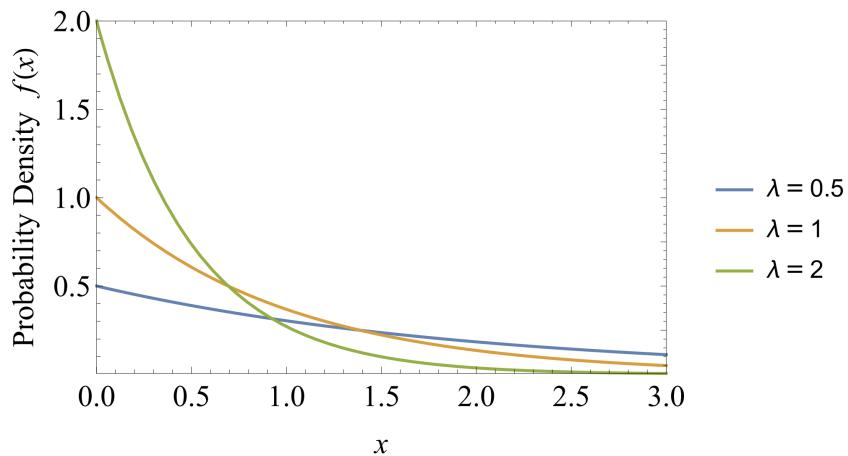
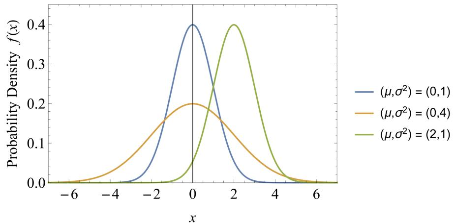
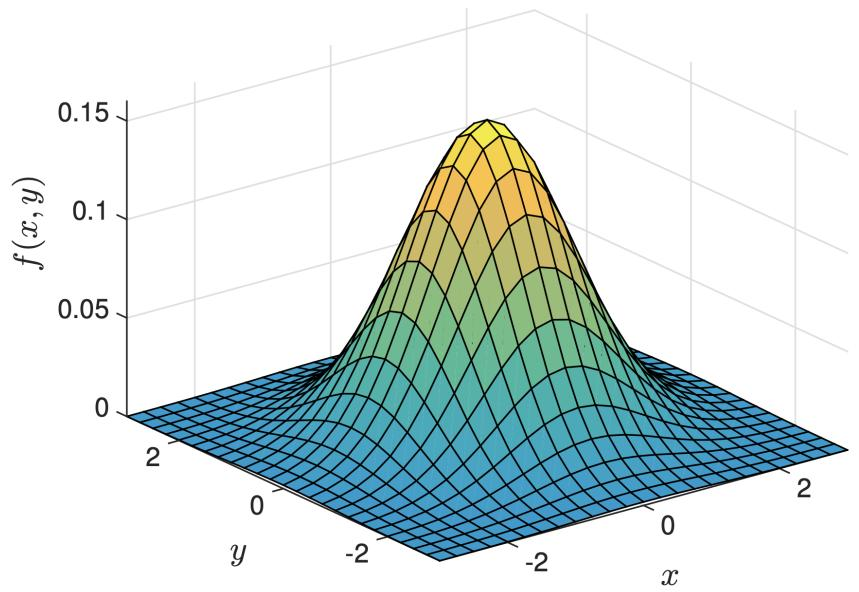
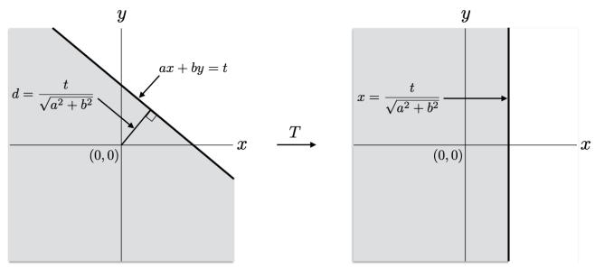
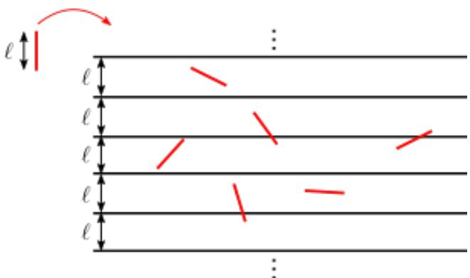

# 020 - 连续概率分布

到目前为止，我们一直专注于 **离散样本空间** （Discrete Sample Spaces） $\Omega$，其中样本点 $\omega \in \Omega$ 的数量是有限的或可数无限的（如整数）。因此，我们只能讨论 **离散随机变量** （Discrete Random Variables），它们仅取有限或可数无限个值。

但在现实生活中，许多我们希望进行概率建模的量都是实数值；例如箱子中粒子的位置、某个事件发生的时间或陨石的旅行方向。在本讲义中，我们讨论如何将我们在离散设置中看到的各种概念扩展到这种连续设置。正如我们将看到的，一旦我们建立了正确的框架，一切都会以一种自然的方式转化。该框架涉及一些初等微积分，但（在这一层面的讨论中）并不太令人畏惧。

## 1 连续均匀概率空间
假设我们转动一个“幸运轮盘”，并记录指针在轮盘外圆周上的位置。假设轮盘圆周长度为 $\ell$ 且是无偏的，那么指针位置大概率会等可能地取 [0, ℓ] 实数区间内的任何值。我们如何使用概率空间来模拟这个实验？

暂时考虑类似的离散设置，指针只能停在轮盘周围均匀分布的有限个 $m$ 个位置上。（如果 $m$ 非常大，那么这在某种意义上类似于连续设置，我们可以将其视为 $m \to \infty$ 的极限。）然后我们将使用离散样本空间 $\Omega = \{ 0 , \frac { \ell } { m } , \frac { 2 \ell } { m } , \dots , \frac { ( m - 1 ) \ell } { m } \}$ 来模拟这种情况，对于每个 $\omega \in \Omega$，都有均匀概率 $\mathbb{P}[\omega] = \frac{1}{m}$ 。

然而，在连续设置中，如果我们尝试相同的方法，就会遇到麻烦。如果我们让 $\omega$ 范围涵盖 $\Omega = [0, \ell]$ 中的所有实数，我们应该为每个 $\mathbb{P}[\omega]$ 分配什么值？根据均匀性，这个概率对于所有 $\omega$ 应该是相同的。但如果我们指定 $\mathbb{P}[\omega]$ 为任何正值，那么因为 $\Omega$ 中有无限多个 $\omega$，所有概率 $\mathbb{P}[\omega]$ 的总和将是 $\infty$ ！因此，对于所有 $\omega \in \Omega$，$\mathbb{P}[\omega]$ 必须为零。但如果我们的所有样本点的概率都为零，那么我们就无法为任何事件分配有意义的概率！

为了解决这个问题，考虑任何区间 $[a, b] \subseteq [0, \ell]$，其中 $b > a$ 。我们能为这个区间分配一个非零的概率值吗？由于分配给 $[0, \ell]$ 的总概率必须为 1，且由于我们希望我们的概率是均匀的，区间 $[a, b]$ 的概率的逻辑值是

$$
\frac { [ a, b ] \text{ 的长度} }{ [ 0, \ell ] \text{ 的长度} } = \frac {b - a}{\ell}.
$$

换句话说，区间的概率正比于它的长度。

注意，区间是样本空间 $\Omega$ 的子集，因此是事件。因此，与离散概率（我们为样本空间中的点分配概率）不同，在连续概率中，我们是为某些基本事件（在这种情况下是区间）分配概率。其他事件的概率如何？通过指定区间的概率，我们也指定了任何事件 $E$ 的概率，只要 $E$ 可以写成（有限个或可数无限个）不相交区间的并集，$E = \cup_i E_i$ 。因为这样我们可以写出 $\mathbb{P}[E] = \sum_i \mathbb{P}[E_i]$，这与离散情况类似。因此，例如，指针最终落在轮盘的第一或第三象限的概率是 $\frac{\ell/4}{\ell} + \frac{\ell/4}{\ell} = \frac{1}{2}$ 。出于所有实际目的，此类事件就是我们真正需要的全部。

## 2 连续随机变量
回想一下，在离散设置中，我们通常处理随机变量及其分布，而不是直接处理概率空间和事件。连续随机变量最简单的例子是前面讨论的幸运轮盘指针的位置 $X$ 。这个随机变量在 $[0, \ell]$ 上具有均匀分布。确切地说，我们应该如何定义连续随机变量的分布？在离散情况下，随机变量 $X$ 的分布通过为每个可能值 $a$ 指定概率 $\mathbb{P}[X = a]$ 来描述。但对于对应指针位置的随机变量 $X$，对于每个 $a$，我们都有 $\mathbb{P}[X = a] = 0$，因此在定义概率空间时遇到了与上面相同的问题。

解决方法是相同的：与其指定 $\mathbb{P}[X = a]$，不如为所有区间 $[a, b]$ 指定 $\mathbb{P}[a \leq X \leq b]$ 。为了正式地做到这一点，我们需要引入 **概率密度函数** （Probability Density Function, p.d.f.，有时简称为“密度”）的概念。

**定义 20.1**（概率密度函数）。实值随机变量 $X$ 的 **概率密度函数** （p.d.f.）是一个满足以下条件的函数 $f: \mathbb{R} \to \mathbb{R}$ ：

1. $f$ 是非负的：对于所有 $x \in \mathbb{R}$，$f(x) \geq 0$
2. $f$ 的总积分等于 1 ： $\int_{-\infty}^{\infty} f(x) \mathrm{d} x = 1$

那么 $X$ 的分布由下式给出：

$$
\mathbb {P} [ a \leq X \leq b ] = \int_ {a} ^ {b} f (x) \mathrm {d} x \quad \text {对于所有 } a < b.
$$

让我们检查一下这个定义。请注意，定积分仅仅是曲线 $f$ 在 $a$ 和 $b$ 之间的面积。因此 $f$ 的角色类似于我们有时用来描绘离散随机变量分布的“直方图”。 $f$ 非负的第一个条件确保了每个事件的概率都是非负的。 $f$ 的总积分等于 1 的第二个条件确保了它定义了一个有效的概率分布，因为随机变量 $X$ 必须取实数值：

$$
\mathbb {P} [ X \in \mathbb {R} ] = \mathbb {P} [ - \infty < X < \infty ] = \int_ {- \infty} ^ {\infty} f (x) \mathrm {d} x = 1. \tag {1}
$$

例如，考虑幸运轮盘随机变量 $X$，它在区间 $[0, \ell]$ 上具有均匀分布。这意味着 $X$ 的密度 $f$ 在此区间之外消失：对于 $x < 0$ 和 $x > \ell$，$f(x) = 0$ 。在区间 $[0, \ell]$ 内，我们希望 $X$ 的分布是均匀的，这意味着我们应该取 $f$ 为常数 $f(x) = c$（对于 $0 \leq x \leq \ell$）。 $c$ 的值由 (1) 中的要求确定，即 $f$ 下的总面积为 1 ：

$$
1 = \int_ {- \infty} ^ {\infty} f (x) \mathrm {d} x = \int_ {0} ^ {\ell} c \mathrm {d} x = c \ell ,
$$

这给了我们 $c = \frac{1}{\ell}$ 。因此，在 $[0, \ell]$ 上均匀分布的密度由下式给出：

$$
f (x) = \left\{ \begin{array}{ll} 0, & \text{对于 } x < 0, \\ 1 / \ell , & \text{对于 } 0 \leq x \leq \ell , \\ 0, & \text{对于 } x > \ell . \end{array} \right.
$$

**注**：遵循上面的“直方图”类比，人们很容易将 $f(x)$ 视为“概率”。然而，$f(x)$ 本身并不对应任何事物的概率！特别地，不要求 $f(x)$ 被 1 限制。例如，在 $\ell = \frac{1}{2}$ 的区间 $[0, \ell]$ 上的均匀分布密度，对于 $0 \leq x \leq \frac{1}{2}$ 等于 $f(x) = 1/(1/2) = 2$，这大于 1 。为了将密度 $f(x)$ 与概率联系起来，我们需要查看 $x$ 附近的一个非常小的区间 $[x, x + \mathrm{d} x]$；那么我们有

$$
\mathbb {P} [ x \leq X \leq x + \mathrm {d} x ] = \int_ {x} ^ {x + \mathrm {d} x} f (z) \mathrm {d} z \approx f (x) \mathrm {d} x. \tag {2}
$$

因此，我们可以将 $f(x)$ 解释为 $x$ 附近的“单位长度概率”。

### 2.1 累积分布函数
对于连续随机变量 $X$，人们通常从 **累积分布函数** （Cumulative Distribution Function, c.d.f.）开始讨论，它是函数 $F(x) = \mathbb{P}[X \leq x]$ 。它与 $X$ 的概率密度函数 $f(x)$ 密切相关，如下式所示：

$$
F (x) = \mathbb {P} [ X \leq x ] = \int_ {- \infty} ^ {x} f (z) \mathrm {d} z. \tag {3}
$$

因此，人们可以通过 c.d.f.（记为 $F(x)$）来描述随机变量 $X$，然后通过它得到概率密度函数 $f(x)$ ：

$$
f (x) = \frac {\mathrm {d} F (x)}{\mathrm {d} x}.
$$

为了与离散概率联系起来，可以将连续随机变量 $X$ 视为在实线上具有长度为 $\mathrm{d} x$ 的可数无限个区间之一的概率集合。也就是说，概率集合 $\mathbb{P}[x_k < X \leq x_k + \mathrm{d} x]$，其中 $x_k = k \mathrm{d} x$ 对于 $k \in \mathbb{Z}$ 。在这种观点下， $\mathbb{P}[X \leq x_i] = \sum_{j \leq i} \mathbb{P}[x_j < X \leq x_j + \mathrm{d} x]$ 。将其与概率密度函数 $f(x)$ 联系起来，我们有

$$
\mathbb {P} \left[ x _ {j} < X \leq x _ {j} + \mathrm {d} x \right] \approx f (x _ {j}) \mathrm {d} x
$$

对于“小的” $\mathrm{d} x$，以及

$$
F (x _ {i}) = \mathbb {P} [ X \leq x _ {i} ] \approx \sum_ {j \leq i} f (x _ {j}) \mathrm {d} x.
$$

当我们将上面的表达式看作一个 **黎曼和** （Riemann Sum）时，微积分就派上用场了。当 $\mathrm{d} x$ 趋于零时取极限，就得到了 (3) 中的积分。

### 2.2 期望与方差
与离散情况一样，我们定义连续随机变量的期望如下：

**定义 20.2**（期望）。具有概率密度函数 $f$ 的连续随机变量 $X$ 的期望为

$$
\mathbb {E} [ X ] = \int_ {- \infty} ^ {\infty} x f (x) \mathrm {d} x.
$$

注意，积分扮演了离散公式 $\mathbb{E}[X] = \sum_a a \mathbb{P}[X = a]$ 中求和的角色。类似地，我们可以定义方差如下：

**定义 20.3**（方差）。具有概率密度函数 $f$ 的连续随机变量 $X$ 的方差为

$$
\operatorname {Var} (X) = \mathbb {E} \left[ (X - \mathbb {E} [ X ]) ^ {2} \right] = \mathbb {E} \left[ X ^ {2} \right] - \mathbb {E} [ X ] ^ {2} = \int_ {- \infty} ^ {\infty} x ^ {2} f (x) \mathrm{d} x - \left(\int_ {- \infty} ^ {\infty} x f (x) \mathrm{d} x\right) ^ {2}.
$$

#### 示例
令 $X$ 为区间 $[0, \ell]$ 上的均匀随机变量。那么直观上，它的期望值应该在中间，即 $\frac{\ell}{2}$ 。事实上，我们可以使用上面的定义来计算

$$
\mathbb {E} [ X ] = \int_ {0} ^ {\ell} x \frac {1}{\ell} \mathrm{d} x = \left. \frac {x ^ {2}}{2 \ell} \right| _ {0} ^ {\ell} = \frac {\ell}{2},
$$

正如所宣称的那样。我们还可以使用上述定义并代入 $\mathbb{E}[X] = \frac{\ell}{2}$ 来计算其方差：

$$
\operatorname {Var} (X) = \int_ {0} ^ {\ell} x ^ {2} \frac {1}{\ell} \mathrm {d} x - \mathbb {E} [ X ] ^ {2} = \left. \frac {x ^ {3}}{3 \ell} \right| _ {0} ^ {\ell} - \left(\frac {\ell}{2}\right) ^ {2} = \frac {\ell^ {2}}{3} - \frac {\ell^ {2}}{4} = \frac {\ell^ {2}}{1 2}.
$$

这里的系数 $\frac{1}{12}$ 并不特别直观，但方差与 $\ell^2$ 成正比这一事实不足为奇。像离散版本一样，这种分布具有较大的方差。

### 2.3 联合密度
回想一下，对于离散随机变量 $X$ 和 $Y$，它们的联合分布由所有可能值 $a, c$ 的概率 $\mathbb{P}[X = a, Y = c]$ 指定。类似地，如果 $X$ 和 $Y$ 是连续随机变量，那么它们的联合分布由所有 $a \leq b, c \leq d$ 的概率 $\mathbb{P}[a \leq X \leq b, c \leq Y \leq d]$ 指定。此外，正如 $X$ 的分布可以通过其密度函数来表征一样，$X$ 和 $Y$ 的联合分布也可以通过它们的联合密度来表征。

**定义 20.4**（联合密度）。两个随机变量 $X$ 和 $Y$ 的 **联合密度函数** 是一个满足以下条件的函数 $f: \mathbb{R}^2 \to \mathbb{R}$ ：

1. $f$ 是非负的：对于所有 $x, y \in \mathbb{R}$，$f(x, y) \geq 0$ 。
2. $f$ 的总积分等于 1 ： $\int_{-\infty}^{\infty} \int_{-\infty}^{\infty} f(x, y) \mathrm{d} x \mathrm{d} y = 1$

那么 $X$ 和 $Y$ 的联合分布由下式给出：

$$
\mathbb {P} [ a \leq X \leq b, c \leq Y \leq d ] = \int_ {c} ^ {d} \int_ {a} ^ {b} f (x, y) \mathrm {d} x \mathrm {d} y \quad \text {对于所有 } a \leq b \text{ 和 } c \leq d.
$$

与 (2) 类似，我们可以通过观察 $(x, y)$ 附近的一个非常小的正方形 $[x, x + \mathrm{d} x] \times [y, y + \mathrm{d} y]$ 来将联合密度 $f(x, y)$ 与概率联系起来；那么我们有

$$
\mathbb {P} [ x \leq X \leq x + \mathrm {d} x, y \leq Y \leq y + \mathrm {d} y ] = \int_ {y} ^ {y + \mathrm {d} y} \int_ {x} ^ {x + \mathrm {d} x} f (u, v) \mathrm {d} u \mathrm {d} v \approx f (x, y) \mathrm {d} x \mathrm {d} y. \tag {4}
$$

因此，我们可以将 $f(x, y)$ 解释为 $(x, y)$ 附近的“单位面积概率”。

与离散随机变量的联合分布一样，我们可以定义连续随机变量的边缘密度函数和条件密度函数如下：

**定义 20.5**（边缘与条件密度）。考虑 $X$ 和 $Y$ 上的具有联合密度函数 $f_{X, Y}(x, y)$ 的联合分布。

1. $X$ 的 **边缘密度函数** $f_X$ 定义为

$$
f _ {X} (x) = \int_ {- \infty} ^ {\infty} f (x, y) \mathrm{d} y,
$$

类似地， $Y$ 的边缘密度函数 $f_Y$ 定义为

$$
f _ {Y} (y) = \int_ {- \infty} ^ {\infty} f (x, y) \mathrm{d} x.
$$

2. 在 $X = x$ 的条件下，$Y$ 的 **条件密度函数** $f_{Y \mid X = x}$ 定义为

$$
f _ {Y \mid X = x} (y) = \frac {f _ {X , Y} (x , y)}{f _ {X} (x)}.
$$

上述边缘密度函数的积分将 $X$ 和 $Y$ 上的联合密度函数转换为仅针对 $X$（或 $Y$）的密度函数。

条件密度函数 $f_{Y \mid X = x}(y)$ 是在事件 $X = x$ 条件下 $Y$ 的密度函数。回想一下，在 $A$ 条件下事件 $B$ 的概率计算为 $\mathbb{P}[B \mid A] = \frac{\mathbb{P}[A \cap B]}{\mathbb{P}[A]}$ 。对于连续随机变量 $X$ 和 $Y$，事件 $B$ 对应于事件 $Y \in [y, y + \mathrm{d} y]$，事件 $A$ 是 $X \in [x, x + \mathrm{d} x]$ 。使用 (4)，我们可以代入 $\mathbb{P}[A \cap B] \approx f_{X, Y}(x, y) \mathrm{d} x \mathrm{d} y$ 和 $\mathbb{P}[A] \approx f_X(x) \mathrm{d} x$，这得到

$$
\mathbb {P} [ Y \in [ y, y + \mathrm {d} y ] \mid X \in [ x, x + \mathrm {d} x ] ] \approx \frac {f _ {X , Y} (x , y) \mathrm {d} x \mathrm {d} y}{f _ {X} (x) \mathrm {d} x} \approx \frac {f _ {X , Y} (x , y)}{f _ {X} (x)} \mathrm {d} y.
$$

除以 $\mathrm{d} y$ 即可得到 $Y$ 在 $X = x$ 条件下的条件密度。最后这一点可以使用极限来变得更加正式。

### 2.4 独立性
回想一下，如果对于每个可能的值 $a, c$，事件 $X = a$ 和 $Y = c$ 都是独立的，那么我们就说两个离散随机变量 $X$ 和 $Y$ 是独立的。对于连续随机变量，我们有类似的定义：

**定义 20.6**（连续随机变量的独立性）。如果对于所有 $a \leq b$ 和 $c \leq d$，事件 $a \leq X \leq b$ 和 $c \leq Y \leq d$ 是独立的，那么两个连续随机变量 $X, Y$ 是独立的：

$$
\mathbb {P} [ a \leq X \leq b, c \leq Y \leq d ] = \mathbb {P} [ a \leq X \leq b ] \cdot \mathbb {P} [ c \leq Y \leq d ].
$$

这个定义对于独立随机变量 $X$ 和 $Y$ 的联合密度说明了什么？应用 (4) 来将联合密度与概率联系起来，对于较小的 $\mathrm{d} x$ 和 $\mathrm{d} y$，我们得到：

$$
\begin{array}{l} f (x, y) \mathrm {d} x \mathrm {d} y \approx \mathbb {P} [ x \leq X \leq x + \mathrm {d} x, y \leq Y \leq y + \mathrm {d} y ] \\ = \mathbb {P} [ x \leq X \leq x + \mathrm {d} x ] \cdot \mathbb {P} [ y \leq Y \leq y + \mathrm {d} y ] \quad （根据独立性） \\ \approx f _ {X} (x) \mathrm {d} x \times f _ {Y} (y) \mathrm {d} y \\ = f _ {X} (x) f _ {Y} (y) \mathrm {d} x \mathrm {d} y, \\ \end{array}
$$

其中 $f_X$ 和 $f_Y$ 分别是 $X$ 和 $Y$ 的（边缘）密度。因此，我们得到以下结果：

$$
f (x, y) = f _ {X} (x) f _ {Y} (y) \quad \text {对于所有 } x, y \in \mathbb {R}.
$$

**练习**。证明对于独立随机变量 $X$ 和 $Y$，$f_{Y \mid X = x}(y) = f_Y(y)$ 。

### 2.5 全概率公式
具备了条件密度的知识，我们可以类似于离散概率定义全概率公式。

回想一下在离散概率中，我们为一个事件 $A$ 定义全概率公式为

$$
\mathbb {P} [ A ] = \sum_ {x} \mathbb {P} [ A \mid X = x ] \mathbb {P} [ X = x ].
$$

对于连续随机变量，全概率公式定义为

$$
\mathbb {P} [ A ] = \int_ {- \infty} ^ {\infty} \mathbb {P} [ A \mid X = x ] f _ {X} (x) \mathrm{d} x.
$$

现在假设事件 $A$ 定义为 $y \leq Y \leq y + \mathrm{d} y$，其中 $Y$ 是另一个连续随机变量。回想一下，概率 $\mathbb{P}[y \le Y \le y + \mathrm{d} y]$ 可以近似为 $f_Y(y) \mathrm{d} y$ ；条件概率 $\mathbb{P}[y \le Y \le y + \mathrm{d} y \mid X = x]$ 同样可以近似为 $f_{Y \mid X = x}(y) \mathrm{d} y$ 。因此，我们有

$$
\begin{array}{l} f _ {Y} (y) \mathrm {d} y \approx \mathbb {P} [ y \leq Y \leq y + \mathrm {d} y ] \\ = \int_ {- \infty} ^ {\infty} \mathbb {P} [ y \leq Y \leq y + \mathrm {d} y \mid X = x ] f _ {X} (x) \mathrm{d} x \\ \approx \int_ {- \infty} ^ {\infty} \left(f _ {Y | X = x} (y) \mathrm{d} y\right) f _ {X} (x) \mathrm{d} x, \\ \end{array}
$$

$$
\begin{array}{l} f _ {Y} (y) \mathrm {d} y \approx \left(\int_ {- \infty} ^ {\infty} f _ {Y | X = x} (y) f _ {X} (x) \mathrm {d} x\right) \mathrm {d} y, \\ f _ {Y} (y) = \int_ {- \infty} ^ {\infty} f _ {Y | X = x} (y) f _ {X} (x) \mathrm{d} x. \\ \end{array}
$$

这是离散随机变量全概率公式的连续模拟。注意，这也可以看作是利用条件密度的定义来计算边缘密度：

$$
f _ {Y} (y) = \int_ {- \infty} ^ {\infty} f _ {X, Y} (x, y) \mathrm{d} x = \int_ {- \infty} ^ {\infty} f _ {Y | X = x} (y) f _ {X} (x) \mathrm{d} x.
$$

## 3 指数分布
我们已经看到了一种重要的连续分布，即均匀分布。在本节和接下来的章节中，我们将看到另外两种：指数分布和正态分布（或高斯分布）。这三种分布涵盖了应用中出现的大多数连续随机变量。

指数分布是我们已经见过的几何分布的连续版本。回想一下，几何分布描述了在第一次出现正面之前投掷硬币的次数；该分布具有单一参数 $p$，即硬币的偏差（正面概率）。

  
图 1： $\lambda = 0.5, 1, 2$ 时指数分布的概率密度函数 $f(x)$

当然，在现实应用中，我们通常不是在等待硬币出现正面，而是在等待系统故障、闹钟响起、实验成功等。

在这些应用中，我们经常不处理离散事件或离散时间，而是处理连续时间：例如，如果我们正在等待苹果从树上掉下来，它可以在任何时间掉下来，而不一定是在离散时钟的滴答声中。这种情况自然地由 **指数分布** （Exponential Distribution）建模，定义如下。

**定义 20.7**（指数分布）。对于 $\lambda > 0$，具有概率密度函数

$$
f (x) = \left\{ \begin{array}{ll} \lambda e ^ {- \lambda x}, & \text{如果 } x \geq 0, \\ 0, & \text{否则,} \end{array} \right.
$$

的连续随机变量 $X$ 被称为具有参数 $\lambda$ 的 **指数随机变量** ，我们记作 $X \sim \text{Exp}(\lambda)$ 。

注意，根据定义 $f(x)$ 是非负的。此外，我们可以检查它是否满足 (1) ：

$$
\int_ {- \infty} ^ {\infty} f (x) \mathrm{d} x = \int_ {0} ^ {\infty} \lambda e ^ {- \lambda x} \mathrm{d} x = - e ^ {- \lambda x} \Big | _ {0} ^ {\infty} = 1,
$$

因此 $f(x)$ 确实是一个有效的概率密度函数。图 1 显示了具有几个不同 $\lambda$ 值的指数分布的概率密度函数。

### 3.1 指数随机变量的均值与方差
现在让我们计算 $X \sim \text{Exp}(\lambda)$ 的期望和方差。

**定理 20.2**。令 $X$ 为参数 $\lambda > 0$ 的指数随机变量。那么

$$
\mathbb {E} [ X ] = \frac {1}{\lambda} \quad \text{且} \quad \operatorname {Var} (X) = \frac {1}{\lambda^ {2}}.
$$

**证明**。我们可以使用 **分部积分** （Integration by Parts）来计算期望值：

$$
\mathbb {E} [ X ] = \int_ {- \infty} ^ {\infty} x f (x) \mathrm{d} x = \int_ {0} ^ {\infty} \lambda x e ^ {- \lambda x} \mathrm{d} x = - x e ^ {- \lambda x} \Big | _ {0} ^ {\infty} + \int_ {0} ^ {\infty} e ^ {- \lambda x} \mathrm{d} x = 0 + \left(- \frac {e ^ {- \lambda x}}{\lambda}\right) \Big | _ {0} ^ {\infty} = \frac {1}{\lambda}.
$$

为了计算方差，我们首先评估 $\mathbb{E}[X^2]$，再次使用分部积分：

$$
\mathbb {E} \left[ X ^ {2} \right] = \int_ {- \infty} ^ {\infty} x ^ {2} f (x) \mathrm {d} x = \int_ {0} ^ {\infty} \lambda x ^ {2} e ^ {- \lambda x} \mathrm {d} x = - x ^ {2} e ^ {- \lambda x} \Big | _ {0} ^ {\infty} + \int_ {0} ^ {\infty} 2 x e ^ {- \lambda x} \mathrm {d} x = 0 + \frac {2}{\lambda} \mathbb {E} [ X ] = \frac {2}{\lambda^ {2}}.
$$

因此，方差为

$$
\operatorname {Var} (X) = \mathbb {E} [ X ^ {2} ] - \mathbb {E} [ X ] ^ {2} = \frac {2}{\lambda^ {2}} - \frac {1}{\lambda^ {2}} = \frac {1}{\lambda^ {2}},
$$

正如所宣称的那样。 $\square$

### 3.2 作为几何分布的连续时间模拟
与几何分布类似，指数分布具有单一参数 $\lambda$，它描述了事件发生的速率。注意，对于任何 $t \geq 0$，指数分布满足

$$
\mathbb {P} [ X > t ] = \int_ {t} ^ {\infty} \lambda e ^ {- \lambda x} \mathrm{d} x = - e ^ {- \lambda x} \Big | _ {t} ^ {\infty} = e ^ {- \lambda t}. \tag {5}
$$

换句话说，我们必须等待超过时间 $t$ 才能发生事件的概率是 $e ^ { - \lambda t }$，这是一个以速率 $\lambda$ 进行的指数衰减。

现在考虑一种离散时间设置，其中我们每隔 $\delta$ 秒执行一次试验（其中 $\delta$ 非常小——实际上，我们将取 $\delta \to 0$ 以使时间“连续”），并且我们的成功概率是 $p = \lambda \delta$ 。使成功概率与 $\delta$ 成正比是有道理的，因为它对应于一个自然的假设，即单位时间内有固定的成功率，我们将其记为 $\lambda = p / \delta$ 。在这种离散设置中，直到成功为止的试验次数具有参数为 $p$ 的几何分布，因此如果我们让随机变量 $Y$ 表示直到成功为止的时间（以秒为单位），我们有

$$
\mathbb {P} [ Y > k \delta ] = (1 - p) ^ {k} = (1 - \lambda \delta) ^ {k}, \quad \text {对于任何整数 } k \geq 0.
$$

因此，对于任何 $t > 0$，我们有

$$
\mathbb {P} [ Y > t ] = \mathbb {P} [ Y > (\frac {t}{\delta}) \delta ] = (1 - \lambda \delta) ^ {t / \delta} \approx e ^ {- \lambda t}, \tag {6}
$$

其中最后的近似在 $\delta \to 0$ 且 $\lambda$ 和 $t$ 固定时成立。（我们忽略了将 $\frac{t}{\delta}$ 四舍五入为整数的细节，因为我们无论如何都在进行近似。）

将 (6) 与 (5) 进行比较，我们发现该分布与参数为 $\lambda$ 的指数分布具有相同的形式。因此，我们可以将指数分布视为几何分布的连续时间模拟，其中参数 $p$（每次试验的成功概率）被参数 $\lambda$（单位时间的成功概率）所取代。不过请注意， $\lambda$ 并不局限于 $\leq 1$ 。

## 4 正态分布
我们要看的另一种连续分布，也是迄今为止在应用中最普遍的一种，被称为 **正态分布** （Normal Distribution）或 **高斯分布** （Gaussian Distribution）。它有两个参数 $\mu$ 和 $\sigma^2$，分别是该分布的均值和方差。

**定义 20.8**（正态分布）。对于任何 $\mu \in \mathbb{R}$ 且 $\sigma > 0$，具有概率密度函数

$$
f (x) = \frac {1}{\sqrt {2 \pi \sigma^ {2}}} e ^ {- (x - \mu) ^ {2} / (2 \sigma^ {2})}
$$

的连续随机变量 $X$ 被称为具有参数 $\mu$ 和 $\sigma^2$ 的 **正态随机变量** ，记作 $X \sim N(\mu, \sigma^2)$ 。在 $\mu = 0$ 且 $\sigma = 1$ 的特殊情况下， $X$ 被称为具有 **标准正态分布** （Standard Normal Distribution）。

  
图 2：具有几种不同 $\mu$ 和 $\sigma^2$ 选择的正态分布密度函数。

首先让我们检查这是否是概率密度函数的有效定义。显然 $f(x) \geq 0$ 。对于 (1) 中的条件：

$$
\int_ {- \infty} ^ {\infty} f (x) \mathrm{d} x = \frac {1}{\sqrt {2 \pi \sigma^ {2}}} \int_ {- \infty} ^ {\infty} e ^ {- (x - \mu) ^ {2} / (2 \sigma^ {2})} \mathrm{d} x = 1. \tag {7}
$$

该积分为 1 的事实是（多元）微积分中的一个标准练习（或者可以随意在任何标准概率教科书或互联网上查找）。

$f$ 的图形呈现经典的“ **钟形** ”（Bell-shaped）曲线，中心（且关于其对称）位于 $x = \mu$ ，其“宽度”由 $\sigma$ 决定。图 2 显示，具有不同 $\mu$ 和 $\sigma$ 值的正态密度函数彼此非常相似。实际上，正态分布在平移和缩放方面具有以下优良性质。

如果 $X \sim N(\mu, \sigma^2)$ ，那么 $Y = \frac{X - \mu}{\sigma} \sim N(0, 1)$ 。等价地，如果 $Y \sim N(0, 1)$ ，那么 $X = \sigma Y + \mu \sim N(\mu, \sigma^2)$ 。

**证明**。已知 $X \sim N(\mu, \sigma^2)$，我们可以按如下方式计算 $Y = \frac{X - \mu}{\sigma}$ 的分布：

$$
\mathbb {P} [ a \leq Y \leq b ] = \mathbb {P} [ \sigma a + \mu \leq X \leq \sigma b + \mu ] = \frac {1}{\sqrt {2 \pi \sigma^ {2}}} \int_ {\sigma a + \mu} ^ {\sigma b + \mu} e ^ {- (x - \mu) ^ {2} / (2 \sigma^ {2})} \mathrm{d} x = \frac {1}{\sqrt {2 \pi}} \int_ {a} ^ {b} e ^ {- y ^ {2} / 2} \mathrm{d} y,
$$

这是通过在积分中进行简单的变量代换 $x = \sigma y + \mu$ 得到的。因此 $Y$ 确实是标准正态的。注意， $Y$ 仅仅是通过将原点移动到 $\mu$ 并按 $\sigma$ 缩放由 $X$ 得到的。 $\square$

### 4.1 正态随机变量的均值与方差
现在让我们计算正态随机变量的期望和方差。

**定理 20.3**。对于 $X \sim N(\mu, \sigma^2)$，

$$
\mathbb {E} [ X ] = \mu \qquad \text{且} \qquad \operatorname {Var} (X) = \sigma^ {2}.
$$

**证明**。首先考虑 $X \sim N(0, 1)$ 的情况。根据定义，其期望为

$$
\mathbb {E} [ X ] = \int_ {- \infty} ^ {\infty} x f (x) \mathrm{d} x = \frac {1}{\sqrt {2 \pi}} \int_ {- \infty} ^ {\infty} x e ^ {- x ^ {2} / 2} \mathrm{d} x = \frac {1}{\sqrt {2 \pi}} \left(\int_ {- \infty} ^ {0} x e ^ {- x ^ {2} / 2} \mathrm{d} x + \int_ {0} ^ {\infty} x e ^ {- x ^ {2} / 2} \mathrm{d} x\right) = 0.
$$

最后一步得益于函数 $e^{-x^2/2}$ 关于 $x = 0$ 对称的事实，因此两个积分除符号外完全相同。对于方差，我们有

$$
\begin{array}{l} \operatorname {Var} (X) = \mathbb {E} \left[ X ^ {2} \right] - \mathbb {E} [ X ] ^ {2} = \frac {1}{\sqrt {2 \pi}} \int_ {- \infty} ^ {\infty} x ^ {2} e ^ {- x ^ {2} / 2} \mathrm{d} x \\ = \frac {1}{\sqrt {2 \pi}} \left(- x e ^ {- x ^ {2} / 2}\right) \Big | _ {- \infty} ^ {\infty} + \frac {1}{\sqrt {2 \pi}} \int_ {- \infty} ^ {\infty} e ^ {- x ^ {2} / 2} \mathrm{d} x \\ = \frac {1}{\sqrt {2 \pi}} \int_ {- \infty} ^ {\infty} e ^ {- x ^ {2} / 2} \mathrm{d} x = 1. \\ \end{array}
$$

在此第一行中，我们使用了 $\mathbb{E}[X] = 0$ 的事实；在第二行中，我们使用了分部积分；而在最后一行中，我们使用了 (7) 在 $\mu = 0, \sigma = 1$ 这一特殊情况下的结论。因此，标准正态分布的期望 $\mathbb{E}[X] = 0 = \mu$ ，方差 $\operatorname{Var}(X) = 1 = \sigma^2$ 。

现在考虑 $X \sim N(\mu, \sigma^2)$ 的一般情况。根据引理 20.1，我们知道 $Y = \frac{X - \mu}{\sigma}$ 是一个标准正态随机变量，因此 $\mathbb{E}[Y] = 0$ 且 $\operatorname{Var}(Y) = 1$ ，正如我们上面刚刚建立的那样。因此，我们可以从 $Y$ 的期望和方差中读出 $X$ 的期望和方差。对于期望，利用线性性质，我们有

$$
0 = \mathbb {E} [ Y ] = \mathbb {E} \left[ \frac {X - \mu}{\sigma} \right] = \frac {\mathbb {E} [ X ] - \mu}{\sigma},
$$

从而 $\mathbb{E}[X] = \mu$ 。对于方差，我们有

$$
1 = \operatorname {Var} (Y) = \operatorname {Var} \left(\frac {X - \mu}{\sigma}\right) = \frac {\operatorname {Var} (X)}{\sigma^ {2}},
$$

从而 $\operatorname{Var}(X) = \sigma^2$ 。

那么总的来说，正态分布的期望为 $\mu$ ，方差为 $\sigma^2$ 。这解释了参数 $\mu$ 和 $\sigma^2$ 的表示法。

方差为 $\sigma^2$（从而标准差为 $\sigma$）这一事实解释了我们之前的评论，即 $\sigma$ 决定了正态分布的“宽度”。也就是说，根据切比雪夫不等式，分布的恒定比例落在期望 $\mu$ 的距离（例如） $2 \sigma$ 范围内。

**注意**：上述分析表明，通过简单的原点平移和缩放，我们可以将任何正态分布与标准正态分布联系起来。这意味着，在进行正态分布计算时，只需对标准正态分布进行计算即可。因此，数学公式书和在线资源通常包含描述标准正态密度的表格。从中，可以根据下式读出任何正态随机变量 $X \sim N(\mu, \sigma^2)$ 的相应信息

$$
\mathbb {P} [ X \leq a ] = \mathbb {P} [ Y \leq \frac {a - \mu}{\sigma} ],
$$

其中 $Y$ 是标准正态的。

正态分布贯穿于整个科学和社会科学领域，因为它是通过对同一随机变量的大量独立观测值进行平均而得到的汇总数据的标准模型（例如伯克利蚊子的重量，或物理实验的结果）。众所周知，这种平均数据倾向于在“钟形”曲线中聚集在其均值附近，且随着观测次数的增加，这种对应关系变得更加精确。对这一现象的理论解释是 **中心极限定理** （Central Limit Theorem），我们将在第 5 节中讨论。

### 4.2 独立正态随机变量之和
正态分布的一个重要性质是，独立正态随机变量之和也是正态分布。我们从 $X$ 和 $Y$ 是独立标准正态随机变量的简单情况开始。在这种情况下，结果得益于 $X$ 和 $Y$ 的联合分布是旋转对称的。一般情况遵循引理 20.1 中正态分布的平移和缩放性质。

**定理 20.4**。令 $X \sim N(0, 1)$ 和 $Y \sim N(0, 1)$ 为独立标准正态随机变量，并假设 $a, b \in \mathbb{R}$ 为常数。那么 $Z = a X + b Y \sim N(0, a^2 + b^2)$ 。

**证明**。由于 $X$ 和 $Y$ 是独立的，根据定理 20.1，我们知道 $(X, Y)$ 的联合密度为

$$
f (x, y) = f (x) \cdot f (y) = \frac {1}{2 \pi} e ^ {- \left(x ^ {2} + y ^ {2}\right) / 2}.
$$

关键观察是 $f(x, y)$ 关于原点旋转对称，即 $f(x,y)$ 仅取决于 $x^2 + y^2$ 的值，这是点 $(x, y)$ 距离原点 $(0, 0)$ 的距离；见图 3 。

  
图 3：联合密度函数 $f(x, y) = \frac{1}{2 \pi} e^{-(x^2 + y^2)/2}$ 是旋转对称的。

因此， $f(T(x,y)) = f(x,y)$，其中 $T$ 是平面 $\mathbb{R}^2$ 关于原点的任何旋转。由此可知，对于任何集合 $A \subseteq \mathbb{R}^2$ ，

$$
\mathbb {P} [ (X, Y) \in A ] = \mathbb {P} [ (X, Y) \in T (A) ] \tag {8}
$$

其中 $T$ 是 $\mathbb{R}^2$ 的一个旋转。现在给定任何 $t \in \mathbb{R}$ ，我们有

$$
\mathbb {P} [ Z \leq t ] = \mathbb {P} [ a X + b Y \leq t ] = \mathbb {P} [ (X, Y) \in A ]
$$

其中 $A$ 是半平面 $\{(x, y) \mid a x + b y \leq t\}$ 。边界线 $a x + b y = t$ 距离原点的距离为 $d = \frac{t}{\sqrt{a^2 + b^2}}$ 。因此，如图 4 所示，集合 $A$ 可以旋转为集合

$$
T (A) = \left\{(x, y) \mid x \leq \frac {t}{\sqrt {a ^ {2} + b ^ {2}}} \right\}.
$$

  
图 4：半平面 $a x + b y \leq t$ 被旋转为半平面 $x \leq \frac{t}{\sqrt{a^2 + b^2}}$ 。

根据 (8)，这种旋转不会改变概率：

$$
\mathbb {P} [ Z \leq t ] = \mathbb {P} [ (X, Y) \in A ] = \mathbb {P} [ (X, Y) \in T (A) ] = \mathbb {P} \left[ X \leq \frac {t}{\sqrt {a ^ {2} + b ^ {2}}} \right] = \mathbb {P} \left[ \sqrt {a ^ {2} + b ^ {2}} X \leq t \right].
$$

由于上述方程对所有 $t \in \mathbb{R}$ 成立，我们得出结论， $Z$ 与 $\sqrt{a^2 + b^2} X$ 具有相同的分布。由于 $X$ 具有标准正态分布，根据引理 20.1，我们知道 $\sqrt{a^2 + b^2} X$ 具有均值为 0、方差为 $a^2 + b^2$ 的正态分布。因此我们得出结论， $Z = a X + b Y$ 也具有均值为 0、方差为 $a^2 + b^2$ 的正态分布。 $\square$

一般情况现在很容易从引理 20.1 和定理 20.4 中得出。

**推论 20.1**。令 $X \sim N(\mu_X, \sigma_X^2)$ 和 $Y \sim N(\mu_Y, \sigma_Y^2)$ 为独立正态随机变量。那么对于任何常数 $a, b \in \mathbb{R}$ ，随机变量 $Z = a X + b Y$ 也是正态分布的，其均值为 $\mu = a \mu_X + b \mu_Y$ ，方差为 $\sigma^2 = a^2 \sigma_X^2 + b^2 \sigma_Y^2$ 。

**证明**。根据引理 20.1， $Z_1 = (X - \mu_X) / \sigma_X$ 和 $Z_2 = (Y - \mu_Y) / \sigma_Y$ 是独立标准正态随机变量。我们可以写成：

$$
Z = a X + b Y = a \left(\mu_ {X} + \sigma_ {X} Z _ {1}\right) + b \left(\mu_ {Y} + \sigma_ {Y} Z _ {2}\right) = \left(a \mu_ {X} + b \mu_ {Y}\right) + \left(a \sigma_ {X} Z _ {1} + b \sigma_ {Y} Z _ {2}\right).
$$

根据定理 20.4， $Z' = a \sigma_X Z_1 + b \sigma_Y Z_2$ 是正态分布的，均值为 0，方差为 $\sigma^2 = a^2 \sigma_X^2 + b^2 \sigma_Y^2$ 。由于 $\mu = a \mu_X + b \mu_Y$ 是一个常数，根据引理 20.1，我们得出结论 $Z = \mu + Z'$ 是一个均值为 $\mu$、方差为 $\sigma^2$ 的正态随机变量，如所愿。 $\square$

## 5 中心极限定理
回想一下之前的一份讲义，关于独立同分布（i.i.d.）随机变量序列 $\{X_i\}$ 的 **大数定律** （Law of Large Numbers）：它指出，样本平均值 $\frac{S_n}{n}$（其中 $S_n = \sum_{i=1}^n X_i$）与均值的任何偏差 $\varepsilon > 0$（无论多么小）的概率，随着平均值中观测次数 $n$ 趋于无穷大而趋于零。因此，通过取足够大的 $n$，我们可以使任何给定偏差的概率变得尽可能小。

实际上，我们可以说一些比大数定律强大得多的结论：即，对于足够大的 $n$，样本平均值 $\frac{S_n}{n}$ 的分布看起来像均值为 $\mu$、方差为 $\frac{\sigma^2}{n}$ 的正态分布。（当然，我们已经知道这些是 $\frac{S_n}{n}$ 的均值 and 方差；重点是分布变成了正态分布！）标准差随 $n$ 减小（具体来说是按 $\frac{\sigma}{\sqrt{n}}$）这一事实意味着分布趋向于在 $\mu$ 处的一个尖峰。

回想一下上一节，正态分布的密度是一个以均值 $\mu$ 为中心的对称钟形曲线。其高度 and 宽度由标准差 $\sigma$ 决定如下：均值 $x = \mu$ 处的高度约为 $\frac{0.4}{\sigma}$ ； $50\%$ 的质量包含在均值两侧宽度为 $0.67\sigma$ 的区间内， $99.7\%$ 包含在均值两侧宽度为 $3\sigma$ 的区间内。（注意，为了得到正确的比例，偏差的数量级是 $\sigma$ 而不是 $\sigma^2$ 。）

为了精确地阐述中心极限定理（以便极限分布是一个常数而不是依赖于 $n$ 的东西），我们将 $\frac{S_n}{n}$ 标准化为

$$
\frac {\frac {S _ {n}}{n} - \mu}{\frac {\sigma}{\sqrt {n}}} = \frac {S _ {n} - n \mu}{\sigma \sqrt {n}}.
$$

中心极限定理随后指出， $\frac{S_n - n \mu}{\sigma \sqrt{n}}$ 的分布收敛于标准正态分布。

**定理 20.5**（中心极限定理）。令 $X_1, X_2, \dots$ 为独立同分布的随机变量序列，具有共同的有限期望 $\mathbb{E}[X_i] = \mu$ 和有限方差 $\operatorname{Var}(X_i) = \sigma^2$ 。令 $S_n = \sum_{i=1}^n X_i$ 。那么，当 $n \to \infty$ 时， $\frac{S_n - n \mu}{\sigma \sqrt{n}}$ 的分布收敛于 $N(0, 1)$ 。换句话说，对于任何常数 $c \in \mathbb{R}$ ，

$$
\mathbb {P} \left[ \frac {S _ {n} - n \mu}{\sigma \sqrt {n}} \leq c \right] \to \frac {1}{\sqrt {2 \pi}} \int_ {- \infty} ^ {c} e ^ {- x ^ {2} / 2} \mathrm{d} x \quad \text{当 } n \to \infty .
$$

中心极限定理是一个非常令人震惊的事实。它所说的是：如果我们取任何任意随机变量 $X$ 的 $n$ 次观测值的平均值，那么该平均值的分布将是一个以 $\mu = \mathbb{E}[X]$ 为中心的钟形曲线。因此，当 $n$ 变大时， $X$ 的所有分布痕迹都消失了：所有分布，无论多么复杂，在取平均值时看起来都像正态分布。原始分布的唯一影响是通过方差 $\sigma^2$，它决定了对于给定的 $n$ 值曲线的宽度，从而决定了曲线收缩为尖峰的速率。

中心极限定理立即告诉我们，平均数据倾向于看起来是正态的，即使得出这些数据的分布本身并非正态。由于我们在现实生活中处理的许多数据都是取平均值的结果（平均财富、平均身高、平均气温等），因此开发正态分布并不奇怪。但实际上还有一个更深层的原因，即为什么即使某个群体本身的身高也往往遵循正态分布：这是因为一个人的身高实际上本身就是平均了许多因素（营养、环境、各种遗传因素等）的结果，所以至少直观上我们会期望它遵循正态分布。

## 6 布丰投针问题
这里是连续随机变量的一个简单而有趣的例子，用于分析估计 $\pi$ 值的经典程序；这被称为布丰投针问题，由其 18 世纪的发明者乔治-路易·勒克莱尔，布丰伯爵命名。

如图 5 所示，给出一根长度为 $\ell$ 的针，以及一块画有间距为 $\ell$ 的平行线的木板。该实验包括将针随机抛射到木板上并观察

  
图 5：布丰投针问题。

它是否与其中一条线相交。我们将在下面看到（假设是完全随机的抛射），该事件的概率恰好为 $2/\pi$ 。这意味着，如果我们多次进行该实验，并记录针与线相交的抛射比例，那么大数定律告诉我们，我们将得到量 $2/\pi$ 的良好估计，从而也就得到了 $\pi$ 的估计；我们可以使用切比雪夫不等式，就像我们在之前讲义中考虑的其他估计问题一样，来确定为了达到指定的准确度和置信度我们需要多少次抛射。

为了分析该实验，让我们考虑哪些随机变量在起作用。注意，针落下的位置完全由两个随机变量指定：针的中点与最近的水平线之间的垂直距离 $Y$，以及针与垂线之间的夹角 $\Theta$ 。随机变量 $Y$ 的范围在 0 到 $\ell/2$ 之间，而 $\Theta$ 范围在 $-\pi/2$ 到 $\pi/2$ 之间。由于我们假设抛射是完全随机的，我们可以假设它们的联合分布具有在矩形 $[0, \ell/2] \times [-\pi/2, \pi/2]$ 上均匀的密度 $f(y, \theta)$ 。由于该矩形的面积为 $\frac{\pi \ell}{2}$ ，因此密度应该是

$$
f (y, \theta) = \left\{ \begin{array}{ll} \frac {2}{\pi \ell}, & \text{对于 } (y, \theta) \in [ 0, \ell / 2 ] \times [ - \pi / 2, \pi / 2 ], \\ 0, & \text{否则。} \end{array} \right. \tag {9}
$$

等价地， $Y$ 和 $\Theta$ 是独立的随机变量，各自在其对应范围内均匀分布。为了检查我们的答案，让我们验证该密度在所有可能值上的积分为 1 ：

$$
\int_ {- \infty} ^ {\infty} \int_ {- \infty} ^ {\infty} f (y, \theta) \mathrm {d} y \mathrm {d} \theta = \int_ {- \pi / 2} ^ {\pi / 2} \int_ {0} ^ {\ell / 2} \frac {2}{\pi \ell} \mathrm {d} y \mathrm {d} \theta = \left. \int_ {- \pi / 2} ^ {\pi / 2} \frac {2 y}{\pi \ell} \right| _ {0} ^ {\ell / 2} \mathrm {d} \theta = \left. \int_ {- \pi / 2} ^ {\pi / 2} \frac {1}{\pi} \mathrm {d} \theta = \frac {\theta}{\pi} \right| _ {- \pi / 2} ^ {\pi / 2} = 1.
$$

这是我们联合分布的 (1) 式类似物；我们现在是在计算“曲面” $f(y, \theta)$ 下的体积，而不是曲线 $f(x)$ 下的面积。

现在令 $E$ 表示针与线相交的事件。我们如何用 $Y$ 和 $\Theta$ 的值来表达这一事件？根据初等几何，针的端点距离其中点的垂直距离是 $\frac{\ell}{2} \cos \Theta$ ，因此针将与线相交当且仅当 $Y \leq \frac{\ell}{2} \cos \Theta$ 。因此我们有

$$
\mathbb {P} [ E ] = \mathbb {P} [ Y \leq \frac {\ell}{2} \cos \Theta ] = \int_ {- \pi / 2} ^ {\pi / 2} \int_ {0} ^ {(\ell / 2) \cos \theta} f (y, \theta) \mathrm{d} y \mathrm{d} \theta .
$$

代入 (9) 中的密度 $f(y, \theta)$ 并进行积分，我们得到

$$
\mathbb {P} [ E ] = \int_ {- \pi / 2} ^ {\pi / 2} \int_ {0} ^ {(\ell / 2) \cos \theta} \frac {2}{\pi \ell} \mathrm{d} y \mathrm{d} \theta = \left. \int_ {- \pi / 2} ^ {\pi / 2} \frac {2 y}{\pi \ell} \right| _ {0} ^ {(\ell / 2) \cos \theta} \mathrm{d} \theta = \frac {1}{\pi} \int_ {- \pi / 2} ^ {\pi / 2} \cos \theta \mathrm{d} \theta = \frac {1}{\pi} \sin \theta \Big | _ {- \pi / 2} ^ {\pi / 2} = \frac {2}{\pi}.
$$

这正是我们在本节开始时所宣称的！
